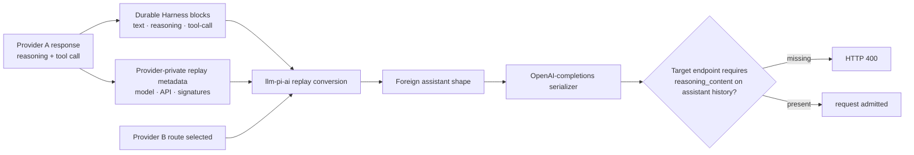

# Fix cross-provider `reasoning_content` replay in `llm-pi-ai`

A Session works on one provider, then a DeepSeek-compatible `openai-completions` route rejects a later tool-using request:

```text
400 ... The `reasoning_content` in the thinking mode must be passed back to the API
```

Treat this as a **provider-history serialization mismatch**, not a tool failure and not Session corruption. The durable history may be valid Harness data while the selected endpoint requires a wire field that a foreign-provider assistant message cannot reproduce losslessly.

## Fast route

1. Stop repeated retries; the same serialized history usually produces the same 400.
2. Record the exact target route, model, API protocol, and first failing turn/step.
3. Confirm whether the route is owned by `@deepseek-ai/dsh-llm-pi-ai` or the direct DeepSeek adapter.
4. Reproduce in a copied Session or disposable profile; do not edit the original Session log.
5. For a hand-declared DeepSeek-compatible `openai-completions` route, test the explicit compatibility switch shown below.
6. Verify both a fresh Session and the affected cross-provider history before promoting the change.

## Why provider switching changes the wire



At rc.2, `llm-pi-ai` stores provider-private replay metadata beside provider-neutral Harness content. Same-provider replay can restore validated signatures. A message without usable matching metadata becomes a foreign assistant message: its text, reasoning text, and tool calls remain, but the message deliberately does not pretend to originate from the new provider/model.

That distinction protects replay integrity. A signature from Provider A must not be relabeled as Provider B's native state merely to satisfy a request schema.

## Identify the adapter boundary

Inspect the resolved composition:

```sh
dsh --profile web --dump-config
```

Then record:

| Evidence | Why it matters |
|---|---|
| provider route key | selects the adapter registration and profile |
| model ID | selects model-level compatibility and reasoning metadata |
| resolved `api` | the switch below belongs only to `openai-completions` |
| sanitized `baseURL` host | URL-based compatibility detection may not recognize a private gateway |
| previous assistant source provider/model | decides whether native replay metadata can be reused |
| presence of tool calls | many thinking endpoints enforce stricter history rules on tool-use turns |

The direct `dsh-llm-deepseek` adapter has its own serializer. At the verified source revision, it passes non-empty durable reasoning back as `reasoning_content`. Do not apply a `llm-pi-ai` profile fix to a route owned by that adapter.

## Configuration-level containment

rc.2 exposes pi-ai's `requiresReasoningContentOnAssistantMessages` switch for `openai-completions` routes. A private DeepSeek-compatible endpoint whose hostname is not recognized can declare the requirement explicitly:

```yaml
- id: llm
  name: '@deepseek-ai/dsh-llm-pi-ai'
  config:
    providers:
      private-deepseek:
        apiKeyEnv: PRIVATE_DEEPSEEK_API_KEY
        api: openai-completions
        baseURL: https://gateway.example.com/v1
        compat:
          thinkingFormat: deepseek
          requiresReasoningContentOnAssistantMessages: true
        models:
          - id: deepseek-compatible-reasoner
            name: Private DeepSeek-compatible reasoner
            contextWindow: 65536
            maxTokens: 8192
            reasoningEfforts:
              off:
              high: high
```

Use your actual route and model metadata. Do not copy the example capacities as provider facts.

The switch tells the OpenAI-completions serializer that replayed assistant messages need the compatibility field while reasoning is active. It is a **wire-shape declaration**, not proof that the gateway is DeepSeek, not restoration of a foreign provider's private signature, and not permission to invent hidden reasoning.

If a catalog route already describes the model, prefer a route-level `compat` override or `modelOverrides` rather than replacing the entire catalog with `models`. In `llm-pi-ai`, a non-empty `models` list replaces the served catalog.

## Safe A/B procedure

1. Export or copy the affected Session using supported tooling; keep the original immutable.
2. Create a disposable profile with the same target route but a distinct route key.
3. Add the compatibility switch only to that route.
4. Run a fresh reasoning + tool-call turn.
5. Replay a sanitized history containing an assistant reasoning block followed by a tool call from another provider.
6. Capture the target request shape at a controlled gateway or mock server. Redact authorization and content before sharing.
7. Compare the first failed and first admitted requests field by field.
8. Remove the disposable profile and any captured private payloads after the test.

Do not repeatedly submit a production Session merely to see whether the 400 changes. Each attempt can spend tokens before a later history validation fails.

## Interpret the result correctly

| Result | Interpretation | Next action |
|---|---|---|
| fresh and cross-provider cases pass | declared compat matches the endpoint | keep the scoped override and regression test it |
| fresh passes, old Session still fails | another historical message shape is incompatible | reduce the first failing prefix; inspect roles, tool pairs, and reasoning fields |
| request now carries the field but endpoint still rejects it | endpoint requires stronger semantic passback | use a supported same-provider path or gateway contract; do not fabricate signatures |
| direct DeepSeek route passes, pi-ai private route fails | adapter/profile compatibility boundary confirmed | keep routes distinct and report the minimal wire diff |
| both routes fail on the same history | shared durable content may be malformed | inspect assistant/tool pairing and first bad Session event |
| switching back to the original provider passes | cross-provider projection is decisive | start a clean target-provider Session or define an explicit migration contract |

## Prevention contract

A production system that permits provider switching should test a matrix, not one happy path:

- same provider and same model;
- same provider and different model;
- different provider with plain assistant text;
- different provider with reasoning only;
- different provider with reasoning plus tool calls;
- tool result followed by another reasoning turn;
- cold Session reload before the switch;
- reasoning enabled, disabled, and provider-default;
- endpoint recognized by catalog versus hand-declared private gateway;
- failure before any external effect versus failure after an effect with unknown outcome.

For every row, assert both Harness block preservation and the exact provider wire shape. “The UI still shows the Think row” does not prove that the next adapter serialized it correctly.

## What not to do

- Do not edit JSONL history to insert guessed `reasoning_content`.
- Do not copy a signature across providers or models.
- Do not delete tool results to make the request smaller.
- Do not classify every HTTP 400 as retryable.
- Do not enable a compatibility flag globally when only one route requires it.
- Do not publish raw reasoning, prompts, credentials, or proprietary gateway payloads in an issue.

## Report a useful upstream reproduction

Include:

- exact DSH and `dsh-llm-pi-ai` versions;
- target protocol and sanitized hostname class;
- source and target provider/model identities;
- smallest ordered Harness block sequence that fails;
- whether native replay metadata exists and matches the source;
- sanitized before/after wire message keys;
- fresh-Session, same-provider, and direct-adapter controls;
- whether the explicit compat switch changes the result.

This evidence separates a Harness replay defect, pi-ai conversion rule, incomplete route declaration, and endpoint-specific contract.

## Verification boundary

The DSH configuration and replay behavior above are source-verified at rc.2 commit [`b150a551`](https://github.com/deepseek-ai/deepseek-harness/tree/b150a551b8d465e31e418e1b2eaf5e79bbb7d28e). The reported private-gateway 400 is a community observation; this handbook did not send credentials or requests to that endpoint. Whether an empty compatibility field satisfies any specific gateway must be verified against that gateway's contract and a controlled request capture.

## Pinned official sources

- [`llm-pi-ai` configuration and wire compatibility](https://github.com/deepseek-ai/deepseek-harness/blob/b150a551b8d465e31e418e1b2eaf5e79bbb7d28e/packages/llm/llm-pi-ai/README.md)
- [`llm-pi-ai` compat profile and resolution](https://github.com/deepseek-ai/deepseek-harness/blob/b150a551b8d465e31e418e1b2eaf5e79bbb7d28e/packages/llm/llm-pi-ai/src/catalog.ts)
- [`llm-pi-ai` durable replay conversion](https://github.com/deepseek-ai/deepseek-harness/blob/b150a551b8d465e31e418e1b2eaf5e79bbb7d28e/packages/llm/llm-pi-ai/src/replay.ts)
- [Direct DeepSeek assistant serialization](https://github.com/deepseek-ai/deepseek-harness/blob/b150a551b8d465e31e418e1b2eaf5e79bbb7d28e/packages/llm/llm-deepseek/src/serialize.ts)
- [Community field report #4745](https://github.com/deepseek-ai/deepseek-harness/discussions/4745)
