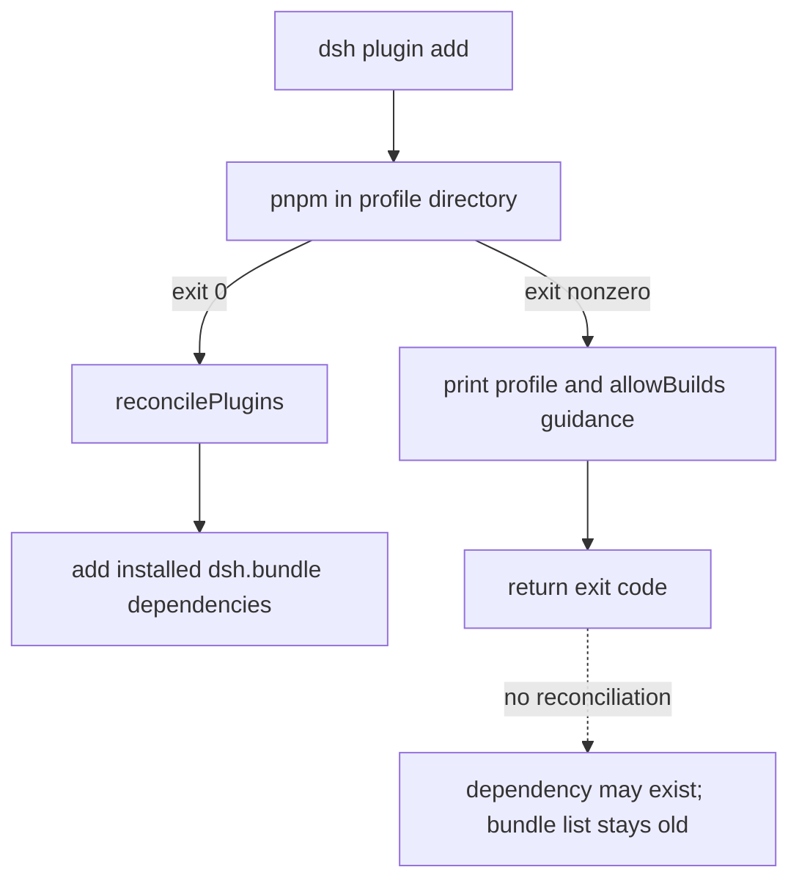

# Recover a plugin materialized after pnpm exits nonzero

Use this runbook when `dsh plugin --profile <name> add <spec>` exits nonzero, yet the dependency appears in the profile manifest or `node_modules`, and the plugin never appears in `dsh.profile.bundles`.

```text
dsh: pnpm failed in profile directory ...
```

This is a partial package-manager transaction plus a skipped composition reconciliation. It is not proof that the plugin installed successfully, and it is not safe to activate a package merely because `node_modules/<name>/package.json` exists.

## Five states, not one “installed” flag

| State | Evidence | What it permits |
|---|---|---|
| materialized | package directory and manifest exist | inspect only |
| dependency-recorded | profile `package.json` names the package | pnpm owns desired dependency state |
| built | every declared runtime export exists | proceed to bundle inspection |
| reconciled | package name appears in `dsh.profile.bundles` when it declares a bundle | composition includes the layer |
| bootable | config dump and isolated boot succeed | consider the change usable |

A blocked Git `prepare` script can reach the first two states while missing generated `dist/` or `lib/` files. Blind reconciliation would convert a visible install failure into a later import or boot failure.

## The rc.8 control flow



At rc.8, `runPlugin()` captures the profile manifest before spawning pnpm. It calls `reconcilePlugins(before, dir)` only when `result.status` is zero. On a nonzero exit it prints a diagnostic, including `allowBuilds` guidance for Git-like specs, and returns without inspecting the post-command state.

Reconciliation itself is installed-state based. It scans dependency names, resolves each package, checks for `dsh.bundle.patch`, appends newly discovered bundles, and removes dependency-managed entries that no longer resolve as bundles. Shipped template bundles remain untouched.

## Contain the ambiguous result

1. Do not boot or hot-reload the affected profile.
2. Preserve the exact command, full pnpm output, exit code, Harness commit, Node/pnpm versions, and profile path.
3. Copy these profile files before another package-manager command:

```text
package.json
pnpm-lock.yaml
pnpm-workspace.yaml
cordis.patch.yml
```

4. Record whether the dependency existed before the command.
5. Inspect the post-command state without editing it.

Use the exact profile directory reported by DSH. Another workspace or global pnpm tree is not evidence for this transaction.

## Classify what pnpm left behind

From the profile directory, collect:

```sh
pnpm why <package-name>
pnpm list <package-name> --depth 0
```

Then inspect the resolved package manifest and every runtime target named by `exports`, `main`, and `dsh.bundle.patch`. For a Git dependency, confirm whether `prepare` completed and whether the installed commit matches the requested pin.

| Result | Classification | Next action |
|---|---|---|
| no dependency and no package | clean refusal | fix the first pnpm error, then retry once |
| dependency exists, package missing | incomplete materialization | restore known-good profile or run a clean pnpm recovery |
| package exists, exported files missing | build-blocked artifact | review and permit the exact script, or remove the dependency |
| exports exist, no `dsh.bundle.patch` | plain dependency | do not add it to the bundle list |
| exports and bundle patch exist, bundle absent | skipped reconciliation candidate | rerun the supported command to a zero exit before activation |
| bundle already present despite nonzero exit | pre-existing or independently changed state | diff against the captured baseline before boot |

The first nonzero diagnostic remains authoritative. Later file presence tells you the partial state; it does not retroactively make the command successful.

### Registry packages can hit pnpm 11's approval gate too

Upstream discussion [#3699](https://github.com/deepseek-ai/deepseek-harness/discussions/3699) reports rc.8 profile upgrades where pnpm 11 writes an `allowBuilds` entry such as `'@scope/package': set this to true or false`, then stops with `ERR_PNPM_IGNORED_BUILDS`. The quoted key is normal YAML for a scoped package; the placeholder value is a deliberate security stop, not proof of malformed YAML. The report also notes that DSH's extra guidance was clearer for Git specs than for registry packages.

Treat this as an approval decision, not an installation failure to bypass:

1. read the exact package identity and the profile path printed by pnpm;
2. inspect the package lifecycle scripts and provenance;
3. set only that reviewed key to `true`, or use the profile's supported `approve-builds` flow if available;
4. rerun the original command and require a zero exit before trusting reconciliation.

Do not set every placeholder to `true`, use `--ignore-scripts` to hide the gate, or delete the profile workspace file. The safety boundary is correct; the missing piece is an explicit, package-specific recovery path.

## Recovery path A: complete a reviewed Git build

Use this only when the package is trusted, pinned, and its install script has been reviewed.

1. Read the exact blocked package key printed by pnpm.
2. Inspect `prepare`, transitive lifecycle scripts, and generated outputs.
3. Add only that exact key to `allowBuilds` in the selected profile's `pnpm-workspace.yaml`.
4. Rerun the original `dsh plugin --profile ... add ...` command.
5. Require a zero exit. That successful invocation owns reconciliation.
6. Verify every runtime export and bundle-patch target before boot.
7. Run `dsh --profile <name> --dump-config`, then an isolated boot smoke test.

Do not use `--ignore-scripts` for a source package whose exports are generated by `prepare`. That preserves materialization while guaranteeing the runtime artifact is absent.

## Recovery path B: return to known-good state

If the script is untrusted, not portable, or still failing, remove through the same profile owner:

```sh
dsh plugin --profile <name> remove <package-name>
```

Require a zero exit, then verify:

- the dependency no longer appears in `package.json` or `pnpm why`;
- the package is absent from `dsh.profile.bundles`;
- unrelated template and community bundles are unchanged;
- `--dump-config` and a clean boot match the known-good baseline.

If removal also exits nonzero, stop all writers, preserve the profile directory, and restore the captured manifest and lockfile as one reviewed unit. Do not delete the complete Harness home or any Session root.

## Why existence-only reconciliation is unsafe

The upstream report proposes reconciling whenever `node_modules/<package>/package.json` exists after a failed pnpm command. That closes the “installed but invisible” gap, but existence alone does not prove the bundle can load.

A robust contract needs an explicit policy for partial success:

- If nonzero always means failure, preserve the old bundle list and provide a supported retry or rollback command.
- If DSH accepts a postcondition as success, validate dependency ownership, exact resolution, bundle declaration, patch target, and every runtime export before reconciliation; report a distinct recovered-success result rather than returning the original failure ambiguously.
- Never activate an incomplete package while claiming the package-manager command failed.

The CLI should also serialize profile mutation so another process cannot change the manifest between the before snapshot, pnpm exit, postcondition inspection, and reconciliation write.

## Unsafe shortcuts

- Do not manually append the package name to `dsh.profile.bundles` after a failed build.
- Do not infer build success from `package.json` or a `node_modules` symlink.
- Do not delete the lockfile before preserving it; it records the partial resolution.
- Do not run a second package-manager command before capturing the first result.
- Do not boot a credential-bearing profile to “see what happens” when exports are missing.
- Do not allow every blocked build script globally.
- Do not treat a successful `pnpm why` as proof that Cordis patch composition succeeds.

## Upstream regression gates

- A zero-exit add reconciles a valid bundle exactly once.
- A nonzero add with no post-state change leaves the profile byte-equivalent.
- A nonzero add with only a materialized manifest does not activate missing exports.
- A blocked `prepare` reports the exact profile and allowlist file.
- A reviewed retry that exits zero activates the bundle.
- A plain dependency never enters `dsh.profile.bundles`.
- A Git alias reconciles by the installed package's real name.
- A failed update does not remove the previously bootable bundle silently.
- A successful remove cleans dependency-managed bundle state.
- Template bundles remain untouched.
- Concurrent profile mutation is rejected or serialized.
- CLI exit status and user-facing result distinguish failure, recovered success, and rollback.

## Incident bundle

```text
Harness version and source commit:
OS, Node, pnpm, and Corepack versions:
Exact profile and plugin spec:
Full first pnpm diagnostic and exit code:
Dependency present before / after:
Resolved package path and version or commit:
prepare script status:
Missing or present export targets:
dsh.bundle.patch declaration and target:
dsh.profile.bundles before / after:
Retry or removal result:
```

Remove tokens, private Git URLs, filesystem usernames, and unrelated profile configuration before sharing.

## Primary sources

Verified against DeepSeek Harness rc.8 commit `141eb6fef83422698aef7a981029e843e8161534`.

- [Upstream nonzero-reconciliation report #3451](https://github.com/deepseek-ai/deepseek-harness/discussions/3451)
- [rc.8 plugin forwarding and reconciliation](https://github.com/deepseek-ai/deepseek-harness/blob/141eb6fef83422698aef7a981029e843e8161534/apps/cli/src/plugin.ts)
- [rc.8 CLI plugin-management contract](https://github.com/deepseek-ai/deepseek-harness/blob/141eb6fef83422698aef7a981029e843e8161534/apps/cli/reference/README.md#plugin-management)
- [rc.8 profile manifest and bundle resolution](https://github.com/deepseek-ai/deepseek-harness/blob/141eb6fef83422698aef7a981029e843e8161534/packages/boot/app-boot/src/profile.ts)
- [Missing Git plugin artifact recovery](git-plugin-missing-dist.md)
- [Plugin installation and known-good recovery](plugin-install-recovery.md)
