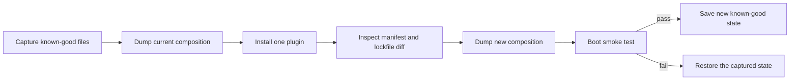
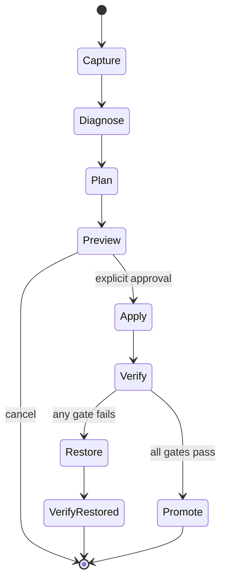

# Install DeepSeek Harness plugins without losing a known-good profile

Treat a profile as a layered runtime composition, not as a loose package directory. `dsh plugin` delegates package changes to pnpm and then reconciles bundle layers against the installed dependencies. A successful package install therefore proves only that pnpm completed; it does not prove that the composed profile can boot.

## The safe change loop



Before changing a working profile, preserve these files through version control or a dated copy outside the profile:

```text
$DSH_HOME/profiles/<name>/package.json
$DSH_HOME/profiles/<name>/pnpm-lock.yaml
$DSH_HOME/profiles/<name>/cordis.patch.yml
$DSH_HOME/cordis.patch.yml
```

Then capture the resolved tree:

```sh
dsh --profile web --dump-config > before.yml
dsh plugin --profile web add <package>
dsh --profile web --dump-config > after.yml
```

Compare `before.yml`, `after.yml`, the profile manifest, and the lockfile before starting the long-lived Web process. Install one bundle at a time so the first broken boundary remains attributable.

## What bundle reconciliation actually owns

After pnpm exits successfully, the CLI reads the profile dependencies and checks each installed package for a `dsh.bundle.patch` declaration.

- A dependency that declares a bundle joins `dsh.profile.bundles`.
- A dependency that no longer exists or no longer declares a bundle leaves the list.
- A plain dependency stays installed but is not a composition layer.
- Shipped template bundles that are not dependency-managed are intentionally left alone.

This means a missing entry is not enough evidence that `plugin add` replaced the whole array. Record whether that package was a dependency before and after the command, whether it still resolves, and whether its installed manifest still declares `dsh.bundle.patch`. Those facts identify whether the removal followed the reconciliation contract or exposed a defect.

## Diagnose a boot failure before editing files

| First error | Boundary | First action |
|---|---|---|
| package installs but no layer appears | bundle manifest | inspect the installed package's `dsh.bundle.patch` declaration |
| `DUPLICATE_ADAPTER` | LLM route ownership | find every plugin registering the named provider and keep one owner |
| `settings namespace not registered` | service lifecycle | declare the required `settings` service or make it explicitly optional |
| module, schema, or patch resolution error | composition | run `--dump-config` and inspect the first named row or source layer |
| Web process dies during an in-process restart | process ownership | restart from a supervisor outside the process tree being terminated |

## Runtime export mismatch after a Harness upgrade

This startup signature names an out-of-tree plugin compatibility failure, not a core source-build failure:

```text
failed to import loader entry dsh-agy (@a1soyo0/dsh-agy)
The requested module '@deepseek-ai/dsh-llm' does not provide an export named 'CallId'
```

Read the deepest ESM cause first. In report #4827, both the Host and Web rows fail inside the installed profile package:

```text
$DSH_HOME/profiles/web/node_modules/@a1soyo0/dsh-agy/lib/...
import { CallId } from "@deepseek-ai/dsh-llm"
```

rc.2 exported a runtime brand constructor named `CallId`. Alpha.1 renamed that public brand to `ToolCallId`; there is no `CallId` value in its `brand.ts` or root re-export. A plugin bundle built against the rc.2 value surface therefore cannot instantiate under the alpha.1 core closure merely because pnpm installed it successfully.

### Choose one compatible closure

| Requirement | Safe choice | Proof |
|---|---|---|
| alpha.1 is required | install a plugin release that explicitly supports alpha.1 / `ToolCallId` | cold boot plus one plugin-owned operation |
| current plugin is required | run the last compatible Harness release in a separate pinned installation/profile | exact core and plugin versions plus cold boot |
| Web access is urgent; plugin is optional | remove the plugin from only the affected profile | manifest/lockfile diff, reconciled Bundle list, cold boot |
| no compatible pair is known | keep the broken profile as evidence and create a clean control profile | control boot does not mutate the original |

For the optional-plugin route, stop the profile, capture its manifest and lockfile, then use the supported profile package transaction:

```sh
dsh plugin --profile web remove @a1soyo0/dsh-agy
dsh --profile web --dump-config > after-remove.yml
dsh --profile web
```

The plugin command forwards `remove` to pnpm in that profile, then reconciles dependency-managed Bundle membership. It does not remove in-box template Bundles. Inspect the manifest, lockfile, resolved tree, and dump before cold boot; if pnpm fails, treat the transaction as potentially partial and restore the captured pair rather than deleting `node_modules` by hand.

Do not add a fake `CallId` export to alpha.1, edit the plugin's built `.mjs`, or alias `CallId` to `ToolCallId` globally. The rename may accompany broader schema and lifecycle changes, and a booting import is not proof of behavioral compatibility.

### Compatibility regression contract

A third-party Bundle should test its declared Harness peer range against each supported release family:

1. install into an empty profile with a frozen lockfile;
2. import every Host and Web entrypoint under Node ESM;
3. dump the composed tree;
4. cold boot the selected profile;
5. invoke one plugin-owned feature;
6. uninstall and prove Bundle reconciliation;
7. reject unsupported core versions before Loader activation with an actionable version message.

For type-only identifiers, use `import type` so the bundler erases the import. When a branded constructor is required at runtime, import the exact supported value and declare a peer range that matches that API surface.

Do not keep adding recovery plugins to a profile that cannot compose. Return to the captured state first, reproduce with one added package, and preserve the first error.

## There is no safe universal `reset` in rc.2

Discussion #4735 asks for automatic repair after a configuration edit or plugin conflict prevents startup. DeepSeek Harness rc.2 does not ship a general `doctor`, `repair`, or factory-reset command. That absence matters: `$DSH_HOME` is not one disposable cache. It can contain independent user-owned and security-sensitive state:

- profile manifests, lockfiles, plugin installations, and profile patch layers;
- the home-level patch applied above every profile;
- managed credentials and environment fallbacks;
- user-authored agent presets;
- persisted Sessions and local indexes.

Deleting or replacing the whole directory can destroy the evidence needed to identify the first bad layer, erase unrelated profiles and Sessions, or silently change credential and permission behavior. “Restore defaults” must therefore name a **profile and state class**, show the proposed diff, preserve a snapshot, and leave credentials and Sessions out of scope by default.

The rc.2 launcher already exposes two useful diagnostic properties, but neither is an automatic repair:

1. `--dump-default-config` composes only the selected profile's Bundle layers without its user patch files.
2. `--dump-config` adds the profile patch, the home patch, and explicit `--patch` overlays without activating plugins.

Both commands still need the profile manifest and every listed Bundle to resolve and parse. A corrupt manifest, missing Bundle, or broken dependency closure can therefore fail before either dump is available.

## Recover by narrowing one layer at a time

Use a new directory for evidence. Do not redirect diagnostic output into `$DSH_HOME`.

```sh
mkdir -p ./dsh-recovery-evidence
dsh --version > ./dsh-recovery-evidence/version.txt
dsh --profile web --dump-default-config > ./dsh-recovery-evidence/default.yml
dsh --profile web --dump-config > ./dsh-recovery-evidence/effective.yml
```

Interpret the first boundary:

| Result | Proven boundary | Next bounded action |
|---|---|---|
| both dumps succeed, live boot fails | plugin activation, required service, app argument, or runtime effect | preserve the first boot stack; test an exact overlay or clean profile |
| default succeeds, effective fails | profile patch, home patch, or named overlay | parse copies offline; never edit both user layers at once |
| default fails while manifest parses | listed Bundle, Bundle patch, or module resolution | inspect the ordered Bundle list and resolve each package from the profile |
| manifest does not parse | profile metadata | restore the exact known-good manifest snapshot; do not invent JSON fields |
| pnpm operation failed | dependency transaction may be partial | inspect manifest, lockfile, workspace file, and store state before retrying |

An empty or comments-only `cordis.patch.yml` is not the disabled form; it parses to no document and fails. The explicit no-op layer is:

```yaml
[]
```

Do not replace a suspect patch in place merely to test this. Copy the original first, record its hash and timestamp, then use a disposable `--patch` or a cloned profile. The home-level patch outranks the profile patch, so a clean profile alone does not exclude a machine-wide override.

## A clean profile is a control, not a repair

Create a distinct diagnostic profile rather than deleting the broken one:

```sh
dsh plugin --profile recovery-probe add @deepseek-ai/dsh-base
dsh --profile recovery-probe --dump-config > ./dsh-recovery-evidence/probe.yml
```

This proves whether the selected installation, pnpm executable, base Bundle, shared module fallback, and home-level patch can compose. It does **not** prove the original profile is safe to reset, and it may still inherit the same home patch and environment layers. Use a separate temporary `DSH_HOME` only when you explicitly want to test the installation without any user state; never point that probe at the production home or later promote the probe wholesale.

Compare four independent deltas:

1. `package.json`: requested dependency and ordered `dsh.profile.bundles` membership;
2. `pnpm-lock.yaml`: exact resolved graph and peer decisions;
3. profile `cordis.patch.yml`: profile-only overrides;
4. home `cordis.patch.yml`: machine-wide overrides applied last.

If removing one third-party Bundle restores the probe, that is isolation evidence—not proof the package is intrinsically defective. Capture the exact version, peer graph, activation stack, and conflicting row or route before reporting it.

## Design automatic repair as a transaction

A safe future `dsh doctor` should be read-only unless the operator selects one explicit repair plan. Separate diagnosis from mutation:



The snapshot must be immutable and scoped to the selected profile plus any home-level file the plan proposes to touch. Record paths, file types, modes or ACL facts, hashes, selected installation identity, DSH/Node/pnpm versions, and a manifest of intentionally excluded state. Never copy secret values into a diagnostic report.

Each repair operation needs a typed precondition and inverse. Examples:

| Candidate repair | Required precondition | Inverse |
|---|---|---|
| replace invalid patch with `[]` | exact file hash still matches captured failure | restore captured file atomically |
| remove one dependency-managed Bundle | package is both a dependency and managed Bundle; manifest revision unchanged | restore manifest and lockfile, then exact frozen install |
| regenerate profile dependency closure | exact manifest and lockfile parse; package manager and registry identity recorded | restore full captured closure or abort before mutation |
| remove orphan lock file | no live writer owns it; platform-specific owner evidence collected | none—therefore never infer from age alone |

Do not make “delete the last installed plugin” an automatic rule. A pnpm command may have changed several transitive packages, the latest plugin may be unrelated, and a home patch can be the true failing layer.

## Keep hot reload and cold boot separate

rc.2 watches the profile and home patch files. A rejected read, YAML parse, schema, or Loader candidate leaves the last good in-memory tree running and emits `hmr/config-update-failed`. That protects a live process from one invalid edit; it does not make the file on disk valid for the next cold boot.

The recovery UI should therefore show two facts independently:

- **live generation:** the last configuration generation that activated successfully;
- **disk candidate:** the current file revision and its parse/activation result.

“Service is still running” must not be displayed as “configuration saved successfully.” Before restart, verify the disk candidate through offline composition. Conversely, a failed live candidate must not be persisted as the new known-good generation.

## Acceptance gates for repair or reset

- [ ] The selected DSH installation, profile, and Harness home resolve to absolute paths before mutation.
- [ ] Diagnosis is read-only and produces a redacted evidence bundle.
- [ ] The first failing boundary is classified before a repair is proposed.
- [ ] The plan names every file and package operation; no wildcard or whole-home deletion is used.
- [ ] Credentials, Sessions, user presets, and unrelated profiles are excluded by default.
- [ ] The snapshot records hashes, file type, permissions, version, registry, and package-manager identity.
- [ ] Every mutation checks that the captured precondition still holds.
- [ ] Multi-file changes are serialized and recoverable after interruption.
- [ ] Profile and home patch layers are diagnosed independently and in precedence order.
- [ ] A successful clean-profile control is not mislabeled as repair of the original profile.
- [ ] Offline default and effective config dumps succeed after the change.
- [ ] Cold boot activates every enabled row; a live HMR survivor is insufficient evidence.
- [ ] One provider request and one authorized tool call pass in the repaired profile.
- [ ] The exact restored snapshot cold-boots if post-repair verification fails.
- [ ] Logs and exported evidence never contain credential values or full sensitive environment data.
- [ ] The operator receives the snapshot location, repair manifest, verification result, and rollback result.

## Adapter routes have one runtime owner

`ctx.llm.registerAdapter()` fails atomically when any requested provider route already has an adapter. The official DeepSeek adapter owns `deepseek-official`; a third-party adapter must use a distinct route unless the original owner is removed from the composition.

`registerConfigurableProviders()` is not an override mechanism. It publishes advisory settings/catalog metadata, while `registerAdapter()` owns request dispatch. Registering catalog metadata does not resolve a duplicate runtime route.

For a third-party adapter:

```ts
export const inject = ['llm']

export function apply(ctx: Context) {
  ctx.llm.registerAdapter(['my-distinct-route'], adapter)
}
```

## Required services must be declared

If a plugin requires a Cordis service during `apply()`, declare it in `inject`:

```ts
export const inject = ['settings']

export function apply(ctx: Context) {
  ctx.settings.register(/* ... */)
}
```

The plugin waits until every required service is ready. If the service is genuinely optional, omit it from `inject` and handle `ctx.get('settings')` returning `undefined` at every use site. Do not silently skip required registration and wait for a later client error.

## Recovery evidence for an upstream report

Attach a sanitized, minimal evidence set:

```text
Harness commit or published version:
Operating system and Node/pnpm versions:
Exact plugin spec installed:
Manifest dependency diff:
dsh.profile.bundles before and after:
First dump-config difference:
First boot error and owning row:
Clean-profile reproduction result:
Deepest ESM importer path and missing export:
Installed plugin version and declared Harness peer range:
```

Do not include credentials or the full user home. A small reproduction profile is more useful than a screenshot of the dead Web surface.

## Official sources

- [rc.2 CLI profile and plugin contract](https://github.com/deepseek-ai/deepseek-harness/blob/b150a551b8d465e31e418e1b2eaf5e79bbb7d28e/apps/cli/reference/README.md)
- [rc.2 plugin reconciliation implementation](https://github.com/deepseek-ai/deepseek-harness/blob/b150a551b8d465e31e418e1b2eaf5e79bbb7d28e/apps/cli/src/plugin.ts)
- [rc.2 `CallId` runtime brand](https://github.com/deepseek-ai/deepseek-harness/blob/b150a551b8d465e31e418e1b2eaf5e79bbb7d28e/packages/llm/llm/src/brand.ts)
- [Alpha.1 `ToolCallId` runtime brand](https://github.com/deepseek-ai/deepseek-harness/blob/cd5ef8148158c3a752a658978873241fdf8e2bbc/packages/llm/llm/src/brand.ts)
- [Alpha.1 plugin management contract](https://github.com/deepseek-ai/deepseek-harness/blob/cd5ef8148158c3a752a658978873241fdf8e2bbc/apps/cli/reference/README.md#plugin-management)
- [Third-party plugin export mismatch report #4827](https://github.com/deepseek-ai/deepseek-harness/discussions/4827)
- [rc.2 profile composition and live-layer ownership](https://github.com/deepseek-ai/deepseek-harness/blob/b150a551b8d465e31e418e1b2eaf5e79bbb7d28e/apps/cli/src/profile-boot.ts)
- [rc.2 app-boot profile and transactional HMR contract](https://github.com/deepseek-ai/deepseek-harness/blob/b150a551b8d465e31e418e1b2eaf5e79bbb7d28e/packages/boot/app-boot/README.md)
- [rc.2 atomic file replacement and lock contract](https://github.com/deepseek-ai/deepseek-harness/blob/b150a551b8d465e31e418e1b2eaf5e79bbb7d28e/packages/util/atomic-write/README.md)
- [Community plugin lifecycle report](https://github.com/deepseek-ai/deepseek-harness/discussions/1904)
- [Automatic repair and reset request #4735](https://github.com/deepseek-ai/deepseek-harness/discussions/4735)
