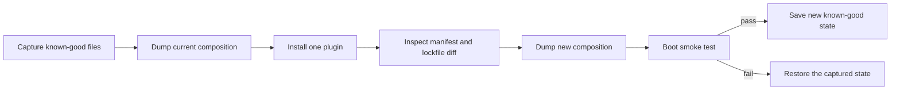

# Install DeepSeek Harness plugins without losing a known-good profile

Treat a profile as a layered runtime composition, not as a loose package directory. `dsh plugin` delegates package changes to pnpm and then reconciles bundle layers against the installed dependencies. A successful package install therefore proves only that pnpm completed; it does not prove that the composed profile can boot.

## The safe change loop



Before changing a working profile, preserve these files through version control or a dated copy outside the profile:

```text
$DSH_HOME/profiles/<name>/package.json
$DSH_HOME/profiles/<name>/pnpm-lock.yaml
$DSH_HOME/profiles/<name>/cordis.patch.yml
$DSH_HOME/cordis.patch.yml
```

Then capture the resolved tree:

```sh
dsh --profile web --dump-config > before.yml
dsh plugin --profile web add <package>
dsh --profile web --dump-config > after.yml
```

Compare `before.yml`, `after.yml`, the profile manifest, and the lockfile before starting the long-lived Web process. Install one bundle at a time so the first broken boundary remains attributable.

## What bundle reconciliation actually owns

After pnpm exits successfully, the CLI reads the profile dependencies and checks each installed package for a `dsh.bundle.patch` declaration.

- A dependency that declares a bundle joins `dsh.profile.bundles`.
- A dependency that no longer exists or no longer declares a bundle leaves the list.
- A plain dependency stays installed but is not a composition layer.
- Shipped template bundles that are not dependency-managed are intentionally left alone.

This means a missing entry is not enough evidence that `plugin add` replaced the whole array. Record whether that package was a dependency before and after the command, whether it still resolves, and whether its installed manifest still declares `dsh.bundle.patch`. Those facts identify whether the removal followed the reconciliation contract or exposed a defect.

## Diagnose a boot failure before editing files

| First error | Boundary | First action |
|---|---|---|
| package installs but no layer appears | bundle manifest | inspect the installed package's `dsh.bundle.patch` declaration |
| `DUPLICATE_ADAPTER` | LLM route ownership | find every plugin registering the named provider and keep one owner |
| `settings namespace not registered` | service lifecycle | declare the required `settings` service or make it explicitly optional |
| module, schema, or patch resolution error | composition | run `--dump-config` and inspect the first named row or source layer |
| Web process dies during an in-process restart | process ownership | restart from a supervisor outside the process tree being terminated |

Do not keep adding recovery plugins to a profile that cannot compose. Return to the captured state first, reproduce with one added package, and preserve the first error.

## Adapter routes have one runtime owner

`ctx.llm.registerAdapter()` fails atomically when any requested provider route already has an adapter. The official DeepSeek adapter owns `deepseek-official`; a third-party adapter must use a distinct route unless the original owner is removed from the composition.

`registerConfigurableProviders()` is not an override mechanism. It publishes advisory settings/catalog metadata, while `registerAdapter()` owns request dispatch. Registering catalog metadata does not resolve a duplicate runtime route.

For a third-party adapter:

```ts
export const inject = ['llm']

export function apply(ctx: Context) {
  ctx.llm.registerAdapter(['my-distinct-route'], adapter)
}
```

## Required services must be declared

If a plugin requires a Cordis service during `apply()`, declare it in `inject`:

```ts
export const inject = ['settings']

export function apply(ctx: Context) {
  ctx.settings.register(/* ... */)
}
```

The plugin waits until every required service is ready. If the service is genuinely optional, omit it from `inject` and handle `ctx.get('settings')` returning `undefined` at every use site. Do not silently skip required registration and wait for a later client error.

## Recovery evidence for an upstream report

Attach a sanitized, minimal evidence set:

```text
Harness commit or published version:
Operating system and Node/pnpm versions:
Exact plugin spec installed:
Manifest dependency diff:
dsh.profile.bundles before and after:
First dump-config difference:
First boot error and owning row:
Clean-profile reproduction result:
```

Do not include credentials or the full user home. A small reproduction profile is more useful than a screenshot of the dead Web surface.

## Official sources

- [CLI plugin reconciliation implementation](https://github.com/deepseek-ai/deepseek-harness/blob/47f943859bef60e4160492346772ded9b24f765a/apps/cli/src/plugin.ts)
- [CLI profile and plugin contract](https://github.com/deepseek-ai/deepseek-harness/blob/47f943859bef60e4160492346772ded9b24f765a/apps/cli/reference/README.md)
- [Services and dependency lifecycle](https://github.com/deepseek-ai/deepseek-harness/blob/47f943859bef60e4160492346772ded9b24f765a/docs/user/develop/framework/service.md)
- [LLM adapter ownership contract](https://github.com/deepseek-ai/deepseek-harness/blob/47f943859bef60e4160492346772ded9b24f765a/docs/subsystems/llm-streaming.md#adapter-contract)
- [Community plugin lifecycle report](https://github.com/deepseek-ai/deepseek-harness/discussions/1904)
