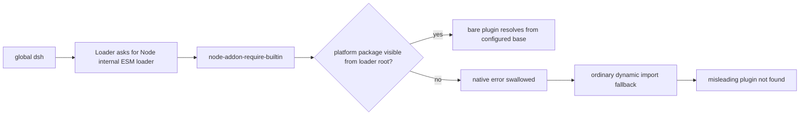

# Fix pnpm global native-binding plugin resolution

Use this guide when a published DeepSeek Harness CLI installed with pnpm can start, but `dsh web` cannot mount an installed bare plugin specifier and reports a misleading error such as:

```text
failed to import loader entry ...
Cannot find module '@deepseek-ai/...' imported from ...
```

At upstream commit `99f6f02`, the CLI and vendored Loader both depend on `node-addon-require-builtin@0.1.4`. The Loader uses that optional native helper to reach Node's internal ESM loader. In an isolated pnpm global virtual-store layout, the platform package can exist under the entry package while the shared custom loader cannot resolve it from its own physical package root. The first native failure is swallowed; the later ordinary import failure is the error users see.

> [!IMPORTANT]
> This is a global-install topology problem, not the source-checkout HMR diagnosis in discussion #2699. Do not apply source-workspace repair commands to a published global package.

## Confirm the topology before changing anything

```sh
command -v dsh
dsh --version
node --version
pnpm --version
pnpm root -g
pnpm bin -g
```

Record the exact CLI package version and the path returned for `dsh`. If the binary belongs to npm, Corepack, a packaged application, or a source checkout, stop and route that installation separately.

## Understand the two-stage failure



The final package name may be installed correctly. Prove native bridge resolution first instead of repeatedly reinstalling the plugin.

## Capture a non-destructive resolution trace

Find the installed CLI manifest without editing the global store:

```sh
DSH_BIN="$(command -v dsh)"
ls -l "$DSH_BIN"
pnpm list -g --depth 3 @deepseek-ai/dsh node-addon-require-builtin node-addon-native-custom-loader
```

Then inspect the global root returned by `pnpm root -g`:

```sh
GLOBAL_ROOT="$(pnpm root -g)"
find "$GLOBAL_ROOT" -path '*node-addon-require-builtin*' -maxdepth 8 -print
find "$GLOBAL_ROOT" -path '*node-addon-native-custom-loader*' -maxdepth 8 -print
```

Do not conclude that “present on disk” means “resolvable.” Node resolves a bare request from the requiring module's physical location, not from every package in the virtual store.

## Use an install-topology A/B

Keep the failing global installation unchanged. In a disposable empty directory, run the same published version without the global virtual-store boundary:

```sh
mkdir dsh-published-ab
cd dsh-published-ab
npm init -y
npm install --save-exact @deepseek-ai/dsh@<exact-version>
npx dsh web
```

Interpret the result:

| Result | Meaning | Next action |
|---|---|---|
| Local exact install works; pnpm global fails | global dependency visibility is implicated | use the local pinned launcher while tracking the upstream fix |
| Both fail with the same first native error | broader platform-package or release artifact problem | capture OS/arch and installed dependency tree |
| Native helper succeeds but one plugin fails | plugin base URL or package installation issue | return to plugin-specific resolution evidence |
| Source checkout alone fails with HMR flag message | different topology | use the source HMR guide |

## Safe recovery now

Until an official release contains a reviewed fix, prefer one of these reversible paths:

1. run an exact published version from a project-local installation;
2. use the official packaged distribution when available for your platform;
3. keep the failing global tree intact and test a fixed release in a separate prefix.

Pin the version. Do not silently switch production to `latest` during diagnosis.

## Avoid false fixes

- **Do not add `--expose-internals` permanently.** It bypasses the native path by exposing unsupported Node internals and does not repair package ownership.
- **Do not hoist everything globally.** Broad hoisting changes dependency visibility for unrelated packages and hides the regression.
- **Do not copy a platform binary between virtual-store directories.** Native artifacts are platform-, architecture-, ABI-, and package-version-specific.
- **Do not set `NARB_DISABLE_OPTIONAL_PACKAGE=1` as a repair.** Its stated purpose is to disable the optional-package route.
- **Do not delete the failing global installation before collecting the tree.** The physical layout is the primary evidence.

## Acceptance test for a fixed release

A real fix must pass from a fresh, isolated pnpm global prefix without hoisting:

```text
1. install exact CLI version into an empty pnpm global prefix
2. confirm entry, custom-loader, and platform packages occupy isolated roots
3. start dsh web without --expose-internals
4. mount a bare plugin specifier from the profile
5. restart the process and repeat the mount
6. set the documented optional-package opt-out and confirm its semantics remain explicit
```

Test both first start and cold restart. A warm process can cache the internal loader and conceal a resolution regression.

## Minimal upstream report

```text
Install command:
Exact @deepseek-ai/dsh version:
OS / architecture:
node --version:
pnpm --version:
command -v dsh:
pnpm root -g:
Relevant pnpm list -g output:
First native-helper error:
Final plugin-import error:
Project-local exact-version A/B:
Fresh global-prefix reproduction:
```

## Primary sources

- [Upstream global pnpm report and proposed fix #3250](https://github.com/deepseek-ai/deepseek-harness/discussions/3250)
- [CLI dependency declaration at `99f6f02`](https://github.com/deepseek-ai/deepseek-harness/blob/99f6f02fecdb7dff40c3fbc9470f5907c29f74ca/apps/cli/package.json)
- [Loader optional peer declaration](https://github.com/deepseek-ai/deepseek-harness/blob/99f6f02fecdb7dff40c3fbc9470f5907c29f74ca/vendor/loader/package.json)
- [Internal-loader discovery and swallowed fallback](https://github.com/deepseek-ai/deepseek-harness/blob/99f6f02fecdb7dff40c3fbc9470f5907c29f74ca/vendor/loader/src/internal.ts)
- [Bare-specifier resolution contract](https://github.com/deepseek-ai/deepseek-harness/blob/99f6f02fecdb7dff40c3fbc9470f5907c29f74ca/packages/boot/app-boot/README.md)

