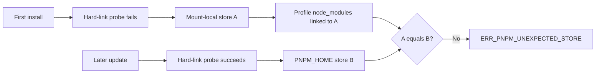

# Fix `ERR_PNPM_UNEXPECTED_STORE` during plugin update

Use this runbook when a DeepSeek Harness profile installed correctly, but a later plugin update stops before reconciliation:

```text
ERR_PNPM_UNEXPECTED_STORE Unexpected store location

The dependencies at "<dsh-home>/profiles/web/node_modules" are currently linked
from the store at "<workspace>/.pnpm-store/v10".

pnpm now wants to use the store at "<home>/Library/pnpm/store/v10".
```

This is store-identity drift. It is not an API-key failure, a broken plugin, or the workspace-root safeguard.

## The invariant that broke

`node_modules` is not independent of the pnpm content-addressable store that materialized it. The profile has two relevant identities:

```text
linked store recorded by the existing node_modules
                         must equal
store selected by pnpm for the current mutation
```

pnpm 10 can select its default store dynamically. If it can hard-link from the project to `PNPM_HOME`, it can use the home store. If that probe fails because of a sandbox, mount, permission, or missing directory, it can fall back to a store on the project filesystem. A later run under a different environment can choose the other result.

DeepSeek Harness rc.8 forwards plugin commands to pnpm from the profile directory. The current forwarder does not pin a store directory. That leaves the same DSH profile vulnerable to different pnpm store decisions across install and update runs.



## Contain the failed update

1. Stop Web and every process that can mutate the affected profile.
2. Preserve the exact command, first pnpm error, DSH version, Node version, pnpm version, `DSH_HOME`, and `PNPM_HOME`.
3. Copy the profile's `package.json`, `pnpm-lock.yaml`, `pnpm-workspace.yaml`, `.npmrc` if present, and `cordis.patch.yml`.
4. Do not delete `node_modules` or the old store yet. The error names both sides of the mismatch.
5. Do not boot the profile after an ambiguous update. First prove whether its dependency and bundle state changed.

The profile path printed by DSH is the transaction boundary. Running probes from an unrelated application workspace can report a different pnpm configuration.

## Capture all three store identities

From the exact affected profile directory, collect:

```sh
pnpm --version
pnpm store path
pnpm config get store-dir
pnpm config list
```

Also preserve the two absolute paths from the error:

| Evidence | Meaning |
|---|---|
| `currently linked from` | store that owns the existing `node_modules` links |
| `pnpm now wants to use` | store selected for this invocation |
| explicit `store-dir` | stable store you choose for future profile mutations |

Record whether each path is on the same filesystem device as the profile and whether the DSH process can create and hard-link a disposable file there. Remove only the disposable probe files afterward.

Do not assume that shell-visible `pnpm store path` proves what the Web-triggered update used. Capture the executable, environment, working directory, and effective config for both entrypoints if they differ.

## Choose one stable owner

The durable invariant is simple: every install, add, remove, and update for one profile must resolve the same store directory.

A DSH-owned store under the Harness home is a strong default because its lifecycle and permissions can follow the profile owner. An operator-managed store is also valid when it is explicit, writable by the same service identity, on a compatible filesystem, and used by every mutation entrypoint.

Avoid selecting a workspace-local store when multiple workspaces share one profile. The current workspace should not silently control the profile's package graph.

## Apply the bounded recovery

Create or update `.npmrc` in the affected profile directory with one reviewed absolute location:

```ini
store-dir=/absolute/path/to/stable/dsh-pnpm-store
```

Then, while all other profile writers remain stopped:

```sh
pnpm install --frozen-lockfile
```

Use `--frozen-lockfile` first so recovery relinks the recorded graph instead of silently choosing new dependency versions. If it fails because the lockfile is already inconsistent, preserve the failure and decide on a separate reviewed lockfile repair. Do not combine version drift with store migration.

After a zero-exit relink, rerun the original DSH-owned update command once. Do not run raw `pnpm update` as a substitute when the profile owner normally performs bundle reconciliation.

## Prove the recovery across boundaries

Require all of these signals:

1. `pnpm store path` from the profile equals the explicit stable path.
2. `pnpm install --frozen-lockfile` exits zero without changing dependency resolution.
3. The DSH plugin update exits zero.
4. The profile manifest, lockfile, and `dsh.profile.bundles` diff contain only intended changes.
5. Every installed plugin runtime export and `dsh.bundle.patch` target resolves.
6. `dsh --profile <name> --dump-config` succeeds.
7. An isolated profile boot succeeds before normal Sessions or credentials are exposed.
8. A second no-op install and update resolve the same store again.

The last gate matters. One successful relink proves recovery at one instant; a repeated mutation proves the store decision is stable.

## Route neighboring errors separately

| Signature | Broken boundary | Next guide |
|---|---|---|
| `ERR_PNPM_UNEXPECTED_STORE` | current store differs from linked store | pin, relink, and repeat-prove here |
| `ERR_PNPM_ADDING_TO_ROOT` | add target is an implicit workspace root | [workspace-root add guide](pnpm-adding-to-root-plugin.md) |
| pnpm exits nonzero but package files remain | partial package-manager transaction | [partial plugin install guide](plugin-add-nonzero-reconcile.md) |
| package exists but `dist/` or `lib/` is missing | blocked or failed lifecycle build | [missing plugin artifact guide](git-plugin-missing-dist.md) |
| install succeeds but Web fails to load plugins | Client composition or boot failure | [Web plugin boot guide](web-client-plugin-boot-failure.md) |

## Durable runtime repair

The CLI should make store identity deterministic instead of depending on pnpm's environment-sensitive probe. A narrow repair can resolve a stable store under `DSH_HOME` and pass it to every forwarded pnpm mutation through `npm_config_store_dir`, while preserving an explicit user `--store-dir` override.

Regression coverage should prove:

- first install and later update use the same store across different working directories;
- sandboxed and unsandboxed invocations do not drift;
- a cross-device `DSH_HOME` reports a precise compatibility failure;
- explicit `--store-dir` precedence is retained;
- add, remove, update, install, and no-op runs share the invariant;
- existing drifted profiles receive a bounded one-time relink path;
- nonzero pnpm exits still skip unsafe bundle activation;
- concurrent profile mutations are serialized or rejected;
- Windows, macOS, and Linux path quoting is preserved;
- logs identify the profile and selected store without exposing usernames unnecessarily.

## Unsafe shortcuts

- Do not delete the complete DSH home or Session roots.
- Do not remove both stores before a successful relink is proven.
- Do not set a global store merely to silence one profile's error.
- Do not copy `node_modules` between filesystems.
- Do not switch package-manager versions during the same recovery.
- Do not use `--force` before preserving the linked and selected store evidence.
- Do not manually edit the bundle list after a failed update.
- Do not run two recovery attempts concurrently.

## Incident bundle

```text
DSH version and source revision:
OS, filesystem, Node, pnpm, and Corepack versions:
Profile name and redacted absolute path:
Exact DSH command and exit code:
Linked store from the first error:
Selected store from the first error:
PNPM_HOME and DSH_HOME ownership:
Effective store-dir from CLI and Web entrypoints:
Profile and store filesystem device IDs:
Manifest, lockfile, and bundle-list diff:
Frozen relink result:
Repeated update result:
```

Remove credentials, usernames, private registry URLs, and unrelated profile configuration before sharing.

## Primary sources

Verified against DeepSeek Harness rc.8 commit `141eb6fef83422698aef7a981029e843e8161534` and pnpm 10.33.1 behavior reported upstream.

- [Upstream store-drift reproduction and proposed repair #3545](https://github.com/deepseek-ai/deepseek-harness/discussions/3545)
- [rc.8 plugin command forwarding](https://github.com/deepseek-ai/deepseek-harness/blob/141eb6fef83422698aef7a981029e843e8161534/apps/cli/src/plugin.ts)
- [rc.8 DSH home resolution](https://github.com/deepseek-ai/deepseek-harness/tree/141eb6fef83422698aef7a981029e843e8161534/packages/boot/home-paths)
- [pnpm configuration: store-dir](https://pnpm.io/settings#store-dir)
- [pnpm error documentation](https://pnpm.io/errors#err_pnpm_unexpected_store)
- [Plugin installation and known-good recovery](plugin-install-recovery.md)
