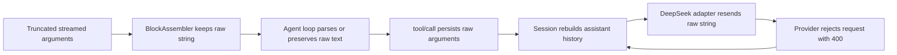

# Recover a Session from invalid tool-call JSON

If every follow-up in one DeepSeek Harness Session fails with `400 INVALID_REQUEST: Unterminated string`, but a new conversation works, the Session history may contain a streamed tool call whose `arguments` string is incomplete JSON.

Do not keep retrying the same Session. Export its log for evidence, start a clean Session, and preserve the old artifact without editing it in place.

> [!WARNING]
> This guide describes behavior verified at upstream commit `99f6f02`. It is a developer-preview bug path, not a supported log-repair procedure. Never replace or rewrite a Session artifact while a Harness process can still own it.

## Recognize the signature

The evidence is stronger when all of these are true:

- the first failure follows a streamed tool call;
- the provider reports `400 INVALID_REQUEST` with `Unterminated string`, `Expecting ',' delimiter`, or another JSON parse error;
- every later message in the **same Session** fails before useful model output;
- a **new conversation** using the same provider and workspace succeeds;
- the exported log contains a `tool/call` whose `data.arguments` is a string that does not pass `JSON.parse`.

Do not classify every provider 400 as a poisoned Session. Authentication, unsupported content, model selection, and context-window failures require different recovery.

## The verified failure chain



At the verified commit:

1. `BlockAssembler` concatenates `argumentsDelta` chunks and can assemble the accumulated string without JSON validation.
2. `parseArguments()` returns the original string when `JSON.parse` fails, so the invalid value reaches the tool scheduling path rather than becoming a parse error at this point.
3. `appendToolCall()` stores `block.arguments` verbatim in the durable `tool/call` event.
4. Session message derivation reconstructs model-visible assistant history from the log.
5. The DeepSeek serializer assigns the stored value directly to `tool_calls[].function.arguments`.
6. A schema-strict endpoint rejects that request. The durable record remains, so another follow-up reconstructs and sends the same invalid value again.

The host presenter is not the durable cause. At `99f6f02`, presenter parsing is contained and falls back to a generic card. Crash repair also does not heal this value: it closes interrupted tool, step, and turn tails; it does not rewrite committed tool arguments.

## Contain and preserve

### 1. Stop the current turn

Cancel the running turn. Confirm the provider usage graph stops changing. If the same Session is idle, do not send another test message just to reproduce the 400 again.

### 2. Export through the Web UI

In the Session header, choose **Session log**. The host flushes live Session state before streaming a ZIP. The root entry is a logical `session.jsonl`, even when the configured persistence artifact is physically stored as compressed Zstandard frames.

Keep the ZIP unchanged as the evidence copy. Before sharing, remove credentials, private prompts, file paths, and tool output that should not leave your environment.

### 3. Start a new conversation

Create a fresh Session in the same workspace. Do not use **Retry**, resume the poisoned Session, or branch from a completed turn that already includes the malformed call. Reconstruct only the minimum task context in a new prompt.

### 4. Prove the isolation

Use a bounded, read-only prompt that does not require the tool involved in the failure. Success in the new Session plus repeatable failure in the old Session isolates the durable history from the provider account and workspace.

### 5. Archive the old Session

Keep it available for diagnosis, but do not return it to normal use. Archiving in the UI hides a Session from the ordinary workspace list without deleting its log.

## Inspect the exported evidence safely

Work on a copy of the downloaded `session.jsonl`, not the live `.jsonl.zstd` artifact. Search for the last `tool/call` before the first 400 and validate only its arguments string.

Example of the relevant logical record:

```json
{"type":"tool/call","seq":42,"data":{"name":"read","arguments":"{\"file_path\":\"C:\\\\work\\\\file.ts"}}
```

The outer event can be valid JSON while `data.arguments` contains invalid inner JSON. A diagnostic script must therefore parse the outer line first, then parse `event.data.arguments` separately.

```js
import { readFile } from 'node:fs/promises'

const rows = (await readFile('session.jsonl', 'utf8')).trimEnd().split('\n')
for (const row of rows) {
  const event = JSON.parse(row)
  if (event.type !== 'tool/call') continue
  try {
    JSON.parse(event.data.arguments)
  } catch (error) {
    console.log({ seq: event.seq, name: event.data.name, error: String(error) })
  }
}
```

This script is read-only. It does not identify whether the provider, adapter, network, or cancellation produced the truncation; correlate the invalid call with preceding `assistant/chunk` events and the first terminal error.

## Do not perform these “repairs”

- Do not edit `session.jsonl.zstd` with a text editor. It is a concatenation of checksummed Zstandard frames, not plain JSONL.
- Do not decompress, rewrite, and replace an artifact under a running process. The backend permits one live writer per Session and validates storage identity, encoding, headers, and contiguous sequence numbers.
- Do not replace invalid arguments with `{}` and assume the original tool had no effects. The invalid value already entered the scheduling path; verify external state separately.
- Do not delete the only evidence copy before reporting upstream.
- Do not assume crash recovery will heal a committed malformed argument. Its documented repair scope is an interrupted tail.

## Report a minimal incident bundle

```text
Harness package version and source commit:
Operating system:
Provider route and model (no credential):
First failing turn and tool name:
Malformed tool/call seq and sanitized arguments:
Preceding tool-call-delta / block-end sequence:
First provider error code and message:
Does every later turn in the same Session fail?
Does a fresh Session succeed?
Session export captured before restart: yes/no
```

Keep the exact punctuation and character offset from the provider parse error. It can be matched against the malformed inner string without disclosing the full prompt.

## Primary sources

- [Upstream incident report #3234](https://github.com/deepseek-ai/deepseek-harness/discussions/3234)
- [`BlockAssembler` accumulation and assembly at `99f6f02`](https://github.com/deepseek-ai/deepseek-harness/blob/99f6f02fecdb7dff40c3fbc9470f5907c29f74ca/packages/llm/llm/src/assembler.ts)
- [Agent-loop argument parsing and durable `tool/call`](https://github.com/deepseek-ai/deepseek-harness/blob/99f6f02fecdb7dff40c3fbc9470f5907c29f74ca/packages/core/agent-loop/src/tool-calls.ts)
- [DeepSeek assistant-message serializer](https://github.com/deepseek-ai/deepseek-harness/blob/99f6f02fecdb7dff40c3fbc9470f5907c29f74ca/packages/llm/llm-deepseek/src/serialize.ts)
- [Session message derivation and fork semantics](https://github.com/deepseek-ai/deepseek-harness/blob/99f6f02fecdb7dff40c3fbc9470f5907c29f74ca/docs/subsystems/session.md)
- [JSONL/Zstandard persistence and crash recovery](https://github.com/deepseek-ai/deepseek-harness/blob/99f6f02fecdb7dff40c3fbc9470f5907c29f74ca/packages/session/session-persistence-jsonl/README.md)
- [Session export behavior](https://github.com/deepseek-ai/deepseek-harness/blob/99f6f02fecdb7dff40c3fbc9470f5907c29f74ca/packages/host/apiproxy/README.md)

