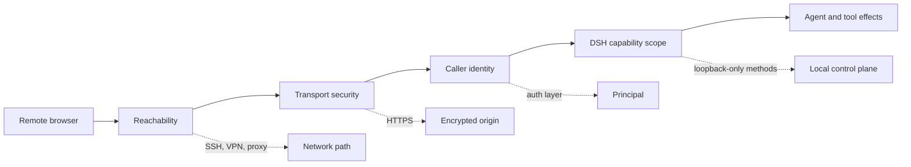

# Remote Web access is a control-plane decision

DeepSeek Harness rc.7 intentionally rejects:

```text
dsh web --host 0.0.0.0
error: --host 0.0.0.0 is intentionally not supported yet for safety:
it would expose remote code execution to the network; use 127.0.0.1 instead
```

This is not an unknown flag or a failed network bind. The shipped Web profile can create Agents with Bash and other Host effects, while its plain Node HTTP carrier supplies no TLS or authentication. A reachable page can therefore become a reachable command-execution control plane.

> [!WARNING]
> `--trusted-host` is a DNS-rebinding and same-origin trust declaration. It is not user authentication. A firewall rule, private LAN, VPN route, UUID polyfill, or rewritten `Host` header also does not authenticate a caller.

## rc.7 fixed one UUID path, not every UUID path

Earlier builds used browser-side `crypto.randomUUID()` on a core request path. A non-loopback page over plain HTTP could render static assets while RPC creation failed because that API normally requires a secure context.

The rc.7 **generic Connection RPC** carrier constructs UUIDs with `crypto.getRandomValues()`, which browsers expose on insecure origins, and has a regression test proving that path no longer requires secure-context `randomUUID`.

However, the Web UI also uses a typed `WebApiClient` inherited from `AbstractApiClient`. Its rc.7 `mintRpcId()` still calls `crypto.randomUUID()` before every typed unary request. That path includes `host.listDirectory`, `host.pickDirectory`, `workspace.create`, Session methods, Settings, credentials, model discovery, and other typed calls. Draft image attachment IDs also call `crypto.randomUUID()` directly.

| Browser path | rc.7 UUID source | Plain HTTP on non-loopback IP |
|---|---|---|
| Generic Connection RPC | `randomUuid()` → `crypto.getRandomValues()` | UUID generation works |
| Typed `WebApiClient` unary RPC | `AbstractApiClient.mintRpcId()` → `crypto.randomUUID()` | throws before `fetch()` |
| Draft image attachment | `browserDraftAttachment()` → `crypto.randomUUID()` | throws before upload |

So “the page connects” and even “generic RPC works” do not prove that workspace browsing, Settings, or draft attachments work. Do not carry an HTML UUID polyfill forward as the operational solution: use a loopback origin or trusted HTTPS. A code-level fallback fixes compatibility, but it still does not make direct remote exposure safe.

### Diagnose the exact failing carrier

On the failing page, capture:

```js
({
  href: location.href,
  secure: window.isSecureContext,
  randomUUID: typeof crypto.randomUUID,
  getRandomValues: typeof crypto.getRandomValues,
})
```

Then open DevTools Network, clear it, and trigger **Add workspace** once.

- `crypto.randomUUID is not a function` with **no** matching `/api/host.listDirectory` or `/api/host.pickDirectory` request means the browser threw while minting the typed RPC ID.
- An HTTP request that reaches the server and returns `403` belongs to the Host/Origin trust or loopback-only capability boundary instead.
- A request that stays pending or a socket that closes belongs to transport lifecycle, not UUID generation.
- A failure only after selecting an image can belong to the separate draft-attachment ID path.

The safe immediate recovery is to stop using the non-loopback HTTP origin. For one operator, use SSH local forwarding and open `http://127.0.0.1:3080`. For a browser-only deployment, use an authenticated HTTPS gateway and test capability scope independently.

The security boundary did **not** disappear:

- the CLI still refuses `--host 0.0.0.0`;
- the Web carrier still has no TLS or authentication;
- every `/api` request and WebSocket upgrade passes a Host and origin trust fence;
- configuration, credentials, directory selection, native open actions, and Agent-preset authoring remain loopback-only;
- a remote page is classified as non-loopback by its browser hostname, so some settings use memory scope rather than Host persistence.

## Four independent gates



Passing one gate proves nothing about the next:

| Gate | Evidence | Does not prove |
|---|---|---|
| Reachability | TCP connection and HTML response | encryption, identity, or authorization |
| Browser transport | core RPC and WebSocket stream work | an unauthorized client is rejected |
| API trust fence | Host and Origin are accepted | the human caller is authenticated |
| Capability scope | one remote method succeeds | loopback-only settings or credentials are available |

## Choose one topology

### A. SSH local forwarding: smallest remote boundary

Keep DSH on the remote host's loopback interface:

```sh
npx @deepseek-ai/dsh web --host 127.0.0.1 --port 3080
```

On the operator machine, create a local-only forward:

```sh
ssh -N -L 127.0.0.1:3080:127.0.0.1:3080 user@remote-host
```

Open `http://127.0.0.1:3080` locally. Both the remote DSH listener and local tunnel endpoint remain loopback-bound. The browser also sees a real loopback hostname, so the shipped loopback-only capability decisions stay coherent.

Use `ExitOnForwardFailure=yes` in automation and keep SSH authentication, host-key verification, account permissions, and lifecycle under normal operator control.

### B. Authenticated HTTPS gateway: deliberate product boundary

Use this only when multiple devices or browser-only clients require access. Keep the DSH backend on `127.0.0.1`; let a separately maintained gateway own:

- TLS termination and renewal;
- authenticated user identity;
- session expiry, revocation, and rate limiting;
- WebSocket and streaming proxy behavior;
- request and security audit logs;
- explicit rejection before any DSH route is reached.

Do not treat a `Host` or `Origin` rewrite as the security layer. Rewriting them to loopback may bypass the DSH trust fence and can expose methods that upstream intentionally keeps local. If a gateway changes those headers, the gateway's own authentication and authorization become the real control plane and must be tested as such.

Remote settings may still behave differently because the browser hostname is not loopback. Do not promise full local-UI parity unless the exact rc.7 capability matrix has been tested.

### C. Direct non-loopback binding: wait for an upstream contract

Do not patch the built CLI, generated frontend, trust list, or profile merely to make `0.0.0.0` accept connections. Those changes are overwritten by upgrades and can silently remove a deliberate safety refusal.

If an experimental composition enables an all-interfaces server, isolate it inside an authoritative outer boundary and treat it as a custom deployment, not the supported Web profile.

## Verify more than the home page

Use a disposable workspace and a test principal. Record every result.

### Before authentication

- `/` is rejected or redirected to the identity boundary;
- `/api` requests do not reach DSH;
- WebSocket upgrades are rejected;
- static plugin bundles do not leak deployment metadata beyond policy.

### After authentication

- the exact browser origin is HTTPS when using a gateway;
- workspace and model catalogs load;
- one bounded, read-only turn streams to completion;
- cancel and reconnect work;
- the gateway preserves WebSocket and streaming lifecycles;
- loopback-only settings, credentials, native actions, and preset authoring are unavailable unless an independently reviewed design intentionally mediates them.

### Revocation and isolation

- an expired or revoked session cannot reconnect;
- a second test user cannot see the first user's Sessions, workspace paths, or events;
- closing the gateway does not change the DSH listener from loopback;
- logs identify the authenticated principal without recording secrets or full prompts by default.

## Do not confuse the 3-second readiness guard with a stream abort

An rc.6 field report attributes `Signal timed out` on a slow Tailscale or Cloudflare path to `streamOpenTimeoutMs: 3_000`. The symptom is real and the timing is useful evidence, but the pinned rc.7 implementation does **not** abort `/api/events.mux` or `/api/events.host` when that timer wins.

The Connection controller starts both stream pumps, then waits for three readiness signals:

1. `host.describe()` must return successfully;
2. the mux stream should invoke `onOpen`;
3. the Host stream should invoke `onOpen`.

It races the two stream-open callbacks against a three-second sleep. If the sleep wins, the controller proceeds to `connected` after `host.describe()`; it leaves the generation and both pumps alive so late stream openings can still deliver events. The timer's `AbortController` only cancels the sleep when the streams open early. It is not the controller passed into either stream.

```text
start generation
  ├─ open events.mux ───────────────┐
  ├─ open events.host ──────────────┼─ keep pumping until stream loss/stop
  └─ host.describe + [both open OR 3 s guard]
                              └──────→ connected
```

This distinction changes the investigation. Raising the value to 15 seconds can change ordering and may hide a race elsewhere, but it does not prove that the three-second guard killed a healthy connection. Also, `Signal timed out` does not occur in the pinned Connection source, so capture the exact browser stack and the package/build identity that emits it before assigning ownership.

### Measure the opening path

Use browser Network timing and gateway logs to build one timeline for the same request ID or timestamp window:

| Segment | Evidence to capture | A slow result points toward |
|---|---|---|
| DNS + TCP + TLS | browser timing, tunnel relay status | network path or certificate handshake |
| Identity boundary | redirect chain, authentication duration | gateway or identity provider |
| Upgrade / first headers | WebSocket status and time to first headers | buffering, upgrade forwarding, backend reachability |
| `host.describe` | request start, response, status | unary RPC path, trust fence, or Host health |
| `events.mux` + `events.host` | open callback, first frame, close code | streaming carrier or proxy lifecycle |
| Session history | request/stream correlation and first render | downstream state load rather than stream opening |

Do not use successful HTML delivery as evidence that the event streams are healthy. Do not use a longer timeout as the only acceptance test.

### Safe operational response

- Prefer SSH local forwarding for one operator; it removes the remote gateway from the browser-to-DSH stream path.
- For an authenticated HTTPS gateway, verify WebSocket upgrades end to end, disable response buffering for streaming routes, and preserve close/error semantics.
- Compare the same disposable Session on loopback and through the tunnel. If only the tunnel fails, keep the gateway and relay timings with the report.
- Record the exact DSH version, built asset hash, browser, tunnel mode, direct-versus-relay state, console stack, stream status, and close code.
- Avoid editing generated JavaScript or silently increasing a bundled constant. A reproducible configuration experiment belongs in a source build with the changed value recorded.

### Regression matrix for a durable fix

If upstream changes readiness behavior, test 2.9-second, 3.1-second, and 15-second stream openings on both direct and relayed paths. Prove that:

- a late `onOpen` does not create a second connection generation;
- an early open cancels only the readiness sleep;
- stop or stream failure cancels both pumps and leaves no orphan connection;
- `host.describe` failure never becomes connected merely because the timer elapsed;
- history loading, reconnect, cancellation, and first live event remain ordered;
- diagnostics distinguish readiness-guard expiry, unary failure, stream close, and downstream history failure.

## Route common symptoms

| Symptom | First boundary |
|---|---|
| CLI refuses `--host 0.0.0.0` | Intentional rc.7 startup policy |
| Tunnel connects but local port refuses | Remote DSH listener, port, or SSH forward failure |
| Page loads but `/api` returns 403 | Host/Origin trust fence or loopback-only method |
| `crypto.randomUUID is not a function` and no typed `/api` request appears | rc.7 typed `WebApiClient` throws while minting the RPC ID; use localhost or HTTPS |
| Generic RPC works but Add workspace fails before network | Different UUID carriers; the generic fallback does not cover typed Host/Workspace calls |
| Image selection alone throws `randomUUID` | Draft attachment ID path still requires a secure origin in rc.7 |
| Core RPC works but settings do not persist | Remote browser classification and privileged capability scope |
| Static page works but events do not stream | WebSocket or streaming gateway configuration |
| `Signal timed out` near three seconds | Capture its stack first; the rc.7 readiness guard itself does not abort streams |
| Raising `streamOpenTimeoutMs` changes the symptom | Timing evidence, not root-cause proof; compare connection generations and stream lifecycle |
| Anyone on the network can open the page | Missing authentication; stop exposure immediately |
| Old guide says rc.7 removed every `randomUUID` call | Overbroad claim; inspect typed RPC and draft-attachment paths |

## Primary sources

- [Official Web CLI behavior](https://github.com/deepseek-ai/deepseek-harness/blob/99f6f02fecdb7dff40c3fbc9470f5907c29f74ca/apps/cli/reference/README.md#web-alias)
- [CLI refusal for all-interfaces binding](https://github.com/deepseek-ai/deepseek-harness/blob/99f6f02fecdb7dff40c3fbc9470f5907c29f74ca/packages/bundle/web-app/src/startup.ts)
- [Web carrier exposure contract](https://github.com/deepseek-ai/deepseek-harness/blob/99f6f02fecdb7dff40c3fbc9470f5907c29f74ca/docs/subsystems/web-server.md#configuration)
- [Connection trust and privileged-method contract](https://github.com/deepseek-ai/deepseek-harness/blob/99f6f02fecdb7dff40c3fbc9470f5907c29f74ca/packages/client/connection/README.md)
- [Host and origin trust implementation](https://github.com/deepseek-ai/deepseek-harness/blob/99f6f02fecdb7dff40c3fbc9470f5907c29f74ca/packages/client/connection/src/api-request-trust.ts)
- [Insecure-origin UUID implementation](https://github.com/deepseek-ai/deepseek-harness/blob/99f6f02fecdb7dff40c3fbc9470f5907c29f74ca/packages/client/connection/src/client/random-uuid.ts)
- [Regression test without secure-context `randomUUID`](https://github.com/deepseek-ai/deepseek-harness/blob/99f6f02fecdb7dff40c3fbc9470f5907c29f74ca/packages/client/connection/tests/client-apply.client.spec.ts#L284-L315)
- [Typed RPC `mintRpcId()` still using `crypto.randomUUID()` at rc.7](https://github.com/deepseek-ai/deepseek-harness/blob/99f6f02fecdb7dff40c3fbc9470f5907c29f74ca/packages/host/apiproxy/src/fetch/client.ts#L298-L300)
- [rc.7 browser `WebApiClient` inherits the typed carrier without overriding UUID minting](https://github.com/deepseek-ai/deepseek-harness/blob/99f6f02fecdb7dff40c3fbc9470f5907c29f74ca/packages/client/connection/src/client/web-api-client.ts)
- [Draft attachment UUID call at rc.7](https://github.com/deepseek-ai/deepseek-harness/blob/99f6f02fecdb7dff40c3fbc9470f5907c29f74ca/packages/client/ui-conversation/src/client/service.ts#L61-L68)
- [Plain-HTTP typed-RPC field report #3443](https://github.com/deepseek-ai/deepseek-harness/discussions/3443)
- [Connection readiness guard implementation](https://github.com/deepseek-ai/deepseek-harness/blob/99f6f02fecdb7dff40c3fbc9470f5907c29f74ca/packages/client/connection/src/client/connection.ts#L108-L151)
- [Readiness timeout regression test](https://github.com/deepseek-ai/deepseek-harness/blob/99f6f02fecdb7dff40c3fbc9470f5907c29f74ca/packages/client/connection/tests/connection.client.spec.ts#L215-L228)
- [Slow-link field report #3413](https://github.com/deepseek-ai/deepseek-harness/discussions/3413)
- [Official remote-listening discussion #76](https://github.com/deepseek-ai/deepseek-harness/discussions/76)
