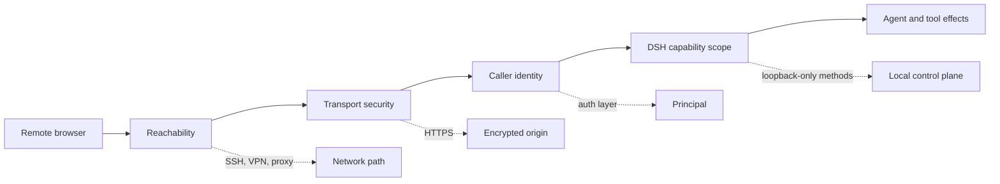

# Remote Web access is a control-plane decision

DeepSeek Harness rc.7 intentionally rejects:

```text
dsh web --host 0.0.0.0
error: --host 0.0.0.0 is intentionally not supported yet for safety:
it would expose remote code execution to the network; use 127.0.0.1 instead
```

This is not an unknown flag or a failed network bind. The shipped Web profile can create Agents with Bash and other Host effects, while its plain Node HTTP carrier supplies no TLS or authentication. A reachable page can therefore become a reachable command-execution control plane.

> [!WARNING]
> `--trusted-host` is a DNS-rebinding and same-origin trust declaration. It is not user authentication. A firewall rule, private LAN, VPN route, UUID polyfill, or rewritten `Host` header also does not authenticate a caller.

## What changed in rc.7

Earlier builds used browser-side `crypto.randomUUID()` on a core request path. A non-loopback page over plain HTTP could render static assets while RPC creation failed because that API normally requires a secure context.

The current Connection carrier constructs UUIDs with `crypto.getRandomValues()`, which browsers expose on insecure origins, and has a regression test proving RPC calls no longer require secure-context `randomUUID`. Do not carry the old HTML polyfill into rc.7 as a remote-access solution.

The security boundary did **not** disappear:

- the CLI still refuses `--host 0.0.0.0`;
- the Web carrier still has no TLS or authentication;
- every `/api` request and WebSocket upgrade passes a Host and origin trust fence;
- configuration, credentials, directory selection, native open actions, and Agent-preset authoring remain loopback-only;
- a remote page is classified as non-loopback by its browser hostname, so some settings use memory scope rather than Host persistence.

## Four independent gates



Passing one gate proves nothing about the next:

| Gate | Evidence | Does not prove |
|---|---|---|
| Reachability | TCP connection and HTML response | encryption, identity, or authorization |
| Browser transport | core RPC and WebSocket stream work | an unauthorized client is rejected |
| API trust fence | Host and Origin are accepted | the human caller is authenticated |
| Capability scope | one remote method succeeds | loopback-only settings or credentials are available |

## Choose one topology

### A. SSH local forwarding: smallest remote boundary

Keep DSH on the remote host's loopback interface:

```sh
npx @deepseek-ai/dsh web --host 127.0.0.1 --port 3080
```

On the operator machine, create a local-only forward:

```sh
ssh -N -L 127.0.0.1:3080:127.0.0.1:3080 user@remote-host
```

Open `http://127.0.0.1:3080` locally. Both the remote DSH listener and local tunnel endpoint remain loopback-bound. The browser also sees a real loopback hostname, so the shipped loopback-only capability decisions stay coherent.

Use `ExitOnForwardFailure=yes` in automation and keep SSH authentication, host-key verification, account permissions, and lifecycle under normal operator control.

### B. Authenticated HTTPS gateway: deliberate product boundary

Use this only when multiple devices or browser-only clients require access. Keep the DSH backend on `127.0.0.1`; let a separately maintained gateway own:

- TLS termination and renewal;
- authenticated user identity;
- session expiry, revocation, and rate limiting;
- WebSocket and streaming proxy behavior;
- request and security audit logs;
- explicit rejection before any DSH route is reached.

Do not treat a `Host` or `Origin` rewrite as the security layer. Rewriting them to loopback may bypass the DSH trust fence and can expose methods that upstream intentionally keeps local. If a gateway changes those headers, the gateway's own authentication and authorization become the real control plane and must be tested as such.

Remote settings may still behave differently because the browser hostname is not loopback. Do not promise full local-UI parity unless the exact rc.7 capability matrix has been tested.

### C. Direct non-loopback binding: wait for an upstream contract

Do not patch the built CLI, generated frontend, trust list, or profile merely to make `0.0.0.0` accept connections. Those changes are overwritten by upgrades and can silently remove a deliberate safety refusal.

If an experimental composition enables an all-interfaces server, isolate it inside an authoritative outer boundary and treat it as a custom deployment, not the supported Web profile.

## Verify more than the home page

Use a disposable workspace and a test principal. Record every result.

### Before authentication

- `/` is rejected or redirected to the identity boundary;
- `/api` requests do not reach DSH;
- WebSocket upgrades are rejected;
- static plugin bundles do not leak deployment metadata beyond policy.

### After authentication

- the exact browser origin is HTTPS when using a gateway;
- workspace and model catalogs load;
- one bounded, read-only turn streams to completion;
- cancel and reconnect work;
- the gateway preserves WebSocket and streaming lifecycles;
- loopback-only settings, credentials, native actions, and preset authoring are unavailable unless an independently reviewed design intentionally mediates them.

### Revocation and isolation

- an expired or revoked session cannot reconnect;
- a second test user cannot see the first user's Sessions, workspace paths, or events;
- closing the gateway does not change the DSH listener from loopback;
- logs identify the authenticated principal without recording secrets or full prompts by default.

## Route common symptoms

| Symptom | First boundary |
|---|---|
| CLI refuses `--host 0.0.0.0` | Intentional rc.7 startup policy |
| Tunnel connects but local port refuses | Remote DSH listener, port, or SSH forward failure |
| Page loads but `/api` returns 403 | Host/Origin trust fence or loopback-only method |
| Core RPC works but settings do not persist | Remote browser classification and privileged capability scope |
| Static page works but events do not stream | WebSocket or streaming gateway configuration |
| Anyone on the network can open the page | Missing authentication; stop exposure immediately |
| Old guide says to add `randomUUID` polyfill | Stale pre-rc.7 browser workaround |

## Primary sources

- [Official Web CLI behavior](https://github.com/deepseek-ai/deepseek-harness/blob/99f6f02fecdb7dff40c3fbc9470f5907c29f74ca/apps/cli/reference/README.md#web-alias)
- [CLI refusal for all-interfaces binding](https://github.com/deepseek-ai/deepseek-harness/blob/99f6f02fecdb7dff40c3fbc9470f5907c29f74ca/packages/bundle/web-app/src/startup.ts)
- [Web carrier exposure contract](https://github.com/deepseek-ai/deepseek-harness/blob/99f6f02fecdb7dff40c3fbc9470f5907c29f74ca/docs/subsystems/web-server.md#configuration)
- [Connection trust and privileged-method contract](https://github.com/deepseek-ai/deepseek-harness/blob/99f6f02fecdb7dff40c3fbc9470f5907c29f74ca/packages/client/connection/README.md)
- [Host and origin trust implementation](https://github.com/deepseek-ai/deepseek-harness/blob/99f6f02fecdb7dff40c3fbc9470f5907c29f74ca/packages/client/connection/src/api-request-trust.ts)
- [Insecure-origin UUID implementation](https://github.com/deepseek-ai/deepseek-harness/blob/99f6f02fecdb7dff40c3fbc9470f5907c29f74ca/packages/client/connection/src/client/random-uuid.ts)
- [Regression test without secure-context `randomUUID`](https://github.com/deepseek-ai/deepseek-harness/blob/99f6f02fecdb7dff40c3fbc9470f5907c29f74ca/packages/client/connection/tests/client-apply.client.spec.ts#L284-L315)
- [Official remote-listening discussion #76](https://github.com/deepseek-ai/deepseek-harness/discussions/76)
