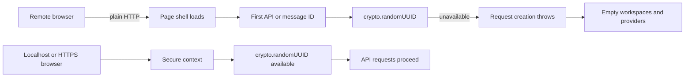

# Remote Web UI fails over plain HTTP

Use this guide when the DeepSeek Harness page shell opens from another device, but workspaces, providers, sessions, or messages do not load and the browser console reports:

```text
crypto.randomUUID is not a function
```

This symptom is not a provider failure. It occurs earlier, in the browser transport and client layers.

> [!WARNING]
> Do not expose the Web profile directly to an untrusted network. At the verified revision, the upstream Web server has no TLS, authentication, or origin policy, and the CLI deliberately rejects `--host 0.0.0.0` because network exposure can provide remote-code-execution capability. HTTPS fixes the browser secure-context problem; it does not add application authentication or make an unsafe bind safe.

## Why the page can render while its data stays empty



The Web client creates identifiers before sending RPC requests and messages. The verified source contains direct browser-side calls in the API proxy client, connection client, conversation UI, and command client. When a browser does not expose `crypto.randomUUID`, request construction fails before the server can return workspace or provider data.

`http://127.0.0.1` and `http://localhost` receive special browser treatment. `http://192.168.x.x`, a Tailscale IP, or another non-loopback address is not equivalent merely because the network is private.

## Confirm the failing layer

Run these checks in the browser that fails:

```js
window.isSecureContext
typeof globalThis.crypto?.randomUUID
```

The affected path normally produces:

```text
false
"undefined"
```

Then compare the same Harness process from the host machine through its loopback URL. If localhost works while the remote plain-HTTP URL shows the signature above, do not rotate API keys or reinstall providers: those layers have not been reached.

Also record:

```text
Harness version or commit:
Browser and version:
Working URL origin:
Failing URL origin:
window.isSecureContext:
typeof crypto.randomUUID:
First console stack trace:
```

## Choose a safe recovery path

### 1. Keep the default loopback posture

Use the Web UI on the same machine through the printed localhost URL. This is the smallest supported exposure boundary and the right default when remote access is not required.

### 2. Put a trusted HTTPS boundary in front

If remote access is required, terminate HTTPS through infrastructure you control and restrict who can reach it. Preserve WebSocket and streaming behavior, and add access control appropriate to a service capable of executing Agent tools.

The acceptance test is not just “the page opens.” From the remote browser, verify all of the following:

- `window.isSecureContext === true`;
- `typeof crypto.randomUUID === "function"`;
- workspace and provider requests complete;
- a disposable, read-only Agent turn streams successfully;
- an unauthorized client cannot reach the service.

### 3. Wait for an upstream compatibility fix

A UUID fallback can make request construction work in browsers without `crypto.randomUUID`, but that only repairs compatibility. It does not address the Web server's missing TLS, authentication, or origin controls. Treat a local HTML polyfill as a diagnostic experiment, not as evidence that direct network exposure is production-safe.

## Avoid misleading fixes

| Attempt | Why it is insufficient |
|---|---|
| Rotate the model API key | The exception occurs before the provider request is constructed. |
| Clear sessions | Session persistence is downstream of the failed browser RPC. |
| Bind to all interfaces and keep HTTP | It increases exposure and retains the insecure-context failure. |
| Add only a UUID polyfill | It bypasses one browser capability check without supplying transport security or access control. |
| Confirm only that HTML renders | Static shell delivery does not prove the API, SSE, or WebSocket paths work. |

## Report upstream with useful evidence

The upstream report should distinguish two independent contracts:

1. **Browser compatibility:** client code either requires a secure context explicitly or supplies a tested UUID implementation.
2. **Deployment security:** non-loopback access needs an intentional TLS, trust, and authentication story before it is presented as safe.

Include the browser probes and the first failing stack trace. Do not include provider keys, private hostnames, Tailscale identities, or workspace contents.

## Primary sources

- [Upstream report: remote plain-HTTP Web GUI fails at `crypto.randomUUID`](https://github.com/deepseek-ai/deepseek-harness/discussions/1642)
- [API proxy browser client: direct `crypto.randomUUID()` call](https://github.com/deepseek-ai/deepseek-harness/blob/47f943859bef60e4160492346772ded9b24f765a/packages/host/apiproxy/src/fetch/client.ts#L299-L301)
- [Web server exposure contract](https://github.com/deepseek-ai/deepseek-harness/blob/47f943859bef60e4160492346772ded9b24f765a/docs/subsystems/web-server.md#configuration)
- [CLI rejection of all-interfaces binding](https://github.com/deepseek-ai/deepseek-harness/blob/47f943859bef60e4160492346772ded9b24f765a/packages/bundle/web-app/src/startup.ts#L60-L72)
- [W3C Web Cryptography Level 2: `Crypto.randomUUID`](https://www.w3.org/TR/webcrypto-2/#Crypto-method-randomUUID)
