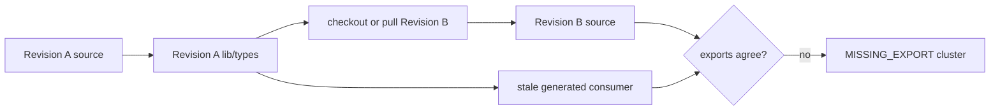

# Fix `MISSING_EXPORT` errors in a source build

Use this runbook when `pnpm run build` reaches `build:lib`, then Rolldown reports several errors like:

```text
[MISSING_EXPORT] "resolveSessionPreset" is not exported by
"../../preset/agent-presets/src/index.ts"

lib/types/api-proxy.js imports ... from @deepseek-ai/dsh-agent-presets
```

When generated `lib/types/*.js` expects symbols that the checked-out `src/index.ts` does not export, treat the build tree as **revision-mixed**. Do not add exports to current source merely to satisfy an old generated importer.

## Prove the mismatch before deleting anything

From the repository root, capture:

```sh
git status --short --branch
git rev-parse HEAD
node --version
pnpm --version
pnpm run build 2>&1 | tee dsh-build.log
```

On PowerShell, use `Tee-Object dsh-build.log` instead of `tee` if no compatible `tee` is installed.

For the first missing symbols, compare their generated importers and current owners:

```sh
rg -n "resolveSessionPreset" lib packages/preset/agent-presets/src
rg -n "ApiRemoteSessionNotFound|createApiRemoteAgentResolver" \
  lib packages/api/remotes/src
```

The decisive shape is:

```text
generated lib/types consumer: imports symbol
current package src/index.ts: does not export symbol
```

One missing export can be a real source defect. A cluster spanning several owner packages, all imported by generated `lib/types/api-proxy.js`, is stronger evidence that output and source came from different revisions.

## Why branch changes expose it



At alpha.1 commit `cd5ef814`, `packages/preset/agent-presets/src/index.ts` no longer exports `resolveSessionPreset`, and `packages/api/remotes/src/index.ts` no longer exports the Host resolver symbols named in report #4824. The failing generated `lib/types/api-proxy.js` still imports them. That pair cannot describe one clean alpha.1 build.

The root build runs the library build before the Web build. Its TypeScript and bundling stages consume generated package outputs, so a stale consumer can fail before current outputs converge.

## Safe clean and rebuild

First preserve user work. `pnpm clean` is repository-output cleanup, not a substitute for inspecting a dirty worktree:

```sh
git status --short
git diff --check
```

If the worktree contains intentional source edits, commit or otherwise preserve them according to your workflow. Do not discard them to fix generated output.

Then run the repository-owned sequence:

```sh
pnpm clean
pnpm install --frozen-lockfile
pnpm run build
```

Use the pnpm version declared by the checked-out root `package.json`. At alpha.1 that is `pnpm@11.7.0`, and Node must satisfy `^22.19.0 || >=24.0.0`.

The official cleaner derives output directories from the root TypeScript project-reference graph. It removes each emitting project's complete `lib` root, root incremental state, known native incremental state, and safe manifest-less package residue. It preserves live package-local `node_modules` directories and refuses to delete an orphan package directory containing unknown files.

`pnpm install --frozen-lockfile` proves that workspace links and installed dependency identity still match the checked-out lockfile. If it reports lockfile drift, stop and resolve the source/lockfile revision rather than installing an unrecorded graph.

## Read the result

| Result | Interpretation | Next action |
|---|---|---|
| clean rebuild passes | stale generated output was causal | run the intended test/start command and retain the log |
| same missing exports return | source or workspace resolution still disagrees | capture HEAD, lockfile identity, and resolved package paths |
| missing symbols change | another output/cache owner remains | compare the new first importer and owner |
| frozen install fails | manifest and lockfile revisions disagree | align the intended revision without discarding user edits |
| clean refuses an unsafe orphan | unknown files exist in a manifest-less package directory | inspect and preserve them; do not bypass the cleaner |
| build reaches Web and fails there | library mismatch is fixed | route the frontend error separately |

## Verification gates

1. `git rev-parse HEAD` names the intended revision.
2. `git status --short` contains no unexplained source or manifest changes.
3. Node and pnpm satisfy the root contract.
4. `pnpm clean` succeeds without an unsafe-orphan refusal.
5. Frozen installation succeeds without changing the lockfile.
6. The rebuilt generated importer agrees with every current package export.
7. `pnpm run build` completes both `build:lib` and `build:web`.
8. Starting DSH reports the expected source or release identity.

## What not to do

- Do not edit `lib/types/api-proxy.js`; the next build replaces it.
- Do not re-export removed internal APIs without an upstream contract.
- Do not recursively delete the repository or user-level pnpm stores.
- Do not run `git reset --hard` or discard a dirty worktree to clear caches.
- Do not use `--no-frozen-lockfile` merely to make a mixed checkout install.
- Do not classify every single missing export as stale output; verify importer/owner evidence.

## Useful upstream evidence

Share a sanitized bundle containing:

```text
HEAD and branch:
last branch/tag switch:
git status --short:
Node and pnpm versions:
first three MISSING_EXPORT names:
generated importer paths:
current owner index paths:
pnpm clean result:
frozen install result:
first clean-build failure:
```

## Verification boundary

The build order, package-manager contract, cleaner scope, and changed export surfaces are source-verified at alpha.1 commit [`cd5ef814`](https://github.com/deepseek-ai/deepseek-harness/tree/cd5ef8148158c3a752a658978873241fdf8e2bbc). The seven-error Windows build is a community report; this handbook did not reproduce its local checkout or filesystem.

## Pinned official sources

- [Alpha.1 root build and runtime contract](https://github.com/deepseek-ai/deepseek-harness/blob/cd5ef8148158c3a752a658978873241fdf8e2bbc/package.json)
- [Alpha.1 complete build driver](https://github.com/deepseek-ai/deepseek-harness/blob/cd5ef8148158c3a752a658978873241fdf8e2bbc/scripts/build.ts)
- [Alpha.1 repository cleaner](https://github.com/deepseek-ai/deepseek-harness/blob/cd5ef8148158c3a752a658978873241fdf8e2bbc/scripts/clean.ts)
- [Alpha.1 agent-presets public surface](https://github.com/deepseek-ai/deepseek-harness/blob/cd5ef8148158c3a752a658978873241fdf8e2bbc/packages/preset/agent-presets/src/index.ts)
- [Alpha.1 API remotes public surface](https://github.com/deepseek-ai/deepseek-harness/blob/cd5ef8148158c3a752a658978873241fdf8e2bbc/packages/api/remotes/src/index.ts)
- [Community source-build report #4824](https://github.com/deepseek-ai/deepseek-harness/discussions/4824)
