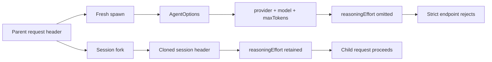

# Spawn subagent drops reasoning effort

Use this runbook when a parent Agent can call a reasoning model successfully, but every fresh `subagent` delegation fails with a provider response such as:

```text
400 {"code":"1210","message":"This model always engages in thinking and cannot be disabled; please use low, high, or max"}
```

On DeepSeek Harness `0.1.1-rc.2`, the in-process `spawn` route inherits the parent's provider, model, and output-token cap, but not its selected `reasoningEffort`. A provider that permits omission may hide the gap. A provider that requires an explicit thinking level rejects the child's first request.

This is a child-route fidelity failure. It is not proof that the parent model setting is invalid.

## Recognize the exact boundary

| Observation | Meaning |
|---|---|
| parent `request/header` contains `reasoningEffort` | the parent route is configured |
| spawned child uses the same provider and model | basic route inheritance worked |
| spawned child header omits `reasoningEffort` | the effort field was lost before dispatch |
| `subagent_fork` retains the effort | the forked Session carried its persisted header |
| parent only receives `Error: subagent run failed` | the in-process result dropped the provider diagnostic |

Do not diagnose from the parent-facing headline alone. Preserve both Session IDs and compare their first durable `request/header` events.

## Why spawn and fork diverge



The rc.2 source has four connected gaps:

1. `AgentOptions` has fields for `provider`, `model`, and `maxTokens`, but no `reasoningEffort` field.
2. `resolveChildAgentOptions()` can therefore inherit only those three route values for a fresh child.
3. A fresh loop seeds its first request from `AgentOptions` and has no persisted child header from which to restore effort.
4. `readResult()` returns the stop reason and partial output but does not populate `SubagentResult.diagnostic`, so the parent loses the endpoint message.

The fork provider starts from copied Session history. Its existing request header carries the effort across the same boundary, which is why it is a useful control experiment.

## Capture a bounded proof

Use a disposable task that does not write files or call external systems.

```text
Return exactly: CHILD_ROUTE_OK
```

Run it once through the configured spawn-backed `subagent` tool and, only if the preset exposes it, once through `subagent_fork`. Record:

```text
DSH version:
parent Session ID:
child Session ID:
delegation tool name:
provider implementation: spawn | fork | other
parent request/header provider:
parent request/header model:
parent request/header reasoningEffort:
child first request/header provider:
child first request/header model:
child first request/header reasoningEffort:
child turn/end reason:
sanitized provider status and code:
```

The decisive reproduction is the same parent route and same task with one changed delegation provider. Do not publish API keys, full prompts, raw headers, or unrelated Session content.

## Contain the failure safely

Choose the smallest reversible option that fits the task.

### Use fork as a controlled workaround

If the current preset exposes `subagent_fork` and the child may inherit completed parent context, use it for the bounded task. Fork and spawn do not have identical privacy, context, or token-cost properties. Do not switch silently for work that requires a fresh standalone prompt.

### Route spawn to a model that permits omission

Configure a distinct spawn-backed tool instance with an explicit `agentOptions` provider and model whose contract accepts an omitted effort. This restores delegation but changes model behavior and cost. Verify the child's actual header and output rather than assuming the configured row mounted.

At rc.2, `tool-subagent` documents only `provider`, `model`, and positive `maxTokens` inside `agentOptions`. Adding an undocumented `reasoningEffort` key to that row is not a supported workaround.

### Keep the parent on the strict model

Do not disable thinking globally just to make delegation pass. A separate child route preserves the parent's chosen model while keeping the workaround explicit and removable.

## Avoid misleading repairs

- Do not rotate a valid API key. Authentication already reached a semantic provider error.
- Do not retry the same spawn call indefinitely. The missing field is deterministic.
- Do not raise `maxTokens`. Output budget and reasoning selection are separate route fields.
- Do not infer the child effort from the Web model picker. Inspect the child header.
- Do not treat a successful fork as proof that fresh spawn is fixed.
- Do not paste the provider response without the child route evidence. The same status can have other configuration causes.

## Runtime repair contract

A durable upstream repair should:

1. add an optional adapter-owned reasoning-effort ID to `AgentOptions`;
2. inherit it in `resolveChildAgentOptions()` with explicit child overrides taking precedence;
3. seed a fresh loop from that option while preserving a matching persisted header's precedence;
4. define how adapter defaults interact with explicit inherited effort;
5. carry the child's terminal LLM diagnostic into `SubagentResult.diagnostic`;
6. preserve the exact provider error in the parent-facing failed tool result; and
7. keep per-delegation effort separate from parent-effort inheritance.

Per-delegation selection is a separate product surface. Fixing inheritance does not automatically add a `reasoningEffort` field to the model-facing tool schema.

## Regression gates

- [ ] spawn inherits provider, model, max tokens, and explicit effort;
- [ ] a child override wins over the inherited effort;
- [ ] omission remains omission when the parent has no explicit effort;
- [ ] adapter defaults remain distinguishable from explicit selection;
- [ ] a strict-thinking endpoint receives an accepted value;
- [ ] a resumed child restores the matching persisted header;
- [ ] a changed provider or model does not reuse stale effort;
- [ ] fork retains its existing header behavior;
- [ ] parent and child headers are independently observable;
- [ ] provider status, code, and message reach the parent diagnostic;
- [ ] partial child output remains available on terminal failure;
- [ ] unsupported effort fails before provider network I/O;
- [ ] per-delegation override behavior is either supported and tested or rejected by schema; and
- [ ] the workaround can be removed without changing the parent route.

## Primary sources

- [Official Discussion #4666](https://github.com/deepseek-ai/deepseek-harness/discussions/4666)
- [rc.2 AgentOptions](https://github.com/deepseek-ai/deepseek-harness/blob/b150a551b8d465e31e418e1b2eaf5e79bbb7d28e/packages/core/agent/src/runtime-types.ts)
- [rc.2 child route resolution](https://github.com/deepseek-ai/deepseek-harness/blob/b150a551b8d465e31e418e1b2eaf5e79bbb7d28e/packages/subagent/subagent/src/child-agent.ts)
- [rc.2 first-request seed](https://github.com/deepseek-ai/deepseek-harness/blob/b150a551b8d465e31e418e1b2eaf5e79bbb7d28e/packages/core/agent-loop/src/agent.ts)
- [rc.2 in-process result projection](https://github.com/deepseek-ai/deepseek-harness/blob/b150a551b8d465e31e418e1b2eaf5e79bbb7d28e/packages/subagent/subagent-in-process-driver/src/index.ts)
- [rc.2 delegation tool contract](https://github.com/deepseek-ai/deepseek-harness/blob/b150a551b8d465e31e418e1b2eaf5e79bbb7d28e/packages/subagent/tool-subagent/README.md)

## Related handbook guides

- [Set reasoning effort for headless runs](../guides/headless-reasoning-effort.md)
- [Understand Session model and deployment default coupling](session-model-default-coupling.md)
- [Bound subagent scale](../agent-patterns/subagents.md)
