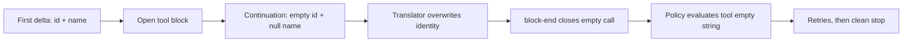

# Diagnose empty tool names in streamed calls

If a DeepSeek Harness Agent reports that tool `""` is disabled, retries, and then exits with no useful output, inspect the provider stream before changing tool policy. An OpenAI-compatible gateway may be overwriting the real tool identity with empty values in continuation deltas.

This guide separates a provider-stream compatibility defect from a disabled tool, malformed arguments, and a poisoned Session.

> [!WARNING]
> The source path below is verified at upstream commit `99f6f02` (rc.7). The two-line source repair discussed in the incident is not part of a published release at the verification date. Do not patch a global installation in place.

## Recognize the signature

The diagnosis is strong when all of these are true:

- the first streamed `tool_calls[]` delta contains a real `id` and `function.name`;
- later deltas for the same `index` contain `id: ""` and `function.name: null`;
- the completed `tool/call` has an empty `callId` and `name`;
- policy reports `tool "" is disabled` even though the intended tool is enabled;
- the Agent may retry and finish with `stop`, no answer, and no stderr failure;
- a route whose continuation deltas omit identity fields works with the same profile and tools.

This is not the same as an unknown real tool name. If the assembled event says `name: "read"`, diagnose registration and policy instead.

## The identity-clobber chain



At `99f6f02`, the DeepSeek translator updates an open tool block whenever the wire field is not `undefined`:

```ts
if (call.id !== undefined) block.callId = call.id
if (call.function?.name !== undefined) block.name = call.function.name
```

That handles the official omission shape, but an explicit empty value also passes the guard. A continuation carrying `id: ""` replaces the captured call ID. A `null` name reaches this runtime path as a defined value and replaces the name. `closeBlock()` then normalizes the missing identity to empty strings.

`BlockAssembler` treats `block-end` as authoritative and follows a first-close-wins contract. The earlier valid delta cannot repair the completed empty block after that close.

## Capture three pieces of evidence

### Wire shape

Capture sanitized provider SSE or gateway logs for one call index. Preserve ordering and the distinction between omitted, empty-string, and `null` fields.

```json
{"index":0,"id":"call_8f2","function":{"name":"read","arguments":""}}
{"index":0,"id":"","function":{"name":null,"arguments":"{\"path\":"}}
{"index":0,"id":"","function":{"name":null,"arguments":"\"README.md\"}"}}
```

Do not publish authorization headers, prompts, file contents, or full gateway logs.

### Session events

Export the Session log and correlate the same call index across the raw chunk and completed event. The decisive contrast is:

```text
assistant/chunk  tool-call-delta  id="call_8f2"  name="read"
assistant/chunk  tool-call-delta  id=""          name omitted
tool/call        callId=""        name=""
```

The event names and envelope fields can vary by export projection. Preserve the raw rows rather than rewriting them into this display form.

### Route A/B

Use the same bounded, read-only prompt with the same profile and tool catalog through two authorized routes:

1. the affected gateway that emits explicit empty continuation identity;
2. a route that omits `id` and `name` after the first delta.

If only the first route produces an empty assembled name, the evidence points to stream-shape compatibility rather than tool registration.

## Safe operator actions

1. Stop repeated retries. They add noise and can consume budget without producing a tool result.
2. Save the Session export and sanitized wire sequence before switching routes.
3. Route the workload through a backend that omits identity fields on continuation deltas, if one is already authorized.
4. Start a fresh Session for the verification prompt. Do not infer recovery from a Session that already contains failed attempts.
5. Pin the working route and Harness version until a source fix and regression test ship.

Do not enable a tool whose name is empty. Policy is correctly refusing an unidentified effect. Do not weaken approval, sandbox, or tool allowlists to make the error disappear.

## Source repair and regression shape

The incident proposes retaining only non-empty identity updates:

```ts
if (call.id) block.callId = call.id
if (call.function?.name) block.name = call.function.name
```

The important regression is not a single happy-path chunk. It must feed at least two deltas for one index:

1. first delta: non-empty `id` and `name`;
2. continuation: `id: ""`, `name: null`, and an argument fragment;
3. terminal finish and `[DONE]`;
4. assert the final block retains the original identity and concatenates all arguments.

Also test a stream that never supplies identity. Hardening should surface that as an explicit protocol error rather than silently presenting a successful empty turn.

## Acceptance gate

- [ ] A normal multi-delta tool call still assembles its full arguments.
- [ ] Empty or null continuation identity does not overwrite the first non-empty identity.
- [ ] Two interleaved tool-call indexes retain independent IDs and names.
- [ ] A call that never supplies a usable name fails loudly before policy evaluation.
- [ ] The Session event records the same non-empty identity that reaches execution.
- [ ] Headless and Web surfaces expose the same protocol failure.
- [ ] No credential or private prompt is present in the incident bundle.

## Minimal report bundle

```text
Harness package version and source commit:
Profile and tools mode:
Provider route and model (no credential):
Gateway implementation and version:
Sanitized deltas for one tool-call index:
Assembled tool/call identity:
Policy or terminal message:
Finish reason:
Same prompt succeeds through omission-style route: yes/no
Fresh Session tested: yes/no
```

## Primary sources

- [Upstream report #3281](https://github.com/deepseek-ai/deepseek-harness/discussions/3281)
- [DeepSeek stream translator at `99f6f02`](https://github.com/deepseek-ai/deepseek-harness/blob/99f6f02fecdb7dff40c3fbc9470f5907c29f74ca/packages/llm/llm-deepseek/src/translate.ts)
- [Translator tests at `99f6f02`](https://github.com/deepseek-ai/deepseek-harness/blob/99f6f02fecdb7dff40c3fbc9470f5907c29f74ca/packages/llm/llm-deepseek/tests/translate.spec.ts)
- [`BlockAssembler` close contract](https://github.com/deepseek-ai/deepseek-harness/blob/99f6f02fecdb7dff40c3fbc9470f5907c29f74ca/packages/llm/llm/src/assembler.ts)
- [Stream chunk protocol](https://github.com/deepseek-ai/deepseek-harness/blob/99f6f02fecdb7dff40c3fbc9470f5907c29f74ca/packages/llm/llm/src/types.ts)

