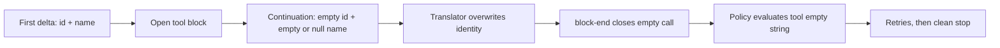

# Fix `UNKNOWN_TOOL` from empty streamed tool identity

If every DeepSeek Harness tool call fails as `UNKNOWN_TOOL`, `unknown tool ""`, or `tool "" is disabled` while ordinary chat still works, inspect the provider stream before changing tool policy. An OpenAI-compatible endpoint may emit a valid tool name and ID in the first delta, then overwrite them with explicit empty values in continuation deltas.

This guide now covers two verified incidents:

- an rc.7 gateway stream whose continuation deltas used an empty ID and `null` name; and
- Alibaba Cloud Bailian (DashScope) `deepseek-v4-flash` on rc.8, whose continuation deltas use empty strings for both ID and name.

The second case is especially easy to misdiagnose because the same DSH tools work through the official DeepSeek API, Bailian Qwen models work, and Bailian's non-streaming response contains the correct function identity.

> [!WARNING]
> The current source path is verified at upstream commit `141eb6f` (rc.8). The two-line hardening is not part of rc.8. Do not patch generated `lib/` files or a global `node_modules` installation in place; an upgrade will overwrite the edit and leave no reviewable source change.

## Current rc.8 Bailian signature

The diagnosis is strong when this complete A/B holds:

| Probe | Bailian `deepseek-v4-flash` | Control |
|---|---|---|
| normal chat | succeeds | succeeds |
| non-streaming function call | contains non-empty `id` and `name` | succeeds |
| streaming first tool delta | contains non-empty `id` and `name` | succeeds |
| streaming continuation | emits `id: ""`, `name: ""` | omits unchanged identity |
| final DSH tool call | empty identity, `UNKNOWN_TOOL` | executes normally |

Use the same sanitized, read-only tool schema and prompt for every route. The useful controls reported in #3464 are the official DeepSeek endpoint with the same model family and Bailian Qwen through the same compatible endpoint. They separate a model/endpoint stream shape from DSH tool registration.

## Recognize the signature

The diagnosis is strong when all of these are true:

- the first streamed `tool_calls[]` delta contains a real `id` and `function.name`;
- later deltas for the same `index` contain `id: ""` and `function.name: ""` or `null`;
- the completed `tool/call` has an empty `callId` and `name`;
- policy reports `tool "" is disabled` even though the intended tool is enabled;
- the Agent may retry and finish with `stop`, no answer, and no stderr failure;
- a route whose continuation deltas omit identity fields works with the same profile and tools.

This is not the same as an unknown real tool name. If the assembled event says `name: "read"`, diagnose registration and policy instead.

## The identity-clobber chain



At rc.8 commit `141eb6f`, the DeepSeek translator updates an open tool block whenever the wire field is not `undefined`:

```ts
if (call.id !== undefined) block.callId = call.id
if (call.function?.name !== undefined) block.name = call.function.name
```

That handles the official omission shape, but an explicit empty value also passes the guard. A continuation carrying `id: ""` replaces the captured call ID. Bailian also supplies `function.name: ""`, which replaces the captured name. A gateway that supplies `null` can reach the same failure through a lenient wire boundary. `closeBlock()` then emits the overwritten identity in the completed tool block.

`BlockAssembler` ignores a falsy empty name on intermediate `tool-call-delta` chunks, but `block-end` is authoritative and follows a first-close-wins contract. The translator's completed empty block therefore wins over the earlier valid delta. The policy layer receives no usable tool name and correctly refuses to execute an unidentified effect.

## Capture three pieces of evidence

### Wire shape

Capture sanitized provider SSE or gateway logs for one call index. Preserve ordering and the distinction between omitted, empty-string, and `null` fields.

```json
{"index":0,"id":"call_8f2","function":{"name":"read","arguments":""}}
{"index":0,"id":"","function":{"name":"","arguments":"{\"path\":"}}
{"index":0,"id":"","function":{"name":"","arguments":"\"README.md\"}"}}
```

Do not publish authorization headers, prompts, file contents, or full gateway logs.

### Session events

Export the Session log and correlate the same call index across the raw chunk and completed event. The decisive contrast is:

```text
assistant/chunk  tool-call-delta  id="call_8f2"  name="read"
assistant/chunk  tool-call-delta  id=""          name omitted
tool/call        callId=""        name=""
```

The event names and envelope fields can vary by export projection. Preserve the raw rows rather than rewriting them into this display form. If the final `tool/call` still has the real name, this guide does not explain the later failure.

### Route A/B

Use the same bounded, read-only prompt with the same profile and tool catalog through two authorized routes:

1. the affected gateway that emits explicit empty continuation identity;
2. a route that omits unchanged `id` and `name` after the first delta.

If only the first route produces an empty assembled name, the evidence points to stream-shape compatibility rather than tool registration.

## Safe operator actions

1. Stop repeated retries. They add noise and can consume budget without producing a tool result.
2. Save the Session export and sanitized wire sequence before switching routes.
3. Route the workload through a backend/model combination that omits identity fields on continuation deltas, if one is already authorized. In #3464, the reported controls were the official DeepSeek endpoint and Bailian Qwen.
4. Start a fresh Session for the verification prompt. Do not infer recovery from a Session that already contains failed attempts.
5. Pin the working route and Harness version until a source fix and regression test ship.

Do not enable a tool whose name is empty. Policy is correctly refusing an unidentified effect. Do not weaken approval, sandbox, or tool allowlists to make the error disappear.

## Source repair and regression shape

Both incidents point to retaining only non-empty identity updates:

```ts
if (call.id) block.callId = call.id
if (call.function?.name) block.name = call.function.name
```

The important regression is not a single happy-path chunk. It must feed at least two deltas for one index:

1. first delta: non-empty `id` and `name`;
2. continuation A: `id: ""`, `name: ""`, and an argument fragment;
3. continuation B: `id: ""`, `name: null`, and an argument fragment at a lenient wire boundary;
4. terminal finish and `[DONE]`;
5. assert the final block retains the original identity and concatenates all arguments.

Also test a stream that never supplies identity. Hardening should surface that as an explicit protocol error rather than silently presenting a successful empty turn.

## Acceptance gate

- [ ] A normal multi-delta tool call still assembles its full arguments.
- [ ] Empty or null continuation identity does not overwrite the first non-empty identity.
- [ ] Bailian-style empty-string and gateway-style null fixtures both pass.
- [ ] Two interleaved tool-call indexes retain independent IDs and names.
- [ ] A call that never supplies a usable name fails loudly before policy evaluation.
- [ ] The Session event records the same non-empty identity that reaches execution.
- [ ] Headless and Web surfaces expose the same protocol failure.
- [ ] No credential or private prompt is present in the incident bundle.

## Minimal report bundle

```text
Harness package version and source commit:
Profile and tools mode:
Provider route and model (no credential):
Gateway implementation and version:
Sanitized deltas for one tool-call index:
Assembled tool/call identity:
Policy or terminal message:
Finish reason:
Same prompt succeeds through omission-style route: yes/no
Fresh Session tested: yes/no
```

## Primary sources

- [Bailian `deepseek-v4-flash` report #3464](https://github.com/deepseek-ai/deepseek-harness/discussions/3464)
- [Earlier null-continuation report #3281](https://github.com/deepseek-ai/deepseek-harness/discussions/3281)
- [rc.8 DeepSeek stream translator](https://github.com/deepseek-ai/deepseek-harness/blob/141eb6fef83422698aef7a981029e843e8161534/packages/llm/llm-deepseek/src/translate.ts)
- [rc.8 translator tests](https://github.com/deepseek-ai/deepseek-harness/blob/141eb6fef83422698aef7a981029e843e8161534/packages/llm/llm-deepseek/tests/translate.spec.ts)
- [rc.8 `BlockAssembler` close contract](https://github.com/deepseek-ai/deepseek-harness/blob/141eb6fef83422698aef7a981029e843e8161534/packages/llm/llm/src/assembler.ts)
- [rc.8 stream chunk protocol](https://github.com/deepseek-ai/deepseek-harness/blob/141eb6fef83422698aef7a981029e843e8161534/packages/llm/llm/src/types.ts)
