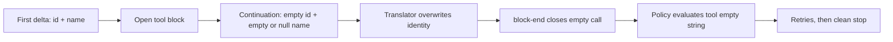

# Fix `UNKNOWN_TOOL` from empty streamed tool identity

If DeepSeek Harness reports `UNKNOWN_TOOL`, `unknown tool ""`, or `tool "" is disabled` while ordinary chat still works, inspect the provider stream before changing tool policy. An OpenAI-compatible endpoint may emit a valid tool name and ID in the first delta, then overwrite them with explicit empty values in continuation deltas.

Do not treat this as only a live tool failure. In rc.2, the empty identity can cross three boundaries: the completed assistant block, the `tool/call`, and the synthesized `tool/result`. A later resume can reject that persisted result with `SessionPersistenceCorruptionError`, while provider replay can reject the empty function name with HTTP 400. The first bad turn is therefore the containment point.

This guide covers four reported shapes:

- an rc.7 gateway stream whose continuation deltas used an empty ID and `null` name; and
- Alibaba Cloud Bailian (DashScope) `deepseek-v4-flash` on rc.8, whose continuation deltas use empty strings for both ID and name; and
- an rc.2 OpenAI-compatible route where an empty final identity entered the durable Session, poisoned provider replay, and made the next resume fail validation; and
- a current `llm-deepseek` aggregation-gateway report where continuation chunks supplied `id: ""` and `function.name: ""`, leaving complete arguments but producing `UNKNOWN_TOOL` for Bash and filesystem calls.

The second case is especially easy to misdiagnose because the same DSH tools work through the official DeepSeek API, Bailian Qwen models work, and Bailian's non-streaming response contains the correct function identity.

> [!WARNING]
> The current source path is verified at upstream commit `b150a55` (`0.1.1-rc.2`). The translator still accepts explicit empty continuation identity. The live append path and restored-event path also do not enforce the same message-shape boundary. Do not patch generated `lib/`, a global `node_modules` installation, or a live Session artifact in place.

> **Current alpha.1 status:** the translator at `cd5ef814` still uses the same `!== undefined` guards. Its happy-path test covers omitted continuation identity, while its defensive empty-identity test starts without any valid ID or name; neither protects a valid first identity from later explicit empty values. This is source verification, not proof that every alpha.1 distribution or gateway reproduces the failure.

## Route the symptom before touching anything

| First visible failure | Inspect first | Meaning |
|---|---|---|
| `tool "" is disabled` or `unknown tool ""` | ordered provider deltas and final `tool/call` | identity was absent or lost before policy |
| repeated provider `400` about empty function name | persisted assistant history | one bad call is being replayed into later requests |
| `SessionPersistenceCorruptionError: ... message must have tool source` | `tool/result.message.source.callId` in a copied log | a stored empty call ID is rejected on restore |
| all Session lists disappear | isolate unreadable Session directories one at a time | enumeration may be failing on one artifact, not every workspace |

Stop the process that owns the Session and preserve the complete Session directory before deeper inspection. A running writer can append more failures or replace an attempted repair with its in-memory state.

## Current rc.8 Bailian signature

The diagnosis is strong when this complete A/B holds:

| Probe | Bailian `deepseek-v4-flash` | Control |
|---|---|---|
| normal chat | succeeds | succeeds |
| non-streaming function call | contains non-empty `id` and `name` | succeeds |
| streaming first tool delta | contains non-empty `id` and `name` | succeeds |
| streaming continuation | emits `id: ""`, `name: ""` | omits unchanged identity |
| final DSH tool call | empty identity, `UNKNOWN_TOOL` | executes normally |

Use the same sanitized, read-only tool schema and prompt for every route. The useful controls reported in #3464 are the official DeepSeek endpoint with the same model family and Bailian Qwen through the same compatible endpoint. They separate a model/endpoint stream shape from DSH tool registration.

## Recognize the signature

The diagnosis is strong when all of these are true:

- the first streamed `tool_calls[]` delta contains a real `id` and `function.name`;
- later deltas for the same `index` contain `id: ""` and `function.name: ""` or `null`;
- the completed `tool/call` has an empty `callId` and `name`;
- policy reports `tool "" is disabled` even though the intended tool is enabled;
- the Agent may retry and finish with `stop`, no answer, and no stderr failure;
- a route whose continuation deltas omit identity fields works with the same profile and tools.

This is not the same as an unknown real tool name. If the assembled event says `name: "read"`, diagnose registration and policy instead.

## The identity-clobber chain



At rc.2 commit `b150a55`, the DeepSeek translator updates an open tool block whenever the wire field is not `undefined`:

```ts
if (call.id !== undefined) block.callId = call.id
if (call.function?.name !== undefined) block.name = call.function.name
```

That handles the official omission shape, but an explicit empty value also passes the guard. A continuation carrying `id: ""` replaces the captured call ID. Bailian also supplies `function.name: ""`, which replaces the captured name. A gateway that supplies `null` can reach the same failure through a lenient wire boundary. `closeBlock()` then emits the overwritten identity in the completed tool block.

`BlockAssembler` ignores a falsy empty name on intermediate `tool-call-delta` chunks, but `block-end` is authoritative and follows a first-close-wins contract. The translator's completed empty block therefore wins over the earlier valid delta. The policy layer receives no usable tool name and correctly refuses to execute an unidentified effect.

## Why one empty call can brick resume

The rc.2 restore boundary calls `adoptSessionEvent()`, which applies `assertMessageEventShape()`. A stored `tool/result` is accepted only when its source has `kind: "tool"`, a non-empty `callId`, and a matching inner `toolCallId`.

The live `Session.append()` path snapshots JSON and validates surface placement, but it does not call that same message-shape assertion. The persistence coordinator checks supported event vocabulary and sequence continuity before writing; it does not add the missing identity validation. This creates a narrow writer/reader asymmetry:

```text
provider delta       id="" name=""
completed block      id="" name=""
tool/call            callId="" name=""
tool/result          source.callId="" toolCallId=""
live Session         continues
provider replay      HTTP 400 on empty function name
next restore         rejects stored tool source
```

Crash-tail repair does not solve this case. `interruptedTurnClosers()` closes unmatched calls at an open tail; it does not rewrite an already committed invalid trio in the middle of a log.

This distinction matters for a source fix. Retaining non-empty stream identity prevents the known overwrite shape. Enforcing the same message invariant before append prevents any producer from persisting a result that the loader will later reject. Both boundaries need regression coverage.

## Capture three pieces of evidence

### Wire shape

Capture sanitized provider SSE or gateway logs for one call index. Preserve ordering and the distinction between omitted, empty-string, and `null` fields.

```json
{"index":0,"id":"call_8f2","function":{"name":"read","arguments":""}}
{"index":0,"id":"","function":{"name":"","arguments":"{\"path\":"}}
{"index":0,"id":"","function":{"name":"","arguments":"\"README.md\"}"}}
```

Do not publish authorization headers, prompts, file contents, or full gateway logs.

### Session events

Export the Session log and correlate the same call index across the raw chunk and completed event. The decisive contrast is:

```text
assistant/chunk  tool-call-delta  id="call_8f2"  name="read"
assistant/chunk  tool-call-delta  id=""          name omitted
tool/call        callId=""        name=""
```

The event names and envelope fields can vary by export projection. Preserve the raw rows rather than rewriting them into this display form. If the final `tool/call` still has the real name, this guide does not explain the later failure.

For a resume failure, correlate the complete identity set rather than searching for only one empty string:

```text
assistant/message.content[].id
tool/call.data.callId
tool/result.data.message.source.callId
tool/result.data.message.content[0].toolCallId
```

Also retain `seq`, turn, step, `sourceEventSeqs`, and the surrounding boundary events. These prove whether the bad record is a committed mid-log event or an incomplete crash tail.

### Route A/B

Use the same bounded, read-only prompt with the same profile and tool catalog through two authorized routes:

1. the affected gateway that emits explicit empty continuation identity;
2. a route that omits unchanged `id` and `name` after the first delta.

If only the first route produces an empty assembled name, the evidence points to stream-shape compatibility rather than tool registration.

## Safe operator actions

1. Stop repeated retries and stop every process that can write the affected Session. Retries add noise, consume budget, and can persist another invalid call.
2. Copy the complete Session directory, record a hash, and save the sanitized wire sequence before switching routes.
3. Route the workload through a backend/model combination that omits identity fields on continuation deltas, if one is already authorized. In #3464, the reported controls were the official DeepSeek endpoint and Bailian Qwen.
4. Start a fresh Session for the verification prompt. Do not infer recovery from a Session that already contains failed attempts.
5. Pin the working route and Harness version until a source fix and regression test ship.

Do not enable a tool whose name is empty. Policy is correctly refusing an unidentified effect. Do not weaken approval, sandbox, or tool allowlists to make the error disappear.

If the old Session no longer opens, preserve it as evidence and continue in a fresh Session from the last independently verified workspace state. Do not delete only the failing `tool/result`, globally replace empty strings, or recompress the live file. One logical call spans several correlated records, and the JSONL Zstandard backend has a format-specific first header frame. Until an official version-aware doctor exists, manual repair is an expert-only operation on an isolated copy, not a normal recovery instruction.

## Source repair and regression shape

Both incidents point to retaining only non-empty identity updates:

```ts
if (call.id) block.callId = call.id
if (call.function?.name) block.name = call.function.name
```

This guard is appropriate only because a tool call requires a non-empty identity. Pair it with terminal validation: skipping an empty continuation must preserve a previous valid value, while a stream that never supplies a valid value must fail as a protocol error before policy or persistence. Silently converting both cases into the same empty completed block preserves the original ambiguity.

The important regression is not a single happy-path chunk. It must feed at least two deltas for one index:

1. first delta: non-empty `id` and `name`;
2. continuation A: `id: ""`, `name: ""`, and an argument fragment;
3. continuation B: `id: ""`, `name: null`, and an argument fragment at a lenient wire boundary;
4. terminal finish and `[DONE]`;
5. assert the final block retains the original identity and concatenates all arguments.

Also test a stream that never supplies identity. Hardening should surface that as an explicit protocol error rather than silently presenting a successful empty turn.

## Acceptance gate

- [ ] A normal multi-delta tool call still assembles its full arguments.
- [ ] Empty or null continuation identity does not overwrite the first non-empty identity.
- [ ] Bailian-style empty-string and gateway-style null fixtures both pass.
- [ ] Two interleaved tool-call indexes retain independent IDs and names.
- [ ] A call that never supplies a usable name fails loudly before policy evaluation.
- [ ] The Session event records the same non-empty identity that reaches execution.
- [ ] A result with an empty source `callId` is rejected before it enters the live log or persistence queue.
- [ ] Append-time and restore-time message-shape fixtures enforce the same invariant set.
- [ ] A committed invalid mid-log fixture is distinguished from an open crash tail.
- [ ] One unreadable Session cannot hide unrelated Session listings.
- [ ] Provider replay never serializes an empty function name from durable history.
- [ ] Headless and Web surfaces expose the same protocol failure.
- [ ] No credential or private prompt is present in the incident bundle.

## Minimal report bundle

```text
Harness package version and source commit:
Profile and tools mode:
Provider route and model (no credential):
Gateway implementation and version:
Sanitized deltas for one tool-call index:
Assembled tool/call identity:
Policy or terminal message:
Finish reason:
Same prompt succeeds through omission-style route: yes/no
Fresh Session tested: yes/no
Resume error and rejected seq, if any:
Complete correlated identity set captured: yes/no
Original Session directory copied and hashed: yes/no
```

## Primary sources

- [Bailian `deepseek-v4-flash` report #3464](https://github.com/deepseek-ai/deepseek-harness/discussions/3464)
- [Earlier null-continuation report #3281](https://github.com/deepseek-ai/deepseek-harness/discussions/3281)
- [Persistent empty-identity and resume-corruption report #4704](https://github.com/deepseek-ai/deepseek-harness/discussions/4704)
- [Current aggregation-gateway report #4851](https://github.com/deepseek-ai/deepseek-harness/discussions/4851)
- [rc.2 DeepSeek stream translator](https://github.com/deepseek-ai/deepseek-harness/blob/b150a551b8d465e31e418e1b2eaf5e79bbb7d28e/packages/llm/llm-deepseek/src/translate.ts)
- [rc.2 translator tests](https://github.com/deepseek-ai/deepseek-harness/blob/b150a551b8d465e31e418e1b2eaf5e79bbb7d28e/packages/llm/llm-deepseek/tests/translate.spec.ts)
- [rc.2 Session append and restored-event validation](https://github.com/deepseek-ai/deepseek-harness/blob/b150a551b8d465e31e418e1b2eaf5e79bbb7d28e/packages/core/session/src/index.ts)
- [rc.2 crash-tail repair](https://github.com/deepseek-ai/deepseek-harness/blob/b150a551b8d465e31e418e1b2eaf5e79bbb7d28e/packages/core/session/src/repair.ts)
- [rc.2 persistence coordinator append boundary](https://github.com/deepseek-ai/deepseek-harness/blob/b150a551b8d465e31e418e1b2eaf5e79bbb7d28e/packages/session/session-persistence/src/coordinator.ts)
- [alpha.1 DeepSeek stream translator](https://github.com/deepseek-ai/deepseek-harness/blob/cd5ef8148158c3a752a658978873241fdf8e2bbc/packages/llm/llm-deepseek/src/translate.ts)
- [alpha.1 translator tests](https://github.com/deepseek-ai/deepseek-harness/blob/cd5ef8148158c3a752a658978873241fdf8e2bbc/packages/llm/llm-deepseek/tests/translate.spec.ts)
