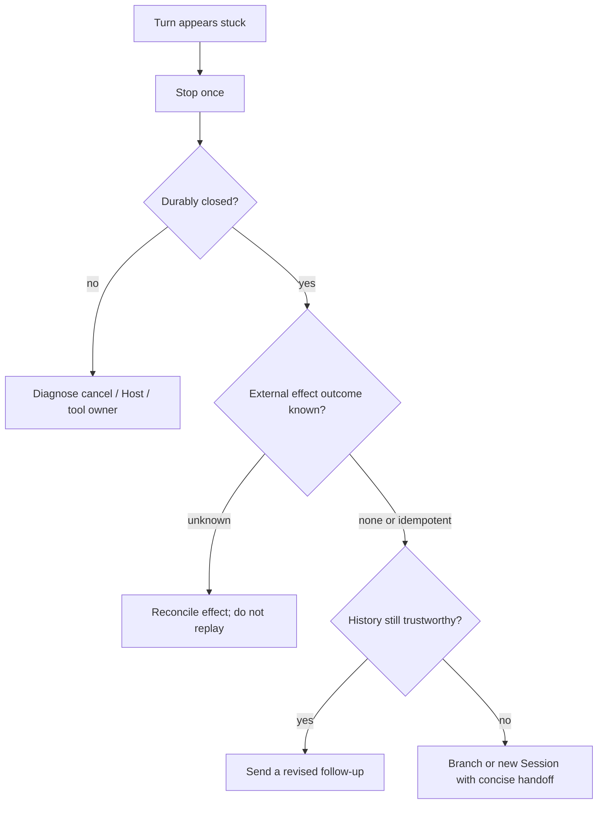

# Stop and safely retry a stuck Turn

Use this guide when the Web conversation appears to keep generating forever, the provider responds to a separate `curl`, and you want to stop or retry the task.

A successful control request proves that the provider endpoint is reachable. It does not prove that the active Harness request, stream parser, tool execution, Session Remote, or browser projection is healthy.

## Stop is already a Session operation

While a Turn is open, alpha.1 shows **Stop generating** in the composer. The action calls the scoped conversation's `cancel()`, which invokes the Session cancellation Remote. A successful stop is not merely a visual button change: the source tests require the Turn to close durably as aborted, the live streaming node to disappear, and any partial assistant output to become a frozen interrupted record.

Use this sequence:

1. Click **Stop generating** once.
2. Wait for the generating control and streaming indicator to disappear.
3. Confirm the transcript shows the stopped/interrupted state.
4. Check the Host log for the matching cancellation and durable `turn/end`.
5. Only then decide whether another request is safe.

Do not repeatedly click Stop or immediately submit the same prompt. Cancellation is asynchronous across the browser, Session Remote, Agent loop, provider stream, and possibly an executing tool.

## Stop preserves queued input but may not deliver it

Alpha.1's Session cancellation controller calls:

```text
agent.cancel({ kind: 'user' }, { keepInbox: true })
```

That choice avoids deleting unclaimed `next-turn` queue messages and `next-step` steering. Preservation is not delivery. The official Agent Loop test named `parks queued work after an active turn aborts` proves that input queued **before** cancellation remains in the inbox after the Agent reaches idle, while no second model request starts. A later waking message causes the preserved input to be claimed, but until then the user's visible bubble can look permanently unanswered.

Keep three timing classes separate:

| Input timing | Current alpha.1 result | Operator meaning |
|---|---|---|
| already claimed by the active driver | abort closes the active Turn; `keepInbox` cannot restore the claimed message | do not expect the interrupted input to return to the queue |
| unclaimed before Stop | remains pending, but the Stop call does not arm a future wake | preserved but parked |
| waking input sent after abort begins and before idle convergence | inserted as `next-turn` and `wakeRequested` is latched | runs after the aborted activity converges |
| input sent after Agent is already idle | opens an ordinary new Turn | also wakes any older parked items |

This is why an aborted Turn followed by silence does not prove that queued text was lost, and why a later message can appear to “unstick” several older bubbles. Inspect the pending queue and durable `agent/inbox/spliced` events before resubmitting text.

### Safe containment for parked user input

1. Wait until the stopped Turn is durably aborted and the Agent is idle.
2. Inventory pending `next-turn` and `next-step` messages by stable message id, target, source, and order.
3. Separate user-authored queue/steering messages from plugin context, Goal notices, child settlement, and other non-user owners.
4. Reconcile external side effects from the aborted Turn.
5. If every pending user message is still valid, send one explicit wake follow-up such as “Continue with the queued messages; do not repeat completed effects,” then verify each prior id is claimed once.
6. If any pending message is stale, sensitive, duplicated, or would repeat an uncertain effect, do not wake the whole inbox. Use the queue's supported cancel/edit operations where available, or move to a clean Session with a reviewed handoff.

Do not repeatedly send copies of invisible queued text. The originals may still be pending and will later arrive alongside the duplicates.

## Route the apparent freeze

| Observation | Likely boundary | Next evidence |
|---|---|---|
| Stop works and Turn becomes interrupted | active request/step was cancelable | inspect last durable assistant/tool events before continuing |
| browser looks frozen but reload shows a closed Turn | client connection or projection lag | browser console, Remote reconnect, last event seq |
| provider control works but active Turn never gets first byte | request-specific route, payload, or upstream stream | request ID, headers without secrets, TTFT, adapter logs |
| assistant text stops but a tool remains running | tool/subprocess ownership | tool call ID, PID/job ID, effect status, cancel result |
| Stop returns an error or Turn remains open | Session cancel/Host lifecycle | Remote response, Agent phase, open turn, Host stack |
| Host no longer responds | process or event-loop failure | process health, terminal stack, resource saturation |

## “Retry” has three different meanings



- **Model retry row:** `llm/retry` is an automatic retry scheduled by the runtime policy for a model request. It is not a user action and does not replay an entire Turn.
- **Send a follow-up:** after a clean abort, submit a new prompt that explicitly states what was interrupted and what must not be repeated.
- **Branch/new Session:** create a separate continuation when the old history is ambiguous, poisoned, or contains unknown external effects.

Alpha.1 exposes **Branch into a new conversation** at an eligible Turn tail. Branching preserves history up to its selected durable sequence; it does not undo calls already made. A brand-new Session with a concise handoff is safer when you cannot prove which tail event is safe to inherit.

## Regenerate reply means branch, then replay

A trustworthy **Regenerate reply** action must not delete the last answer or append a duplicate prompt to the source Session. For a completed target Turn `T`, it should fork from the previous completed Turn `P`, reconstruct only the human-owned input admitted during `T`, and submit that input once in the child Session.

```text
source: ... → turn/end P → user input U → effects E → turn/end T
                         │
                         └─ fork at P → child seed through P → re-admit U → new answer

source T remains immutable; external effects E are not rolled back
```

This distinction matters because alpha.1's `sessions.fork({ atSeq })` does not cut at the exact supplied event. It resolves an in-log anchor to the first `turn/end` at or after that sequence, then seeds the child through that boundary and stops before the next `turn/start`. To regenerate `T`, supply a sequence owned by `P`—normally `P`'s final visible node—not `T`'s user-message sequence. Anchoring inside `T` would include the completed target Turn instead of removing it.

The action is eligible only when all of these facts are true:

- `T` is the last durably completed Turn and has no later chat node;
- a previous completed Turn `P` exists, so the first Turn never offers this action;
- the complete event window for `T` is loaded and its human input is unambiguous;
- every replayed `user/message` has `source.kind === 'user'`; plugin context, Goal notices, runtime injection, commands, and child settlement are excluded;
- queued input consumed as steering is reconstructed from the durable inbox splice history, not guessed from bubble position;
- external effects from `T` are absent, idempotent and reconciled, or explicitly accepted by the operator.

### Preserve ordered input and re-admit images

All human user and steering messages in `T` are part of the replay contract. Preserve message order and content-part order; do not flatten several admissions into one string or silently discard steering. A durable image part contains an attachment identity scoped to the source Session. Alpha.1's `readAttachment(attachmentId)` returns the authenticated reference plus decoded bytes, while `prompt()` accepts text plus **browser-owned temporary image uploads**. Therefore a child cannot safely reuse the source attachment reference: read every required image from the source, construct fresh child uploads, and finish the entire prompt payload before sending anything.

If the public prompt API cannot preserve multiple user/steering admissions and their placement faithfully, disable one-click regeneration for that Turn and offer a reviewed manual branch. A plausible-looking combined prompt is not equivalent history.

### Fork is not an atomic transaction

The source Session remains unchanged on every failure, but the operation as a whole is not atomic. The official controller creates the child before workspace attachment finishes. Attachment reads and replay admission necessarily happen later. Record the returned child identity as soon as it exists and reconcile that child before allowing another click.

| Failure boundary | Durable result | Safe UI response |
|---|---|---|
| fork rejected before creation | no child | keep source selected; show the exact error |
| child created, workspace attach fails | child may already exist | expose/recover that child; do not create another blindly |
| source attachment read or upload preparation fails | child exists; replay not sent | keep the child as incomplete or offer explicit cleanup |
| child prompt admission is rejected | child exists; no accepted replay | retain payload and child identity for a deliberate retry |
| navigation fails after prompt acceptance | child may already be running | reconnect to the same child and inspect it before retrying |

Use a click-scoped operation identity, disable duplicate gestures while any phase is unresolved, and persist `{sourceSession, sourceTurn, boundarySeq, childSession, phase}` across reload. “Source unchanged” must never be presented as “nothing was created.”

### Manual regeneration with the shipped UI

Alpha.1 ships a Turn-tail **Branch into a new conversation** action, but not the proposed combined replay operation. Until an explicit action is implemented:

1. reconcile tool and external effects produced by the answer you want to replace;
2. branch at the tail of the previous completed Turn;
3. open the returned child Session and verify the inherited preset, model route, workspace, and final seeded event;
4. reconstruct the target Turn's user input in its original order;
5. reattach images from trusted original bytes, because attachment identities are Session-scoped;
6. send once, then retain the source and child Session IDs as provenance.

If steering grouping, an attachment, or effect status cannot be reconstructed, use a concise reviewed handoff in a clean Session instead of claiming an exact regeneration.

## Side-effect gate before resubmission

Before sending anything that could repeat work, classify the last step:

| Last operation | Retry policy |
|---|---|
| read-only provider request, no tool call admitted | revised follow-up is usually safe after durable abort |
| idempotent tool with a verified key/result | reconcile by that key, then continue from the observed state |
| file/process operation with a known committed result | do not repeat; tell the Agent what already happened |
| payment, message, deployment, deletion, or remote mutation | verify the external system first |
| tool started but completion is unknown | treat outcome as unknown; never blind-retry |

Cancellation cannot roll back an effect that crossed its commit boundary before the abort arrived. The Session log may show an interrupted Turn while an external subprocess or API call has already completed.

## When the Stop control itself is unavailable

If the button is absent, first determine whether the UI believes the Turn is open. Reload once and compare:

- current Session ID;
- last displayed event/Turn;
- generating indicator;
- Host terminal output;
- browser console and Remote connection state.

If reload reveals the closed result, this was a presentation/connection lag. If the same Turn remains open and Session cancellation fails, preserve the Session and Host evidence before restarting the process. Process termination is a last-resort containment step; it must not be reported as a successful Turn cancellation, and cold reload must prove that the Session closes or recovers consistently.

## Product contract for an explicit user Retry action

A safe Retry control cannot mean “send the same text again.” It should:

1. require the source Turn to be durably closed;
2. show the exact replay boundary and inherited event sequence;
3. identify tool calls and external effects after that boundary;
4. require reconciliation for unknown or non-idempotent effects;
5. create a new Turn or branch rather than rewrite append-only history;
6. preserve the failed/aborted Turn as evidence;
7. attach a new retry identity linked to the source Turn;
8. prevent duplicate clicks while admission is pending;
9. expose cancel, admission, request, and final outcome separately;
10. regression-test cold reload, offline/reconnect, provider timeout, tool execution, and repeated UI gestures.

For a Turn-tail **Regenerate reply (branches, then re-answers)** control, extend that baseline with:

1. hide the action for the first Turn, open Turns, incomplete history, later chat nodes, and non-replayable input;
2. anchor the fork inside the previous completed Turn and verify the returned child's seed boundary;
3. select only human-owned input from the target Turn, using inbox history to distinguish steering;
4. preserve message and content-part order without flattening distinct admissions;
5. read every source image and re-admit fresh child-owned uploads before prompt submission;
6. build and validate the complete payload before the first replay write;
7. preserve source and target Turn evidence, with explicit provenance on the new child operation;
8. disclose inherited preset, provider/model selection, workspace attachment, and child Session identity;
9. treat workspace attach, attachment preparation, prompt admission, and navigation as separate recoverable phases;
10. deduplicate clicks and reconnect to an already-created child instead of creating orphans;
11. block or warn on unreconciled external effects because branching does not undo them;
12. test text-only, multiple steering messages, mixed images, aborted targets, attach failure, prompt rejection, lost navigation, reconnect, cold reload, and repeated clicks.

## Product contract for Stop with pending input

A Stop action needs a visible policy for pending user work. If the intended contract is “interrupt and send queued input immediately,” the implementation should:

1. snapshot only eligible user-owned `next-turn` and `next-step` messages; injected plugin/runtime context keeps its existing non-waking semantics;
2. preserve stable message identity, target provenance, attachments, and FIFO order;
3. abort the current Turn with `keepInbox` and re-arm exactly one wake after convergence;
4. never restore a message already claimed by the aborted driver;
5. serialize Stop, queue edit/cancel, claim, and replay so each id is claimed, canceled, or retained exactly once;
6. convert pre-abort steering to an explicit next-Turn delivery policy, because the aborted step no longer exists;
7. expose `stopping`, `queued for next Turn`, `claimed`, and `failed` separately in the UI;
8. keep non-user context parked unless its owner deliberately wakes the Agent;
9. retain side-effect reconciliation before any replay-like user action;
10. test queued-first/steering-second order, attachments, multiple Stop clicks, slow abort convergence, idle Stop, reconnect, and cold reload.

Removing and reinserting messages is not sufficient proof by itself. A safe implementation must show what happens when claim or queue mutation wins between those operations, and it must not create a new identity that disconnects the optimistic bubble from durable inbox and `user/message` events.

## Evidence for an upstream report

```text
Harness version/commit:
Session ID and Turn number:
Selected provider/model:
Stop button visible and click time:
session/cancel Remote result:
turn/end reason and timestamp:
last assistant/tool event before abort:
provider request ID and first-byte time:
tool/subprocess/external effect outcome:
reload result and last event seq:
pending next-turn/next-step ids before Stop:
pending ids after Agent became idle:
new wake sent during abort convergence: yes / no
browser console and Host error:
```

Remove credentials, prompts, private tool output, and proprietary payloads.

## Verification boundary

The Stop control, scoped Session cancellation, durable interrupted Turn presentation, parked pre-cancel inbox behavior, abort-convergence wake latch, Turn-tail branch action, fork boundary rules, Session-scoped attachment read, and user-versus-steering reconstruction are source-verified at alpha.1 commit [`cd5ef814`](https://github.com/deepseek-ai/deepseek-harness/tree/cd5ef8148158c3a752a658978873241fdf8e2bbc). Discussion #4823 reports a visually stuck Turn and a successful separate provider request, but provides no Session events or cancellation trace yet. Discussions #4831 and #4832 propose combined regeneration and immediate pending-input delivery; their linked forks are design input, not merged upstream behavior.

## Pinned official sources

- [Alpha.1 Stop control wiring](https://github.com/deepseek-ai/deepseek-harness/blob/cd5ef8148158c3a752a658978873241fdf8e2bbc/packages/client/ui-conversation/src/client/apply.ts)
- [Alpha.1 scoped Session cancellation](https://github.com/deepseek-ai/deepseek-harness/blob/cd5ef8148158c3a752a658978873241fdf8e2bbc/packages/client/ui-conversation/src/client/service.ts)
- [Alpha.1 Session controller `keepInbox` cancellation](https://github.com/deepseek-ai/deepseek-harness/blob/cd5ef8148158c3a752a658978873241fdf8e2bbc/packages/api/session-controller/src/commands.ts)
- [Alpha.1 parked queue and abort-convergence wake tests](https://github.com/deepseek-ai/deepseek-harness/blob/cd5ef8148158c3a752a658978873241fdf8e2bbc/packages/core/agent-loop/tests/cancel.spec.ts)
- [Stop-and-deliver pending input proposal #4832](https://github.com/deepseek-ai/deepseek-harness/discussions/4832)
- [Alpha.1 interrupted Turn end-to-end proof](https://github.com/deepseek-ai/deepseek-harness/blob/cd5ef8148158c3a752a658978873241fdf8e2bbc/apps/web/tests/turn-tail-actions.e2e.ts)
- [Alpha.1 Turn-tail branch action](https://github.com/deepseek-ai/deepseek-harness/blob/cd5ef8148158c3a752a658978873241fdf8e2bbc/packages/client/ui-chat/src/client/chat/TurnTailNodeView.tsx)
- [Alpha.1 fork boundary and partial workspace-attachment behavior](https://github.com/deepseek-ai/deepseek-harness/blob/cd5ef8148158c3a752a658978873241fdf8e2bbc/packages/api/session-controller/src/commands.ts)
- [Alpha.1 Session prompt and attachment contract](https://github.com/deepseek-ai/deepseek-harness/blob/cd5ef8148158c3a752a658978873241fdf8e2bbc/packages/api/session-controller/src/client/contract/session.ts)
- [Alpha.1 durable steering reconstruction](https://github.com/deepseek-ai/deepseek-harness/blob/cd5ef8148158c3a752a658978873241fdf8e2bbc/packages/client/ui-chat/src/client/model/steering-history.ts)
- [Regenerate-reply proposal #4831](https://github.com/deepseek-ai/deepseek-harness/discussions/4831)
- [Stuck conversation and Retry request #4823](https://github.com/deepseek-ai/deepseek-harness/discussions/4823)
