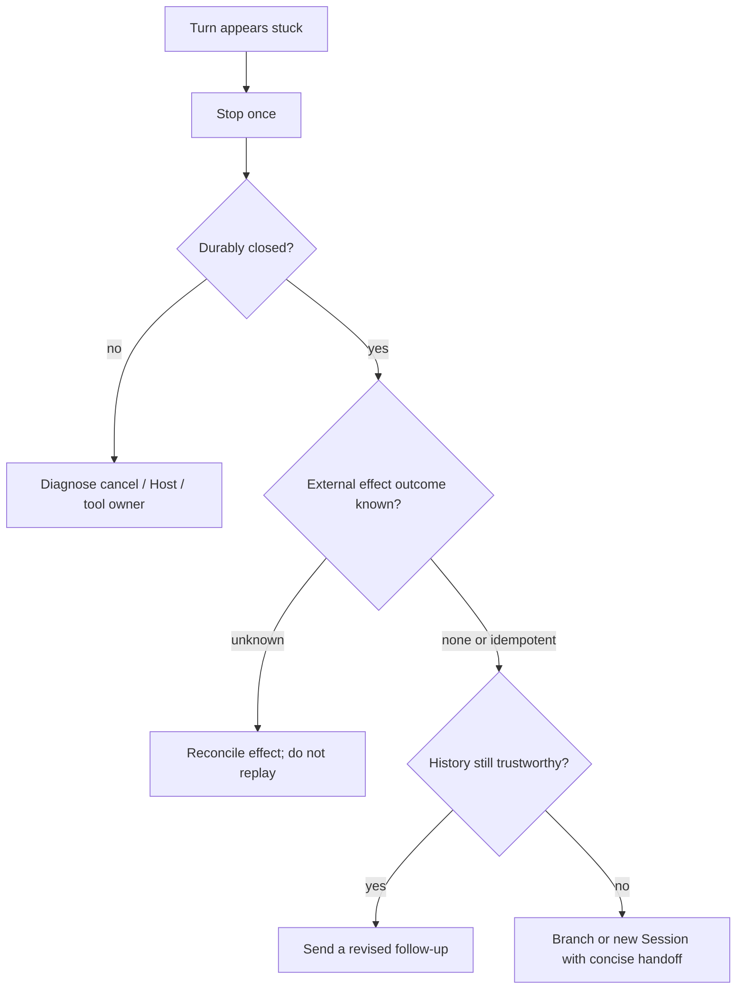

# Stop and safely retry a stuck Turn

Use this guide when the Web conversation appears to keep generating forever, the provider responds to a separate `curl`, and you want to stop or retry the task.

A successful control request proves that the provider endpoint is reachable. It does not prove that the active Harness request, stream parser, tool execution, Session Remote, or browser projection is healthy.

## Stop is already a Session operation

While a Turn is open, alpha.1 shows **Stop generating** in the composer. The action calls the scoped conversation's `cancel()`, which invokes the Session cancellation Remote. A successful stop is not merely a visual button change: the source tests require the Turn to close durably as aborted, the live streaming node to disappear, and any partial assistant output to become a frozen interrupted record.

Use this sequence:

1. Click **Stop generating** once.
2. Wait for the generating control and streaming indicator to disappear.
3. Confirm the transcript shows the stopped/interrupted state.
4. Check the Host log for the matching cancellation and durable `turn/end`.
5. Only then decide whether another request is safe.

Do not repeatedly click Stop or immediately submit the same prompt. Cancellation is asynchronous across the browser, Session Remote, Agent loop, provider stream, and possibly an executing tool.

## Route the apparent freeze

| Observation | Likely boundary | Next evidence |
|---|---|---|
| Stop works and Turn becomes interrupted | active request/step was cancelable | inspect last durable assistant/tool events before continuing |
| browser looks frozen but reload shows a closed Turn | client connection or projection lag | browser console, Remote reconnect, last event seq |
| provider control works but active Turn never gets first byte | request-specific route, payload, or upstream stream | request ID, headers without secrets, TTFT, adapter logs |
| assistant text stops but a tool remains running | tool/subprocess ownership | tool call ID, PID/job ID, effect status, cancel result |
| Stop returns an error or Turn remains open | Session cancel/Host lifecycle | Remote response, Agent phase, open turn, Host stack |
| Host no longer responds | process or event-loop failure | process health, terminal stack, resource saturation |

## “Retry” has three different meanings



- **Model retry row:** `llm/retry` is an automatic retry scheduled by the runtime policy for a model request. It is not a user action and does not replay an entire Turn.
- **Send a follow-up:** after a clean abort, submit a new prompt that explicitly states what was interrupted and what must not be repeated.
- **Branch/new Session:** create a separate continuation when the old history is ambiguous, poisoned, or contains unknown external effects.

Alpha.1 exposes **Branch into a new conversation** at an eligible Turn tail. Branching preserves history up to its selected durable sequence; it does not undo calls already made. A brand-new Session with a concise handoff is safer when you cannot prove which tail event is safe to inherit.

## Side-effect gate before resubmission

Before sending anything that could repeat work, classify the last step:

| Last operation | Retry policy |
|---|---|
| read-only provider request, no tool call admitted | revised follow-up is usually safe after durable abort |
| idempotent tool with a verified key/result | reconcile by that key, then continue from the observed state |
| file/process operation with a known committed result | do not repeat; tell the Agent what already happened |
| payment, message, deployment, deletion, or remote mutation | verify the external system first |
| tool started but completion is unknown | treat outcome as unknown; never blind-retry |

Cancellation cannot roll back an effect that crossed its commit boundary before the abort arrived. The Session log may show an interrupted Turn while an external subprocess or API call has already completed.

## When the Stop control itself is unavailable

If the button is absent, first determine whether the UI believes the Turn is open. Reload once and compare:

- current Session ID;
- last displayed event/Turn;
- generating indicator;
- Host terminal output;
- browser console and Remote connection state.

If reload reveals the closed result, this was a presentation/connection lag. If the same Turn remains open and Session cancellation fails, preserve the Session and Host evidence before restarting the process. Process termination is a last-resort containment step; it must not be reported as a successful Turn cancellation, and cold reload must prove that the Session closes or recovers consistently.

## Product contract for an explicit user Retry action

A safe Retry control cannot mean “send the same text again.” It should:

1. require the source Turn to be durably closed;
2. show the exact replay boundary and inherited event sequence;
3. identify tool calls and external effects after that boundary;
4. require reconciliation for unknown or non-idempotent effects;
5. create a new Turn or branch rather than rewrite append-only history;
6. preserve the failed/aborted Turn as evidence;
7. attach a new retry identity linked to the source Turn;
8. prevent duplicate clicks while admission is pending;
9. expose cancel, admission, request, and final outcome separately;
10. regression-test cold reload, offline/reconnect, provider timeout, tool execution, and repeated UI gestures.

## Evidence for an upstream report

```text
Harness version/commit:
Session ID and Turn number:
Selected provider/model:
Stop button visible and click time:
session/cancel Remote result:
turn/end reason and timestamp:
last assistant/tool event before abort:
provider request ID and first-byte time:
tool/subprocess/external effect outcome:
reload result and last event seq:
browser console and Host error:
```

Remove credentials, prompts, private tool output, and proprietary payloads.

## Verification boundary

The Stop control, scoped Session cancellation, durable interrupted Turn presentation, and Turn-tail branch action are source-verified at alpha.1 commit [`cd5ef814`](https://github.com/deepseek-ai/deepseek-harness/tree/cd5ef8148158c3a752a658978873241fdf8e2bbc). Discussion #4823 reports a visually stuck Turn and a successful separate provider request, but provides no Session events or cancellation trace yet.

## Pinned official sources

- [Alpha.1 Stop control wiring](https://github.com/deepseek-ai/deepseek-harness/blob/cd5ef8148158c3a752a658978873241fdf8e2bbc/packages/client/ui-conversation/src/client/apply.ts)
- [Alpha.1 scoped Session cancellation](https://github.com/deepseek-ai/deepseek-harness/blob/cd5ef8148158c3a752a658978873241fdf8e2bbc/packages/client/ui-conversation/src/client/service.ts)
- [Alpha.1 interrupted Turn end-to-end proof](https://github.com/deepseek-ai/deepseek-harness/blob/cd5ef8148158c3a752a658978873241fdf8e2bbc/apps/web/tests/turn-tail-actions.e2e.ts)
- [Alpha.1 Turn-tail branch action](https://github.com/deepseek-ai/deepseek-harness/blob/cd5ef8148158c3a752a658978873241fdf8e2bbc/packages/client/ui-chat/src/client/chat/TurnTailNodeView.tsx)
- [Stuck conversation and Retry request #4823](https://github.com/deepseek-ai/deepseek-harness/discussions/4823)
