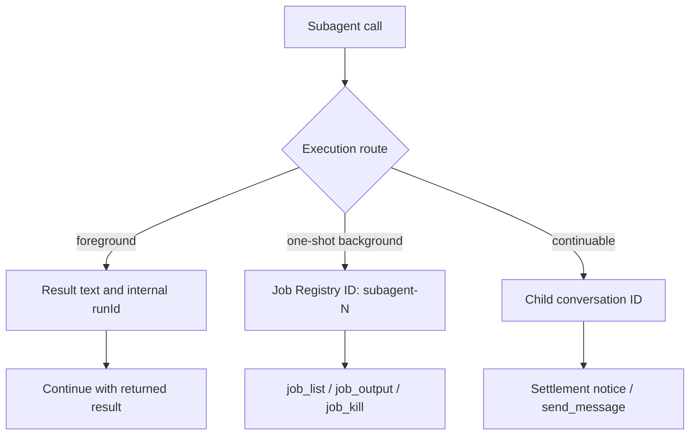

# Fix `unknown job` after a background subagent run

Use this guide when a multi-agent turn produces useful files, then stops after a call like:

```text
job_output({ job_id: "7576042c-f6d8-47e9-a158-120eb8a4b245", wait: true })
Error: unknown job 7576042c-f6d8-47e9-a158-120eb8a4b245
```

At DeepSeek Harness `0.1.1-rc.2`, `job_output` is the correct collector for a **one-shot background** subagent. The error does not prove that subagents use a different task system. It proves that the supplied ID is absent from the caller-visible Job Registry. A UUID-shaped value is especially suspicious because registry-issued job IDs use the form `<kind>-N`, such as `subagent-1`.

## Route by the acknowledgement, not by the plan

The `tool-subagent` plugin has three execution routes. Each returns a different identity with a different continuation contract.

| Route | Start acknowledgement | What the ID names | Correct next action |
|---|---|---|---|
| foreground one-shot | child result text | internal `runId` exists in structured output but is not a Job ID | use the returned result; do not call `job_output` |
| background one-shot | `started background subagent job <jobId>` | parent-owned Job Registry entry, normally `subagent-N` | use `job_list`, then `job_output(jobId)` or `job_kill(jobId)` |
| continuable background | `started subagent <subagentId>` | durable child conversation | wait for the runtime settlement notice; use `send_message` for a later child turn |

Do not infer the route from words such as “background,” “child,” or “job” in the model's prose. Preserve the exact tool result. The acknowledgement is the ownership receipt.



## Why `unknown job` is precise

The process-global Jobs service stores background work, but access is caller-scoped. `job_output` resolves the supplied ID through that registry and throws `unknown job <id>` when no record exists. It does not search subagent transcripts or reinterpret a run ID.

An ID can be unknown because:

1. a foreground `runId` was passed to `job_output`;
2. a continuable child ID was passed to `job_output`;
3. the ID was copied or synthesized incorrectly;
4. the parent Agent lifecycle ended, which cancels, settles, and removes its owned jobs;
5. the Host restarted, because the local Job Registry is process memory; or
6. the caller belongs to another Session and therefore cannot access the owned record.

The report in official discussion #4696 supplies a UUID to `job_output`, while the rc.2 Jobs contract documents branded `<kind>-N` IDs. That shape mismatch is evidence of identity confusion, not enough evidence to select which lifecycle originally produced the UUID.

## Recover without losing completed work

### 1. Freeze the output inventory

Stop launching more children. Record the parent Session ID, Harness version, model/provider, exact subagent acknowledgements, every later completion notice, and the first `unknown job` call. Do not delete the partially generated files.

### 2. Ask the registry what the parent can still control

Call `job_list` from the same live parent Session. Treat its returned IDs as authoritative.

- If the intended `subagent-N` is listed, collect that exact ID.
- If only other jobs are listed, do not keep retrying the UUID.
- If the registry is empty after a restart or parent disposal, the old process-local control handle cannot be reconstructed from a remembered ID.

### 3. Reconcile artifacts against an explicit manifest

For a multi-file task, compare actual files with the planned deliverables. Classify every expected artifact as complete, partial, missing, or conflicting. File presence alone is not success: validate required headings, termination markers, checksums, tests, or minimum structural rules appropriate to the task.

```text
deliverable            state       evidence
chapter-02.md          missing     no path
chapter-05.md          partial     required final section absent
chapter-06.md          complete    structure check passed
assembled-output.pdf   blocked     assembly not run
```

### 4. Restart only missing units

Create replacement subagent calls only for missing or invalid deliverables. Give each replacement a disjoint output path and an idempotent acceptance check. Do not rerun already complete units or let two children overwrite the same file.

For work that must be collected before assembly, choose foreground execution or record the exact one-shot background Job ID. For continuable children, design around settlement notices and child-conversation follow-up instead of polling them as Jobs.

### 5. Gate final assembly

Run assembly only after the manifest proves every required input. The parent must surface missing units as a visible failure; “most children completed” is not a successful aggregate result.

## Prompt and product hardening

Until the runtime distinguishes these identities more strongly, use an orchestration instruction such as:

```text
For every delegation, preserve the exact tool acknowledgement and classify it as
foreground result, one-shot background Job ID, or continuable child ID.
Call job_output only for IDs returned in "started background subagent job ..."
and confirmed by job_list. Before assembly, verify every planned deliverable.
If any identity is unknown, stop polling it, report the missing unit, and recover
only that unit.
```

A durable runtime repair should make identity misuse difficult:

- expose typed, visibly different ID prefixes on the model-facing surface;
- include the legal control verbs in every start acknowledgement;
- reject a UUID-shaped child/run ID with an actionable “not a Job ID” diagnostic;
- preserve an aggregate orchestration manifest independently of transient job handles;
- wake or visibly notify the parent when a continuable child settles;
- never let one missing child silently convert a complete-plan promise into partial success.

## Regression matrix

| Case | Required result |
|---|---|
| foreground subagent completes | result returns inline; no Job entry is implied |
| one-shot background starts | acknowledgement contains the exact caller-visible `subagent-N` |
| one-shot background settles | `job_output` returns final output and terminal status |
| continuable child starts | acknowledgement identifies a child conversation, not a Job |
| child ID passed to `job_output` | actionable identity-class error; no repeated polling loop |
| parent Session differs | access fails without exposing another Session's job labels or output |
| parent disposes | owned jobs cancel and disappear only after settlement |
| Host restarts | process-local jobs are not presented as resumable handles |
| one of N children fails | aggregate manifest names the missing unit; assembly stays blocked |
| replacement unit completes | only the missing path changes; completed siblings remain intact |

## Official sources

- [Official partial multi-agent task report #4696](https://github.com/deepseek-ai/deepseek-harness/discussions/4696)
- [rc.2 `tool-subagent` execution routes](https://github.com/deepseek-ai/deepseek-harness/blob/b150a551b8d465e31e418e1b2eaf5e79bbb7d28e/packages/subagent/tool-subagent/src/index.ts)
- [rc.2 model-facing subagent lifecycle contract](https://github.com/deepseek-ai/deepseek-harness/blob/b150a551b8d465e31e418e1b2eaf5e79bbb7d28e/packages/subagent/tool-subagent/README.md)
- [rc.2 Job ID, ownership, wait, and cleanup contract](https://github.com/deepseek-ai/deepseek-harness/blob/b150a551b8d465e31e418e1b2eaf5e79bbb7d28e/docs/subsystems/jobs.md)
- [rc.2 local registry unknown-ID and owner-disposal behavior](https://github.com/deepseek-ai/deepseek-harness/blob/b150a551b8d465e31e418e1b2eaf5e79bbb7d28e/packages/jobs/jobs-local/src/index.ts)

