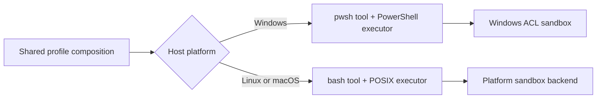

# DeepSeek Harness on Windows: support boundaries and troubleshooting

DeepSeek Harness has a native Windows execution path for the CLI and Web profile. It swaps the POSIX Bash stack for PowerShell and uses a Windows restricted-token plus NTFS ACL sandbox. That does not make every upstream interface portable: the published Python runtime wheels and persistent PTY path currently target Linux and macOS.

This page separates supported runtime layers from common failure modes so you can diagnose Windows behavior without treating every error as an installation problem.

## Compatibility map

| Surface | Windows status | Important boundary |
|---|---|---|
| `npx @deepseek-ai/dsh web` | Native Windows path | uses the `pwsh` tool rather than Bash |
| `dsh --profile headless` | Native Windows path | working directory and active permission mode still define effects |
| Foreground/background shell calls | PowerShell executor | each `pwsh` call starts a fresh shell; no persistent PTY |
| `workspace-write` / `read-only` | Windows ACL backend | reports **partial** enforcement; reads and network are not confined |
| Python SDK wheel | Not currently published for Windows | runtime wheels exist for Linux x64/arm64 and macOS arm64 |
| Upstream minimal JSON-RPC example | Not a Windows Agent interface | persistent PTY and `danger-full-access` assumptions are POSIX-oriented |
| Bash-specific overlays and prompts | Not native Windows tools | use PowerShell syntax, paths, and `$env:NAME` variables |

## What changes on Windows

The shipped composition selects platform-specific rows:



The Windows tool contract is PowerShell-native:

```powershell
Get-ChildItem -Force
$env:DSH_SESSION_ID
Resolve-Path .
```

Do not send Bash syntax such as `export NAME=value`, `$PWD/foo`, or `cmd1 && cmd2` and assume it will be translated. The model-facing tool is named `pwsh`, and each call runs through `pwsh -Command` with no state carried into the next call. Use the tool's `workdir` instead of relying on `Set-Location` from a previous command.

## PowerShell discovery

The executor probes configured and well-known locations. An explicit `pwshPath` wins; otherwise the current implementation searches PowerShell 7 locations, relevant `PATH` entries such as Microsoft Store installs, Windows PowerShell 5.1, then a bare `pwsh` executable.

If shell startup fails:

```powershell
Get-Command pwsh -ErrorAction SilentlyContinue
Get-Command powershell.exe -ErrorAction SilentlyContinue
pwsh -NoLogo -NoProfile -NonInteractive -Command '$PSVersionTable.PSVersion'
```

Then inspect the resolved profile:

```powershell
dsh --profile web --dump-config
```

Confirm that the Windows `pwsh-sandbox` and `tool-pwsh` rows are active and the POSIX Bash rows are disabled. A model response mentioning Bash is not proof that the correct executor mounted; the resolved configuration is.

## Understand the Windows sandbox

The Windows backend duplicates the caller token into a `WRITE_RESTRICTED` token and grants separate restricting SIDs for the workspace and a private session temp directory. It fails closed when setup fails; it does not silently launch the child without its intended restriction.

However, its reported enforcement is deliberately `partial`:

- it restricts writes, not reads, network access, or process visibility;
- objects granting write access to `Everyone` can remain writable;
- NTFS hard links are aliases to one file object, so a workspace grant can affect an external alias;
- children share the host console;
- workspace ACL entries are standing grants used as a cross-run cache.

`read-only` therefore means “no explicit workspace or private-temp write capability,” not complete system isolation. If a task must not read caller-accessible files or reach the network, use an additional isolation boundary such as a disposable VM or container whose filesystem and network policy you control.

## Why the first confined command can be slow

The first `workspace-write` run on a directory materializes an inheritable workspace ACL through its tree. On a large workspace this can take tens of seconds or longer. Later sessions derive the same workspace SID and skip the write when the exact ACL entry already exists.

Before assuming the process is hung:

1. test with a small disposable repository;
2. keep the `dsh` terminal visible for Win32 diagnostics;
3. avoid selecting a drive root or very large monorepo for the first smoke test;
4. compare first-run and second-run time on the same canonical path.

Renaming or moving the workspace derives another identity and can pay the materialization cost again.

## `read-only` and PowerShell language mode

Under the current Windows sandbox, `read-only` denies the temp writes PowerShell uses for its AppLocker probe. PowerShell can therefore start in `ConstrainedLanguage`, where operations such as `Add-Type`, COM construction, reflection, and many non-core .NET static calls fail.

That is distinct from a general tool failure. Check the language mode inside the same confined call:

```powershell
$ExecutionContext.SessionState.LanguageMode
```

The shipped `workspace-write` path grants a private temp capability, allowing that startup probe to complete and normally preserving `FullLanguage` unless machine-wide WDAC or AppLocker policy imposes another restriction.

Do not request a broader permission only to make an arbitrary script work. First decide whether the script actually needs those language features and whether the wider write scope is acceptable.

## Process and output limitations

The Windows `pwsh` tool supports foreground execution and managed background jobs, but it does not provide a persistent PTY. Each call begins a new process.

Inside a confined PowerShell command, a grandchild that tries to capture output through named-pipe stdio can fail with `EPERM`. Ordinary PowerShell pipelines use anonymous pipes and are a different path. When a nested CLI fails only under confinement:

1. run the smallest direct command that reproduces it;
2. distinguish the child command's own denial from `SANDBOX_UNAVAILABLE`;
3. check whether it launches another process with captured stdio;
4. avoid assuming a retry with wider permission fixes an unsupported pipe shape.

WMI/CIM queries are also unavailable under the restricted token because the necessary authenticated-user SID is intentionally absent. `Get-ComputerInfo` can return incomplete information rather than a clear failure, so do not use it as the only environment diagnostic from a confined Agent.

## Python SDK on Windows

The published Python runtime wheels currently carry executables for:

- Linux x64;
- Linux arm64;
- macOS 14+ on Apple silicon.

There is no published Windows runtime wheel in the upstream platform manifest. Installing the Python client alone does not create a Windows runtime carrier, and the upstream minimal example relies on a persistent PTY that is not a Windows Agent interface.

For Windows today, prefer the Node-based CLI/Web or headless profile. If Python must orchestrate the Agent, run the supported runtime in Linux/WSL or another isolated supported host and define the transport and workspace boundary explicitly; do not claim native SDK support that the distributed wheel does not provide.

## `missing required property "description"`

An error such as `invalid arguments: missing required property "description"` happens during tool-argument validation, before PowerShell starts and before the Windows sandbox evaluates the command. In the current schemas, both `run_code` and `pwsh` require a short, non-empty `description` in addition to their executable input.

If many unrelated tools begin failing this way, do not widen the sandbox permission. First inspect the resolved composition and compare it with a clean profile:

```powershell
dsh --profile web --dump-config
$env:DSH_HOME = Join-Path $env:TEMP "dsh-clean-profile"
npx @deepseek-ai/dsh web
```

Configure only the model in the clean profile, select a disposable workspace, and run a bounded read-only task. If the clean profile works, restore third-party plugins one at a time, prioritizing anything that intercepts tool schemas, `tools/*` events, or system-prompt assembly. Preserve the failed call's raw arguments: they show whether the model omitted `description` or a plugin changed the contract after prompt assembly.

## `Unexpected token ''` while reading `package.json`

An error that points at the first character of JSON can reveal an invisible UTF-8 byte order mark:

```text
<anonymous_script>:1
{
^
SyntaxError: Unexpected token '', "{"... is not valid JSON
```

This fails before the profile composition or any plugin starts. Harness reads the active profile manifest as UTF-8 and passes the complete string to `JSON.parse`. A leading Unicode `U+FEFF` is not removed first, so otherwise valid JSON is rejected at byte zero.

The active manifest is normally:

```text
$DSH_HOME/profiles/<profile>/package.json
```

`DSH_HOME` defaults to `~/.dsh`. The stack trace often prints the exact manifest path; use that path instead of editing a similarly named repository `package.json`.

### Confirm the failing file

Inspect the first bytes without printing the whole manifest:

```powershell
$manifest = Join-Path $env:USERPROFILE '.dsh\profiles\web\package.json'
$bytes = [System.IO.File]::ReadAllBytes($manifest)
$bytes[0..([Math]::Min(7, $bytes.Length - 1))] | ForEach-Object { $_.ToString('X2') }
```

A UTF-8 BOM begins with `EF BB BF`. If `DSH_HOME` is set, resolve from that location instead:

```powershell
$root = if ($env:DSH_HOME) { $env:DSH_HOME } else { Join-Path $env:USERPROFILE '.dsh' }
$manifest = Join-Path $root 'profiles\web\package.json'
```

Back up the file, then rewrite only the encoding while preserving its JSON content:

```powershell
Copy-Item $manifest "$manifest.bak" -Force
$text = [System.IO.File]::ReadAllText($manifest)
$text = $text.TrimStart([char]0xFEFF)
[System.IO.File]::WriteAllText(
  $manifest,
  $text,
  [System.Text.UTF8Encoding]::new($false)
)
```

Validate the result before restarting Harness:

```powershell
Get-Content -Raw $manifest | ConvertFrom-Json | Out-Null
dsh --profile web --dump-config
```

Do not delete the complete profile as the first response. The file can contain installed out-of-tree bundle dependencies and the ordered `dsh.profile.bundles` list. Removing a three-byte encoding marker should not become an unrelated configuration reset.

If the BOM returns, identify the editor, PowerShell command, plugin installer, or sync process rewriting the manifest. PowerShell 5.1 commands such as `Out-File -Encoding utf8` commonly emit a BOM; prefer the explicit BOM-free writer above when scripting profile changes. The supported `dsh plugin` flow owns normal profile-manifest writes and emits two-space JSON with a trailing newline.

## `node:zlib` does not export `createZstdDecompress`

This startup error is a Node runtime mismatch:

```text
SyntaxError: The requested module 'node:zlib' does not provide an export
named 'createZstdDecompress'
```

The session JSONL persistence package imports Node's zstd stream API during module initialization. DeepSeek Harness declares this supported Node range:

```text
^22.19.0 || >=24.0.0
```

Node `22.14.0`, visible in the original Windows report, is below that range. The plugin tree fails before any session storage operation runs, so deleting sessions, editing the profile, or disabling the sandbox cannot fix it.

Check which executables PowerShell actually resolves:

```powershell
node --version
where.exe node
where.exe npm
where.exe dsh
npm prefix --global
```

Install a supported Node release, preferably the current Node 24.x line, then open a new PowerShell window and verify `node --version` before reinstalling or refreshing the CLI under that active runtime:

```powershell
npm install --global @deepseek-ai/dsh@latest
node --version
dsh web
```

If `node --version` still prints the old release, stop. Multiple Node installations or a stale `PATH` entry are still selecting it. Do not repeatedly reinstall Harness into the old global npm prefix. Resolve the active Node path first, then install the CLI once under that runtime.

Preserve `$DSH_HOME` while upgrading Node. The runtime upgrade does not require deleting profiles, settings, credentials, attachments, or session logs.

## Symptom checklist

| Symptom | Check first |
|---|---|
| Model emits Bash commands | active platform rows and prompt/tool visibility |
| `pwsh` cannot start | `pwshPath`, `Get-Command pwsh`, install architecture, process logs |
| First command appears frozen | one-time ACL propagation on a large workspace |
| `Add-Type` or .NET calls fail | `LanguageMode` under `read-only` |
| Nested CLI fails with `EPERM` | captured named-pipe stdio under confinement |
| CIM/WMI data is missing | restricted-token SID boundary |
| Write succeeds outside the workspace | `Everyone` DACL, hard link, or non-NTFS/FAT boundary |
| Python runtime is missing | Windows wheel is not published |
| Every tool reports missing `description` | argument schema and active plugins; this occurs before sandbox execution |
| Startup fails with `Unexpected token ''` at `{` | BOM in the exact active profile `package.json` |
| `node:zlib` has no `createZstdDecompress` export | active Node is below `^22.19.0 || >=24.0.0` |
| Interrupted tool reports exit 1 | Windows termination has no POSIX signal marker |
| A plugin argument path breaks at spaces | capture the exact CLI argv and report a minimal upstream reproduction |

## A bounded Windows smoke test

Create a small disposable Git repository, launch the Web UI from it, select that exact directory as the workspace, and ask:

```text
Inspect this Windows workspace without changing files.
Use PowerShell-native commands only.
Report the active shell, PowerShell version, language mode, workspace path,
and resolved permission mode. Cite tool output. Stop before any write,
network request, credential access, or permission escalation.
```

Success evidence is the actual tool transcript and resolved configuration—not only the final assistant summary.

## Report an upstream issue well

Include:

- Windows edition, version, and architecture;
- Node, npm, `dsh`, and PowerShell versions;
- exact launch command and selected workspace path shape;
- active profile and relevant `--dump-config` rows, with secrets removed;
- the smallest reproducing command;
- whether the failure occurs in `danger-full-access`, `workspace-write`, or `read-only`;
- complete stderr and exit marker;
- whether the path includes spaces or non-ASCII characters.

Never attach credentials, a full settings file, or an unredacted session log.

## Official sources

- [CLI composition](https://github.com/deepseek-ai/deepseek-harness/blob/master/apps/cli/composition.md)
- [PowerShell tool](https://github.com/deepseek-ai/deepseek-harness/blob/master/packages/shell/tool-pwsh/README.md)
- [PowerShell executor](https://github.com/deepseek-ai/deepseek-harness/blob/master/packages/shell/pwsh-local/README.md)
- [PowerShell sandbox executor](https://github.com/deepseek-ai/deepseek-harness/blob/master/packages/shell/pwsh-sandbox/README.md)
- [Windows ACL sandbox](https://github.com/deepseek-ai/deepseek-harness/blob/master/packages/sandbox/sandbox-windows-acl/README.md)
- [Python runtime wheel](https://github.com/deepseek-ai/deepseek-harness/blob/master/python/sdk-runtime/README.md)
- [Profile manifest reader and writer](https://github.com/deepseek-ai/deepseek-harness/blob/master/packages/boot/app-boot/src/profile.ts#L263-L284)
- [Profile manifest location and ownership](https://github.com/deepseek-ai/deepseek-harness/blob/master/packages/boot/app-boot/README.md#profiles-and-bundles)
- [Windows BOM startup report](https://github.com/deepseek-ai/deepseek-harness/discussions/1903)
- [Supported Node engine range](https://github.com/deepseek-ai/deepseek-harness/blob/master/package.json#L8-L10)
- [JSONL persistence imports the zstd stream API](https://github.com/deepseek-ai/deepseek-harness/blob/master/packages/session/session-persistence-jsonl/src/zstd-private-decoder.ts#L1-L9)
- [Windows zstd startup report](https://github.com/deepseek-ai/deepseek-harness/discussions/1936)
