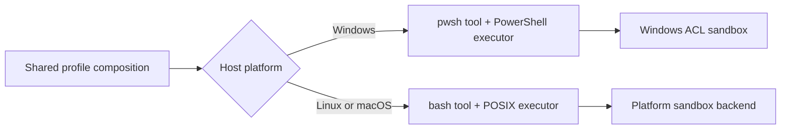

# DeepSeek Harness on Windows: support boundaries and troubleshooting

DeepSeek Harness has a native Windows execution path for the CLI and Web profile. It swaps the POSIX Bash stack for PowerShell and uses a Windows restricted-token plus NTFS ACL sandbox. That does not make every upstream interface portable: the published Python runtime wheels and persistent PTY path currently target Linux and macOS.

This page separates supported runtime layers from common failure modes so you can diagnose Windows behavior without treating every error as an installation problem.

## Compatibility map

| Surface | Windows status | Important boundary |
|---|---|---|
| `npx @deepseek-ai/dsh web` | Native Windows path | uses the `pwsh` tool rather than Bash |
| `dsh --profile headless` | Native Windows path | working directory and active permission mode still define effects |
| Foreground/background shell calls | PowerShell executor | each `pwsh` call starts a fresh shell; no persistent PTY |
| `workspace-write` / `read-only` | Windows ACL backend | reports **partial** enforcement; reads and network are not confined |
| Python SDK wheel | Not currently published for Windows | runtime wheels exist for Linux x64/arm64 and macOS arm64 |
| Upstream minimal JSON-RPC example | Not a Windows Agent interface | persistent PTY and `danger-full-access` assumptions are POSIX-oriented |
| Bash-specific overlays and prompts | Not native Windows tools | use PowerShell syntax, paths, and `$env:NAME` variables |
| MSYS2 / MINGW shell | Separate compatibility target | its GNU-built Node/npm stack is not the native Windows Node toolchain |

## Decode `3221226505` before blaming DSH

Upstream report #4720 contains only:

```text
[ELIFECYCLE] Command failed with exit code 3221226505.
```

The decimal value is the unsigned Windows status `0xC0000409`. Microsoft's NTSTATUS table names that value `STATUS_STACK_BUFFER_OVERRUN`, but modern user-mode software also raises `0xC0000409` through the Fail Fast mechanism for other critical conditions. A Fail Fast exception bypasses ordinary exception handlers, terminates the process, and records a subcode in its first exception parameter. The exit number alone does **not** identify the subcode, crashing module, process, or triggering operation.

Therefore do not conclude any of the following from one pnpm `ELIFECYCLE` line:

- JavaScript exhausted the call stack;
- a malicious buffer overflow occurred;
- DeepSeek Harness core was the crashing process;
- the last visible tool caused the crash;
- reinstalling Node, DSH, or every plugin will repair it.

`ELIFECYCLE` is the package-manager wrapper reporting that a command exited. The terminated process may be the Node Host, a desktop wrapper, a native-addon worker, PowerShell, a package lifecycle child, or another executable in that tree.

### Preserve the exact process owner

Run one bounded reproduction from a foreground PowerShell window rather than double-clicking a launcher. Before starting, record command resolution and versions:

```powershell
Get-Command dsh,node,npm,pnpm,pwsh -All |
  Select-Object Name,CommandType,Source,Version
node --version
npm --version
pnpm --version
dsh --version
$PSVersionTable | Format-List
Get-ComputerInfo -Property WindowsProductName,WindowsVersion,OsBuildNumber,OsArchitecture
```

Capture standard streams without repeatedly restarting:

```powershell
$evidence = Join-Path $env:TEMP 'dsh-native-exit-evidence'
New-Item -ItemType Directory -Force $evidence | Out-Null
$started = Get-Date

dsh web --no-open 1> (Join-Path $evidence 'stdout.log') `
                  2> (Join-Path $evidence 'stderr.log')
$signedExit = [int64]$LASTEXITCODE
$unsignedExit = if ($signedExit -lt 0) { $signedExit + 0x100000000L } else { $signedExit }

[pscustomobject]@{
  Signed = $signedExit
  Unsigned = $unsignedExit
  Hex = ('0x{0:X8}' -f $unsignedExit)
  Started = $started.ToUniversalTime().ToString('o')
  Ended = (Get-Date).ToUniversalTime().ToString('o')
} | ConvertTo-Json | Set-Content (Join-Path $evidence 'exit.json')
```

If a wrapper owns startup, capture the process tree while it is healthy. Do not infer ownership from a window title:

```powershell
Get-CimInstance Win32_Process |
  Where-Object { $_.Name -in @('node.exe','dsh.exe','pwsh.exe','powershell.exe') } |
  Select-Object ProcessId,ParentProcessId,Name,ExecutablePath,CommandLine,CreationDate |
  Export-Csv (Join-Path $evidence 'processes.csv') -NoTypeInformation
```

The command line and environment can contain secrets. Redact tokens, signed URLs, private paths, prompts, and credential arguments before sharing. Preserve executable basename, PID/parent PID, version, timestamps, and the non-secret argument shape.

### Correlate Windows Error Reporting

After the one crash, inspect the Application log in the same time window:

```powershell
Get-WinEvent -FilterHashtable @{ LogName='Application'; StartTime=$started } |
  Where-Object { $_.Id -in 1000,1001 } |
  Select-Object TimeCreated,ProviderName,Id,Message |
  Format-List | Out-File (Join-Path $evidence 'application-events.txt')
```

The useful event identifies the faulting application, faulting module, exception code, and timestamp. An event for `pwsh.exe` belongs to a different boundary than one for the `node.exe` Host. An Event 1001 report may add a failure bucket, report id, and WER artifact location; preserve those identifiers without publishing private paths.

If event metadata is insufficient, capture a dump of the exact confirmed process. Microsoft ProcDump can monitor unhandled exceptions; Windows Error Reporting can also collect per-application user-mode dumps. Both produce sensitive process-memory artifacts and may require administrator or endpoint-owner approval. Use an encrypted, access-controlled directory with enough space, retain the minimum dump count, and remove the diagnostic policy after the bounded reproduction.

Example after confirming the correct PID and installing ProcDump through an approved Microsoft Sysinternals channel:

```powershell
procdump.exe -accepteula -ma -e <confirmed-pid> $evidence
```

Do not attach ProcDump to every `node.exe`, enable a machine-wide full-dump policy casually, upload a dump publicly, or open it on an untrusted analysis service. A full dump can contain API keys, prompts, file content, environment values, and registry or network material.

### Route the evidence, not the numeric label

| Evidence | First owning boundary |
|---|---|
| `node.exe`, native module named, Fail Fast subcode present | exact native addon/runtime call stack; compare Node and DSH artifact without changing both |
| `pwsh.exe` or another tool child crashed while Host remained alive | tool/subprocess provider; one call should settle as failure rather than terminate Host |
| Node Host exited and package manager only echoed `ELIFECYCLE` | Host stack, loaded native modules, last durable Session seq, and fail-loud boundary |
| desktop wrapper exited but child Host logs remain | wrapper/process ownership; record both exit codes separately |
| no WER event and ordinary exit code is small | CLI, package lifecycle, usage, or application-controlled exit—not this native status route |
| `0xC0000409` appears only under one Node version | native ABI/runtime A/B candidate; keep DSH/profile/workspace constant |
| appears only with one plugin removed or added | exact package artifact and activation path; do not call the plugin causal until the dump names its code |

Use one-variable A/B tests after preserving the first dump and event evidence:

1. same DSH/profile/workspace, different supported Node version;
2. same Node/DSH, clean disposable profile versus the failing profile;
3. same composition, failing action omitted versus executed once;
4. exact published artifact versus exact source commit only when their identity is known.

Do not broaden sandbox or approval policy: a native Fail Fast is not an authorization denial. Do not delete the Session log: the last durable sequence is needed to distinguish a crash before tool admission, during execution, or during result persistence.

### Native-exit acceptance gates

- [ ] Decimal and eight-digit unsigned hexadecimal status are both recorded.
- [ ] Command resolution proves the exact dsh, Node, package manager, shell, and wrapper paths.
- [ ] PID and parent-PID evidence identifies which executable terminated.
- [ ] Start/end timestamps correlate one crash with one WER event.
- [ ] Faulting application, module, exception code, and report id are preserved.
- [ ] The Fail Fast subcode and stack come from a dump or debugger, not guessed from `0xC0000409`.
- [ ] Standard streams and the last durable Session sequence are captured before repair.
- [ ] Dumps remain private, encrypted, access-controlled, and retention-bounded.
- [ ] A/B testing changes only one of Node, DSH artifact, profile, plugin, or action at a time.
- [ ] A child crash and Host crash are reported as different outcomes.
- [ ] Reinstall, cache deletion, permission broadening, and whole-home reset are deferred until evidence names their boundary.
- [ ] The final report states what was observed, inferred, and still unknown.

## Field validation: npm rc.6 launcher on Windows

The following matrix records one real-host observation from 2026-08-24. It is
not a compatibility promise for later packages or every Windows policy. The
test used a disposable Git repository and a new `DSH_HOME`; it did not read an
existing profile, credential, Session, or provider response.

### Exact test identity

| Component | Observed identity |
|---|---|
| Windows | 25H2, build `26200.8875`, AMD64 |
| Node / npm | `v24.12.0` / `11.6.2` |
| PowerShell | PowerShell `7.6.4`; Windows PowerShell `5.1.26100.8875` also installed |
| Python | `3.11.7` |
| launcher package | `@deepseek-ai/dsh@0.1.0-rc.6` |
| launcher tarball | npm shasum `de9fbf39056c7f4e658a3e284cb1d66ebc86d040` |
| resolved shell packages | `dsh-tool-pwsh`, `dsh-pwsh-local`, and `dsh-pwsh-sandbox` at `0.1.0-rc.8` |

The last row is important. The rc.6 launcher declares internal dependencies as
caret ranges such as `^0.1.0-rc.6`; resolving that package on 2026-08-24
selected rc.8 shell packages. This run therefore validates the **rc.6 launcher
with its then-current resolved dependency graph**, not an all-rc.6 closure.
The npm package did not expose a `gitHead`, and the upstream repository had no
`v0.1.0-rc.6` tag or GitHub Release, so no source commit is claimed for the
launcher tarball.

The test host's npm wrapper did not materialize `node_modules`, so the published
tarball was unpacked and its production dependencies were installed with an
npm-equivalent hoisted layout:

```powershell
$testRoot = Join-Path $env:TEMP 'dsh-rc6-windows-validation'
New-Item -ItemType Directory -Path $testRoot | Out-Null
$env:DSH_HOME = Join-Path $testRoot 'home'

npm pack @deepseek-ai/dsh@0.1.0-rc.6 --json
tar -xf .\deepseek-ai-dsh-0.1.0-rc.6.tgz -C $testRoot
Set-Location (Join-Path $testRoot 'package')
corepack pnpm@11.7.0 install --prod --node-linker=hoisted

node .\lib\bin.js --version
node .\lib\bin.js --profile web --dump-config
node .\lib\bin.js web --no-open --port 0
```

That reconstruction is test-rig documentation, not a replacement for the normal
`npx @deepseek-ai/dsh@0.1.0-rc.6 web` installation path.

### Results

| Boundary | Result | Evidence |
|---|---|---|
| CLI identity and grammar | Passed | `--version` printed `0.1.0-rc.6`; launcher, Web, and headless help exited 0. |
| Web boot | Passed | `web --no-open --port 0` printed a loopback URL; Chromium loaded a page titled `DeepSeek Harness`. |
| Workspace-selection UI | Partial | The page exposed `Select workspace` / `Add workspace`. Outside the automation sandbox, clicking Select workspace launched the native picker without a Web error; an OS dialog was not selected by headless automation. |
| Platform composition | Passed | The resolved Web config disabled `bash-sandbox`, enabled `pwsh-sandbox`, and defaulted the sandbox policy to `workspace-write`. Root Web tool rows remained disabled until an Agent preset was selected, so the config dump alone was not treated as tool-execution proof. |
| Foreground `pwsh` | Passed | A real `ctx.tools.execute()` call returned `FOREGROUND_OK`, PowerShell `7.6.4`, `FullLanguage`, the disposable Session cwd, and `DSH_SHELL=1`. |
| Background `pwsh` | Passed | The tool returned `started background job pwsh-1`; `job_output` later contained `BACKGROUND_OK` and `[status: completed, exit code: 0]`. |
| `workspace-write` | Passed, partial enforcement | On a previously unused one-file workspace, first/second confined calls took 846/867 ms; no meaningful warmup difference was visible at that size. Both allowed workspace writes, denied an outside write, allowed an outside read, retained `FullLanguage`, and reported `enforcement: partial`. |
| `read-only` | Passed, partial enforcement | It reported `ConstrainedLanguage`, denied a workspace write, still allowed an outside read, and reported `enforcement: partial`. The language-mode probe also emitted the expected `Only core types are supported` errors when the executor preamble attempted non-core type construction. |
| Missing `description` | Passed | Calling `pwsh` without `description` returned `invalid arguments: missing required property "description"`; the command marker did not run. |
| Headless model turn | Not run | No limited provider key was available. Headless help and composition were verified, but no model response or Agent-generated tool transcript is claimed. |
| Python runtime wheel | Not available as a supported Windows carrier | The current upstream `platforms.json` lists Linux x64/arm64 and macOS arm64 only. A configured mirror offered an old `0.0.0.dev0-py3-none-any` placeholder; resolving that file is not evidence of a native Windows runtime executable. |

The foreground probe used the same public plugin assembly as the upstream real
integration suite: `dsh-tools`, `dsh-jobs-local`, `dsh-tool-jobs`,
`dsh-subprocess-local`, `dsh-shell-env`, `dsh-pwsh-local`, and
`dsh-tool-pwsh`. The ACL probe mirrored the upstream real-backend suite with
`dsh-sandbox-local`, `dsh-sandbox-policy`, `dsh-subprocess-local`, and
`dsh-pwsh-sandbox`. The relevant PowerShell commands were:

```powershell
# Foreground identity
[pscustomobject]@{
  Marker = 'FOREGROUND_OK'
  Version = $PSVersionTable.PSVersion.ToString()
  LanguageMode = $ExecutionContext.SessionState.LanguageMode.ToString()
  Cwd = (Get-Location).Path
  Shell = $env:DSH_SHELL
} | ConvertTo-Json -Compress

# Background completion
Start-Sleep -Milliseconds 300
Write-Output 'BACKGROUND_OK'

# Permission probes used Set-Content inside and outside the disposable
# workspace, then Get-Content on an outside marker file.
```

### Interpretation and cleanup

This observation supports the page's main boundaries: the native Web path and
fresh-process PowerShell executor worked; Windows ACL modes restricted writes
but not reads and described themselves as partial; read-only changed PowerShell
language behavior; background execution settled through the generic job
runtime. It does **not** prove provider authentication, a full headless Agent
turn, every native picker completion path, or a pure rc.6 dependency closure.

Stop the Web process before deleting the disposable root. Then remove only the
path you created for the test:

```powershell
Stop-Process -Id <dsh-test-pid>
Remove-Item -LiteralPath $testRoot -Recurse -Force
Remove-Item Env:DSH_HOME -ErrorAction SilentlyContinue
```

Do not substitute your normal `$DSH_HOME` in that cleanup command.

## What changes on Windows

The shipped composition selects platform-specific rows:



The Windows tool contract is PowerShell-native:

```powershell
Get-ChildItem -Force
$env:DSH_SESSION_ID
Resolve-Path .
```

Do not send Bash syntax such as `export NAME=value`, `$PWD/foo`, or `cmd1 && cmd2` and assume it will be translated. The model-facing tool is named `pwsh`, and each call runs through `pwsh -Command` with no state carried into the next call. Use the tool's `workdir` instead of relying on `Set-Location` from a previous command.

## Keep MSYS2 separate from native Windows

Do not use a successful native PowerShell launch as proof that the same package works under MSYS2 or MINGW. MSYS2 can expose Windows executables such as `powershell.exe` through its configured `PATH` while still resolving `node`, `npm`, launch shims, and native addons from its separately patched GNU-toolchain packages. Those are intentionally different runtime stacks.

Capture both shells when diagnosing a launcher failure:

```text
# In MSYS2
which node
which npm
node -p "process.execPath"
node -p "process.platform + ' ' + process.arch"
which powershell

# In native PowerShell
Get-Command node, npm, pwsh, powershell.exe -ErrorAction SilentlyContinue
node -p "process.execPath"
node -p "process.platform + ' ' + process.arch"
```

Different Node and npm paths are expected; the comparison identifies which runtime owns the failure. A package with native addons or Windows-specific launcher assumptions must explicitly support the MSYS2 boundary. Reusing a visible `powershell.exe` does not make its Node ABI, path conversion, signal behavior, or shell-script launch semantics identical to native Windows.

## PowerShell discovery

The executor probes configured and well-known locations. An explicit `pwshPath` wins; otherwise the current implementation searches PowerShell 7 locations, relevant `PATH` entries such as Microsoft Store installs, Windows PowerShell 5.1, then a bare `pwsh` executable.

If shell startup fails:

```powershell
Get-Command pwsh -ErrorAction SilentlyContinue
Get-Command powershell.exe -ErrorAction SilentlyContinue
pwsh -NoLogo -NoProfile -NonInteractive -Command '$PSVersionTable.PSVersion'
```

Then inspect the resolved composition. The Web host plane and a Web session do not show the same shell-tool rows.

```powershell
dsh --profile web --dump-config
```

On the Web host plane, confirm that `pwsh-sandbox` is active on Windows and that the POSIX `bash-sandbox` row is disabled. The shared `tool-pwsh` and `tool-bash` rows are disabled there by design; each Web session remounts the shell tool through its selected Agent preset. The shipped standard preset enables `tool-pwsh` on Windows and disables `tool-bash`.

For a one-shot Agent, inspect the headless dump the same way: POSIX bash rows disable on `win32`, and `tool-pwsh` enables on Windows.

A model response mentioning Bash is not proof that the correct executor mounted; the resolved host and session composition is.

## Understand the Windows sandbox

The Windows backend duplicates the caller token into a `WRITE_RESTRICTED` token and grants separate restricting SIDs for the workspace and a private session temp directory. It fails closed when setup fails; it does not silently launch the child without its intended restriction.

However, its reported enforcement is deliberately `partial`:

- it restricts writes, not reads, network access, or process visibility;
- objects granting write access to `Everyone` can remain writable;
- NTFS hard links are aliases to one file object, so a workspace grant can affect an external alias;
- children share the host console;
- workspace ACL entries are standing grants used as a cross-run cache.

`read-only` therefore means “no explicit workspace or private-temp write capability,” not complete system isolation. If a task must not read caller-accessible files or reach the network, use an additional isolation boundary such as a disposable VM or container whose filesystem and network policy you control.

### Diagnose an apparent delete outside the workspace

Official report #4688 describes a `.NET` recycle-bin delete that appeared to remove a file under `%USERPROFILE%\.dsh` while `workspace-write` was active. A follow-up Windows CI reproduction tested raw `.NET` delete, `Remove-Item`, and `Microsoft.VisualBasic.FileIO.FileSystem.DeleteFile`; all three were denied and all target files survived. Treat the report as an environment-sensitive boundary investigation, not as proof that every rc.2 Windows sandbox permits arbitrary deletion.

The result `file not found` for a missing path outside the workspace is also not proof of a delete bypass. This backend intentionally permits caller-readable paths; it intersects write-class access only. Prove a write-boundary failure by checking the target file after the confined child exits.

Before reproducing any deletion, inspect the target and its ancestors without changing them:

```powershell
$Target = "$env:USERPROFILE\.dsh\some_file.txt"
Get-Item -LiteralPath $Target | Select-Object FullName, LinkType
icacls $Target
icacls (Split-Path -Parent $Target)
fsutil fsinfo volumeinfo (Split-Path -Qualifier $Target)
```

Look for these documented partial-enforcement paths:

| Evidence | Interpretation | Safe response |
|---|---|---|
| an `Everyone` write or modify ACE | the ambient ACE can satisfy both restricted-token access checks | remove the broad grant only after an administrator reviews inheritance and application requirements |
| a capability SID such as `S-1-15-3-...` on an unexpected ancestor | the path may retain a standing grant from an earlier, broader workspace selection | preserve `icacls` output and report the workspace history; do not guess-delete ACL entries |
| multiple hard links | ACLs belong to the file object, so a granted in-workspace alias affects an external alias | move untrusted work to an isolation boundary without shared hard-linked objects |
| FAT-class or another filesystem without NTFS security descriptors | the ACL mechanism cannot express the intended boundary | use NTFS for this backend or a VM/container boundary |

Do not test against `$HOME`, `%USERPROFILE%`, `.dsh`, credentials, or any real user file. If a maintainer requests a destructive probe, create a disposable external directory containing only a sentinel file, record its ACL and volume type, assert file existence from the parent process after every vector, and remove the directory only after the investigation.

If your threat model requires a complete write boundary, reject `enforcement: partial`. Run the Agent in a disposable VM, container, or remote sandbox with an independently scoped filesystem and network policy; a prompt instruction and the local ACL rung are not equivalent to that boundary.

## Why the first confined command can be slow

The first `workspace-write` run on a directory materializes an inheritable workspace ACL through its tree. On a large workspace this can take tens of seconds or longer. Later sessions derive the same workspace SID and skip the write when the exact ACL entry already exists.

Before assuming the process is hung:

1. test with a small disposable repository;
2. keep the `dsh` terminal visible for Win32 diagnostics;
3. avoid selecting a drive root or very large monorepo for the first smoke test;
4. compare first-run and second-run time on the same canonical path.

Renaming or moving the workspace derives another identity and can pay the materialization cost again.

## `read-only` and PowerShell language mode

Under the current Windows sandbox, `read-only` denies the temp writes PowerShell uses for its AppLocker probe. PowerShell can therefore start in `ConstrainedLanguage`, where operations such as `Add-Type`, COM construction, reflection, and many non-core .NET static calls fail.

That is distinct from a general tool failure. Check the language mode inside the same confined call:

```powershell
$ExecutionContext.SessionState.LanguageMode
```

The shipped `workspace-write` path grants a private temp capability, allowing that startup probe to complete and normally preserving `FullLanguage` unless machine-wide WDAC or AppLocker policy imposes another restriction.

Do not request a broader permission only to make an arbitrary script work. First decide whether the script actually needs those language features and whether the wider write scope is acceptable.

## Process and output limitations

The Windows `pwsh` tool supports foreground execution and managed background jobs, but it does not provide a persistent PTY. Each call begins a new process.

Inside a confined PowerShell command, a grandchild that tries to capture output through named-pipe stdio can fail with `EPERM`. Ordinary PowerShell pipelines use anonymous pipes and are a different path. When a nested CLI fails only under confinement:

1. run the smallest direct command that reproduces it;
2. distinguish the child command's own denial from `SANDBOX_UNAVAILABLE`;
3. check whether it launches another process with captured stdio;
4. avoid assuming a retry with wider permission fixes an unsupported pipe shape.

WMI/CIM queries are also unavailable under the restricted token because the necessary authenticated-user SID is intentionally absent. `Get-ComputerInfo` can return incomplete information rather than a clear failure, so do not use it as the only environment diagnostic from a confined Agent.

## Python SDK on Windows

The published Python runtime wheels currently carry executables for:

- Linux x64;
- Linux arm64;
- macOS 14+ on Apple silicon.

There is no published Windows runtime wheel in the upstream platform manifest. Installing the Python client alone does not create a Windows runtime carrier, and the upstream minimal example relies on a persistent PTY that is not a Windows Agent interface.

For Windows today, prefer the Node-based CLI/Web or headless profile. If Python must orchestrate the Agent, run the supported runtime in Linux/WSL or another isolated supported host and define the transport and workspace boundary explicitly; do not claim native SDK support that the distributed wheel does not provide.

## `missing required property "description"`

An error such as `invalid arguments: missing required property "description"` happens during tool-argument validation, before PowerShell starts and before the Windows sandbox evaluates the command. In the current schemas, both `run_code` and `pwsh` require a short, non-empty `description` in addition to their executable input.

If many unrelated tools begin failing this way, do not widen the sandbox permission. First inspect the resolved composition and compare it with a clean profile:

```powershell
dsh --profile web --dump-config
$env:DSH_HOME = Join-Path $env:TEMP "dsh-clean-profile"
npx @deepseek-ai/dsh web
```

Configure only the model in the clean profile, select a disposable workspace, and run a bounded read-only task. If the clean profile works, restore third-party plugins one at a time, prioritizing anything that intercepts tool schemas, `tools/*` events, or system-prompt assembly. Preserve the failed call's raw arguments: they show whether the model omitted `description` or a plugin changed the contract after prompt assembly.

## `Unexpected token ''` while reading `package.json`

An error that points at the first character of JSON can reveal an invisible UTF-8 byte order mark:

```text
<anonymous_script>:1
{
^
SyntaxError: Unexpected token '', "{"... is not valid JSON
```

This fails before the profile composition or any plugin starts. Harness reads the active profile manifest as UTF-8 and passes the complete string to `JSON.parse`. A leading Unicode `U+FEFF` is not removed first, so otherwise valid JSON is rejected at byte zero.

The active manifest is normally:

```text
$DSH_HOME/profiles/<profile>/package.json
```

`DSH_HOME` defaults to `~/.dsh`. The stack trace often prints the exact manifest path; use that path instead of editing a similarly named repository `package.json`.

### Confirm the failing file

Inspect the first bytes without printing the whole manifest:

```powershell
$manifest = Join-Path $env:USERPROFILE '.dsh\profiles\web\package.json'
$bytes = [System.IO.File]::ReadAllBytes($manifest)
$bytes[0..([Math]::Min(7, $bytes.Length - 1))] | ForEach-Object { $_.ToString('X2') }
```

A UTF-8 BOM begins with `EF BB BF`. If `DSH_HOME` is set, resolve from that location instead:

```powershell
$root = if ($env:DSH_HOME) { $env:DSH_HOME } else { Join-Path $env:USERPROFILE '.dsh' }
$manifest = Join-Path $root 'profiles\web\package.json'
```

Back up the file, then rewrite only the encoding while preserving its JSON content:

```powershell
Copy-Item $manifest "$manifest.bak" -Force
$text = [System.IO.File]::ReadAllText($manifest)
$text = $text.TrimStart([char]0xFEFF)
[System.IO.File]::WriteAllText(
  $manifest,
  $text,
  [System.Text.UTF8Encoding]::new($false)
)
```

Validate the result before restarting Harness:

```powershell
Get-Content -Raw $manifest | ConvertFrom-Json | Out-Null
dsh --profile web --dump-config
```

Do not delete the complete profile as the first response. The file can contain installed out-of-tree bundle dependencies and the ordered `dsh.profile.bundles` list. Removing a three-byte encoding marker should not become an unrelated configuration reset.

If the BOM returns, identify the editor, PowerShell command, plugin installer, or sync process rewriting the manifest. PowerShell 5.1 commands such as `Out-File -Encoding utf8` commonly emit a BOM; prefer the explicit BOM-free writer above when scripting profile changes. The supported `dsh plugin` flow owns normal profile-manifest writes and emits two-space JSON with a trailing newline.

## `node:zlib` does not export `createZstdDecompress`

This startup error is a Node runtime mismatch:

```text
SyntaxError: The requested module 'node:zlib' does not provide an export
named 'createZstdDecompress'
```

The session JSONL persistence package imports Node's zstd stream API during module initialization. DeepSeek Harness declares this supported Node range:

```text
^22.19.0 || >=24.0.0
```

Node `22.14.0`, visible in the original Windows report, is below that range. The plugin tree fails before any session storage operation runs, so deleting sessions, editing the profile, or disabling the sandbox cannot fix it.

Check which executables PowerShell actually resolves:

```powershell
node --version
where.exe node
where.exe npm
where.exe dsh
npm prefix --global
```

Install a supported Node release, preferably the current Node 24.x line, then open a new PowerShell window and verify `node --version` before reinstalling or refreshing the CLI under that active runtime:

```powershell
npm install --global @deepseek-ai/dsh@latest
node --version
dsh web
```

If `node --version` still prints the old release, stop. Multiple Node installations or a stale `PATH` entry are still selecting it. Do not repeatedly reinstall Harness into the old global npm prefix. Resolve the active Node path first, then install the CLI once under that runtime.

Preserve `$DSH_HOME` while upgrading Node. The runtime upgrade does not require deleting profiles, settings, credentials, attachments, or session logs.

## Symptom checklist

| Symptom | Check first |
|---|---|
| Model emits Bash commands | active platform rows and prompt/tool visibility |
| `pwsh` cannot start | `pwshPath`, `Get-Command pwsh`, install architecture, process logs |
| First command appears frozen | one-time ACL propagation on a large workspace |
| `Add-Type` or .NET calls fail | `LanguageMode` under `read-only` |
| Nested CLI fails with `EPERM` | captured named-pipe stdio under confinement |
| CIM/WMI data is missing | restricted-token SID boundary |
| Write or delete succeeds outside the workspace | verify target survival from the parent, then inspect `Everyone` DACLs, standing capability ACEs, hard links, and the volume type |
| Python runtime is missing | Windows wheel is not published |
| Every tool reports missing `description` | argument schema and active plugins; this occurs before sandbox execution |
| Startup fails with `Unexpected token ''` at `{` | BOM in the exact active profile `package.json` |
| `node:zlib` has no `createZstdDecompress` export | active Node is below `^22.19.0 || >=24.0.0` |
| Interrupted tool reports exit 1 | Windows termination has no POSIX signal marker |
| A plugin argument path breaks at spaces | capture the exact CLI argv and report a minimal upstream reproduction |

## A bounded Windows smoke test

Create a small disposable Git repository, launch the Web UI from it, select that exact directory as the workspace, and ask:

```text
Inspect this Windows workspace without changing files.
Use PowerShell-native commands only.
Report the active shell, PowerShell version, language mode, workspace path,
and resolved permission mode. Cite tool output. Stop before any write,
network request, credential access, or permission escalation.
```

Success evidence is the actual tool transcript and resolved configuration—not only the final assistant summary.

## Report an upstream issue well

Include:

- Windows edition, version, and architecture;
- Node, npm, `dsh`, and PowerShell versions;
- exact launch command and selected workspace path shape;
- active profile and relevant `--dump-config` rows, with secrets removed;
- the smallest reproducing command;
- whether the failure occurs in `danger-full-access`, `workspace-write`, or `read-only`;
- complete stderr and exit marker;
- whether the path includes spaces or non-ASCII characters.

Never attach credentials, a full settings file, or an unredacted session log.

## Official sources

- [Microsoft NTSTATUS values](https://learn.microsoft.com/en-us/openspecs/windows_protocols/ms-erref/596a1078-e883-4972-9bbc-49e60bebca55)
- [Microsoft `__fastfail` contract](https://learn.microsoft.com/en-us/cpp/intrinsics/fastfail?view=msvc-170)
- [Microsoft Windows Error Reporting user-mode dumps](https://learn.microsoft.com/en-us/windows/win32/wer/collecting-user-mode-dumps)
- [Microsoft Sysinternals ProcDump](https://learn.microsoft.com/en-us/sysinternals/downloads/procdump)
- [Native exit report #4720](https://github.com/deepseek-ai/deepseek-harness/discussions/4720)
- [`@deepseek-ai/dsh@0.1.0-rc.6` package](https://www.npmjs.com/package/@deepseek-ai/dsh/v/0.1.0-rc.6)
- [CLI composition](https://github.com/deepseek-ai/deepseek-harness/blob/master/apps/cli/composition.md)
- [PowerShell tool](https://github.com/deepseek-ai/deepseek-harness/blob/master/packages/shell/tool-pwsh/README.md)
- [PowerShell executor](https://github.com/deepseek-ai/deepseek-harness/blob/master/packages/shell/pwsh-local/README.md)
- [PowerShell sandbox executor](https://github.com/deepseek-ai/deepseek-harness/blob/master/packages/shell/pwsh-sandbox/README.md)
- [Real PowerShell tool integration suite](https://github.com/deepseek-ai/deepseek-harness/blob/master/packages/shell/tool-pwsh/tests/integration.spec.ts)
- [Real Windows ACL PowerShell suite](https://github.com/deepseek-ai/deepseek-harness/blob/master/packages/shell/pwsh-sandbox/tests/acl.e2e.ts)
- [Windows ACL sandbox](https://github.com/deepseek-ai/deepseek-harness/blob/master/packages/sandbox/sandbox-windows-acl/README.md)
- [Windows delete-boundary report and negative CI reproduction #4688](https://github.com/deepseek-ai/deepseek-harness/discussions/4688)
- [rc.2 restricted-token construction](https://github.com/deepseek-ai/deepseek-harness/blob/b150a551b8d465e31e418e1b2eaf5e79bbb7d28e/packages/sandbox/sandbox-windows-acl/src/token.ts)
- [Python runtime wheel](https://github.com/deepseek-ai/deepseek-harness/blob/master/python/sdk-runtime/README.md)
- [Python runtime platform manifest](https://github.com/deepseek-ai/deepseek-harness/blob/master/python/sdk-runtime/platforms.json)
- [Profile manifest reader and writer](https://github.com/deepseek-ai/deepseek-harness/blob/master/packages/boot/app-boot/src/profile.ts#L263-L284)
- [Profile manifest location and ownership](https://github.com/deepseek-ai/deepseek-harness/blob/master/packages/boot/app-boot/README.md#profiles-and-bundles)
- [Windows BOM startup report](https://github.com/deepseek-ai/deepseek-harness/discussions/1903)
- [Supported Node engine range](https://github.com/deepseek-ai/deepseek-harness/blob/master/package.json#L8-L10)
- [JSONL persistence imports the zstd stream API](https://github.com/deepseek-ai/deepseek-harness/blob/master/packages/session/session-persistence-jsonl/src/zstd-private-decoder.ts#L1-L9)
- [Windows zstd startup report](https://github.com/deepseek-ai/deepseek-harness/discussions/1936)
