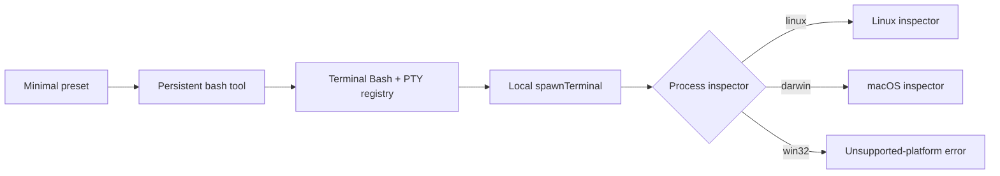

# Windows Minimal preset Bash failure and rc.8 fix

On DeepSeek Harness rc.7 and earlier, native Windows could expose a `bash` tool that failed every time with:

> [!NOTE]
> This is a historical rc.7 failure. DeepSeek Harness rc.8 added a Windows process inspector and changed Minimal to mount persistent PowerShell on `win32`. If you are on rc.8 or later, skip to [Current status on rc.8+](#current-status-on-rc8).

```text
BashError: subprocess-local: terminal inspection is unsupported on platform win32
```

This is not evidence that Bash is missing from `PATH`, the command is malformed, or the sandbox denied it. The rc.7 preset selected a persistent PTY stack whose local process inspector had no Windows implementation.

## Current status on rc.8+

The upstream rc.8 fix changes the failure boundary rather than hiding the error:

- `createProcessInspector()` now supports `win32` through a Windows process inspector;
- Minimal mounts persistent Bash on POSIX and persistent PowerShell on native Windows;
- the Windows tool uses the `pwsh` dialect, so Bash syntax is not portable to that Session;
- a fresh Minimal Session should expose `pwsh` and `str_replace_editor`, not persistent `bash`.

Verify the installed version before applying the historical workaround:

```powershell
dsh --version
```

After upgrading, restart the Host and create a fresh Session. Run a bounded probe such as `Get-Location` and confirm that the tool roster and shell description both say `pwsh`. Existing Sessions retain their previously composed tool roster and should not be used to validate the fix.

> [!WARNING]
> Do not install Git Bash, weaken permissions, or rewrite the command as the first response. The failure occurs while the terminal backend is being constructed, before the requested command executes.

## Identify this exact case

All four conditions should be true:

1. the Host is native `win32`, not WSL;
2. the selected Agent preset is `minimal`;
3. the model-facing tool is `bash`, not `pwsh`;
4. stderr contains the exact terminal-inspection error above.

If the tool is `pwsh`, route the failure through the broader [Windows compatibility guide](windows-compatibility.md). If `bash` reports `ENOENT`, inspect executable discovery instead. If WSL hosts the Harness process, the platform is Linux and this guide does not apply.

## The rc.7 failure crossed four layers



The Minimal composition mounts these rows without a platform guard:

```yaml
- id: pty
  name: '@deepseek-ai/dsh-terminal'
- id: terminal-bash
  name: '@deepseek-ai/dsh-terminal-bash'
- id: persistent-bash
  name: '@deepseek-ai/dsh-tool-bash-persistent'
```

That stack eventually calls `createProcessInspector()`. At the pinned revision, the factory returns implementations only for `linux` and `darwin`, then throws for every other platform.

Standard, Code, and Cordis presets use a different shell contract. Their tool rows explicitly disable `tool-bash` on `win32` and enable `tool-pwsh` there. This is why changing preset can make the same installation work.

## Fast recovery on rc.7 and earlier

Upgrade to rc.8 or later first. If an upgrade is not possible, use **Standard** or **Code** for a native Windows Session, create a fresh Session, and verify that the tool roster contains `pwsh` rather than `bash`.

```powershell
dsh --profile web --dump-config
```

Then run a bounded probe through the Agent:

```powershell
Get-Location
Get-ChildItem -Force | Select-Object -First 5
```

A new Session matters because the selected preset and tool contract are Session facts. Switching a UI control is not sufficient evidence that an already-created Session was recomposed.

If the Minimal prompt is essential, copy the shipped preset through the supported preset-authoring flow and replace its persistent PTY group with the same platform-gated `tool-bash` / `tool-pwsh` rows used by the other presets. Never edit the shipped preset in place: an upgrade can overwrite it, and a malformed composition can prevent the Agent from loading.

## dsh-win32 compatibility companion

On rc.8 or later, no community shell replacement is required. [dsh-win32 0.17.1](https://github.com/sjh9714/dsh-win32/releases/tag/v0.17.1) instead checks the official persistent PowerShell and Workspace Write packages, diagnoses common Windows installation failures, can run a live acceptance check of the installed component chain, and can create the desktop shortcut.

```powershell
npx dsh-win32@0.17.1 doctor
npx dsh-win32@0.17.1 verify
npx dsh-win32@0.17.1 setup
```

`doctor` checks published package metadata and local installation failures. `verify` is model- and API-key-free: in isolated temporary directories it loads the installed official terminal, subprocess, persistent PowerShell, Workspace Write policy, and Windows ACL sandbox components, then checks state persistence, write confinement, cancellation recovery, and cleanup. It does not boot a complete stock Minimal Host or make a model request, so a pass is component-chain acceptance rather than a full Session claim.

The default setup does not install a custom bundle or preset. `setup --sandboxed` remains accepted for command compatibility, but current DSH already owns the sandbox configuration.

If upgrading from rc.7 or earlier is impossible and the older Minimal prompt plus persistent shell is still required, the previous Git Bash and busybox-w32 presets remain available only through an explicit legacy setup.

```powershell
npx dsh-win32@0.17.1 setup --legacy --sandboxed
```

This legacy path is a community workaround, not an upstream repair. The sandboxed preset uses busybox-w32 ash rather than Bash or PowerShell. Bash arrays and `[[ ]]` are unavailable. Prefer upgrading DSH over installing the legacy preset.

To roll back a legacy Web profile installation, remove the bundle and the two community presets.

```powershell
npx @deepseek-ai/dsh plugin --profile web remove dsh-win32
Remove-Item -Recurse -Force "$HOME\.dsh\.agent-presets\minimal-windows","$HOME\.dsh\.agent-presets\minimal-windows-sandboxed" -ErrorAction SilentlyContinue
```

## What not to do

| Attempt | Why it misses this failure |
|---|---|
| install another `bash.exe` | the backend fails at terminal inspection, not executable lookup |
| retry with `danger-full-access` | permission policy does not add a Windows process inspector |
| translate the command to PowerShell | the mounted tool remains persistent Bash |
| edit the shipped Minimal YAML | upgrades overwrite it and the deployment owns that composition |
| treat `str_replace_editor` fallback errors as the cause | they happen after Bash has already failed |

## Regression gates

The upstream implementation addresses both required layers: the Windows process inspector and the platform-specific Minimal shell composition. A release-level regression check should prove:

1. Minimal on `win32` exposes `pwsh`, not persistent `bash`;
2. Minimal on Linux/macOS retains its intended persistent Bash behavior;
3. Standard, Code, and Cordis rosters do not regress;
4. the Minimal tool description matches the actual shell semantics;
5. a fresh Windows Session completes a read-only shell probe;
6. cancellation and process cleanup leave no child behind;
7. preset switching creates the expected Session-scoped roster;
8. resolved-config output makes the platform choice inspectable.

## Source evidence

- [Upstream report #3428](https://github.com/deepseek-ai/deepseek-harness/discussions/3428)
- [rc.7 Minimal preset composition](https://github.com/deepseek-ai/deepseek-harness/blob/99f6f02fecdb7dff40c3fbc9470f5907c29f74ca/apps/cli/config/agent-presets/minimal/agent.cordis.yml)
- [rc.7 `createProcessInspector()` platform factory](https://github.com/deepseek-ai/deepseek-harness/blob/99f6f02fecdb7dff40c3fbc9470f5907c29f74ca/packages/subprocess/subprocess-local/src/process-inspector.ts)
- [rc.8 Windows process inspector](https://github.com/deepseek-ai/deepseek-harness/blob/b150a551b8d465e31e418e1b2eaf5e79bbb7d28/packages/subprocess/subprocess-local/src/process-inspector.ts)
- [rc.8 Minimal platform-specific shell composition](https://github.com/deepseek-ai/deepseek-harness/blob/b150a551b8d465e31e418e1b2eaf5e79bbb7d28/apps/cli/config/agent-presets/minimal/agent.cordis.yml)
- [rc.8 Windows shell tests](https://github.com/deepseek-ai/deepseek-harness/blob/b150a551b8d465e31e418e1b2eaf5e79bbb7d28/apps/cli/tests/windows-shell.spec.ts)
- [rc.8 Standard preset shell rows](https://github.com/deepseek-ai/deepseek-harness/blob/b150a551b8d465e31e418e1b2eaf5e79bbb7d28/apps/cli/config/agent-presets/standard/agent.cordis.yml)
- [dsh-win32 Windows details and measured limitations](https://github.com/sjh9714/dsh-win32/blob/v0.17.1/docs/windows-details.md)
- [dsh-win32 cross-platform and restricted-token CI](https://github.com/sjh9714/dsh-win32/actions/workflows/ci.yml)
