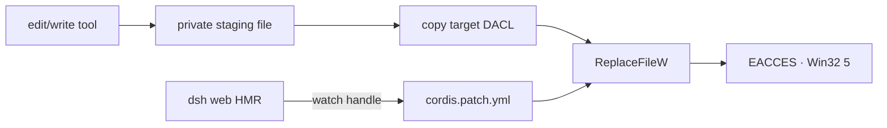

# Fix `ReplaceFileW EACCES` on Windows config files

On Windows, editing an existing DeepSeek Harness profile file can fail with:

```text
ReplaceFileW EACCES (Win32 5): C:\Users\<user>\.dsh\profiles\web\cordis.patch.yml
```

When the same directory accepts a new file, the target ACL is writable, and the replacement succeeds after `dsh web` stops, the likely conflict is the running HMR watcher’s open handle—not a read-only attribute or missing FullControl permission.

Use a stop → backup → edit → validate → restart loop. Do not bypass the atomic writer with a live `Set-Content` on a watched configuration file.

> [!WARNING]
> These steps change the user-level Harness profile. Preserve the last known-good patch, stop the process that watches it, and validate before restart. Never copy a sample patch over your file without reviewing its existing entries.

## Recognize the watcher signature

Evidence for this specific path:

| Check | Watcher conflict | ACL or other denial |
|---|---|---|
| Error names `ReplaceFileW`, `EACCES`, and Win32 `5` | strong signal | possible but not sufficient |
| Creating a new sibling file | succeeds | may fail |
| Replacing an existing HMR-watched file | fails while Host runs | fails independently of HMR |
| Same replacement after clean Host shutdown | succeeds | still fails |
| `attrib` and `icacls` | writable / expected grants | may show read-only or missing rights |

Antivirus, an editor, backup software, or a second Harness process can also retain a handle. A successful post-shutdown edit proves only that removing the active owners resolved the conflict; it does not prove which process held the handle.

## Why this happens at the verified revision

At upstream commit `99f6f02`, `dsh-fs-local` stages a replacement in a private sibling directory, copies the existing Windows DACL to the staging file, writes and syncs it, then publishes with `ReplaceFileW` for an existing Windows target.

The publication branch falls back to Node `rename()` only when `ReplaceFileW` reports `ENOENT`. An `EACCES` from a watched existing target is rethrown. The Cordis HMR plugin uses Chokidar to watch the root and exact registered configuration paths, including the profile’s `cordis.patch.yml`.



This failure occurs at final publication. A staged temporary file may already have been created and cleaned up; the original target remains authoritative.

## Safe recovery procedure

The commands below use the default Web profile path. If `DSH_HOME` or the profile name differs, resolve the real location first.

### 1. Stop the watcher owner

For a foreground `dsh web`, press `Ctrl+C` and wait for graceful shutdown to finish. If it was started by another terminal, service wrapper, or desktop launcher, stop that owner through the same surface.

Inspect possible remaining processes without terminating them blindly:

```powershell
Get-CimInstance Win32_Process |
  Where-Object { $_.CommandLine -match 'dsh' } |
  Select-Object ProcessId, Name, CommandLine |
  Format-Table -AutoSize
```

Review the full command lines. Other Node applications can match a broad search; do not stop an unrelated process.

### 2. Capture attributes and ACL evidence

```powershell
$ProfileDir = Join-Path $env:USERPROFILE '.dsh\profiles\web'
$Patch = Join-Path $ProfileDir 'cordis.patch.yml'

attrib $Patch
icacls $Patch
```

Keep this output with the complete original error. Redact the username and private path before sharing.

### 3. Back up the exact file

```powershell
$Stamp = Get-Date -Format 'yyyyMMdd-HHmmss'
$Backup = "$Patch.backup-$Stamp"
Copy-Item -LiteralPath $Patch -Destination $Backup
Get-FileHash -LiteralPath $Patch, $Backup
```

Both hashes should match before editing.

### 4. Edit while the Host is stopped

Open `$Patch` in your ordinary editor. Keep it a top-level YAML array; an empty or comments-only patch file is invalid. Use `[]` when the intended layer is empty.

Do not use a forceful rename or live non-atomic overwrite as the first recovery attempt. The stopped-owner procedure preserves the normal writer and HMR lifecycle on the next boot.

### 5. Validate the composed profile offline

```powershell
dsh --profile web --dump-config
```

Success means the profile and patch layers composed without a parser or missing-row failure. Review warnings: a patch targeting an absent entry is not proof that the intended configuration applied.

### 6. Restart and run one smoke test

```powershell
dsh web
```

Confirm that the Host stays running, the Web UI loads, and the intended configuration is visible. Do not immediately stack another plugin or patch change on top of the first one.

## Roll back safely

If validation or startup fails, stop `dsh web` again before restoring:

```powershell
Copy-Item -LiteralPath $Backup -Destination $Patch -Force
dsh --profile web --dump-config
dsh web
```

Keep the failed patch and first boot error separately if you plan to report the problem. Do not overwrite the only failure evidence with the backup.

## Optional same-directory probe

If ACL versus replacement behavior is still unclear, run a disposable new-file probe and remove it immediately:

```powershell
$Probe = Join-Path $ProfileDir '.dsh-write-probe.tmp'
Set-Content -LiteralPath $Probe -Value 'probe' -NoNewline
Get-Item -LiteralPath $Probe
Remove-Item -LiteralPath $Probe
```

Creating a new sibling exercises different publication semantics from replacing the watched target. It is supporting evidence, not permission to overwrite `cordis.patch.yml` with `Set-Content` while HMR is active.

## Avoid unsafe workarounds

- **Do not live-overwrite watched YAML with `Set-Content`.** A non-atomic write can expose a partial file to HMR. The last-good tree may survive a rejected refresh, but that is not a safe publication strategy.
- **Do not disable antivirus or weaken the profile ACL as the first response.** Prove the watcher/process correlation first.
- **Do not terminate every `node.exe`.** Identify the command line and owner.
- **Do not assume `maxParallelToolCalls`, sandbox policy, or model permissions affect this native file replacement.** The failure is below the Agent tool policy after write approval.
- **Do not edit the generated `cordis.yml` as a substitute for the owned patch file.** The profile and bundle composition remains the source of truth.

## Report a minimal incident bundle

```text
Harness package version and source commit:
Windows version and Node version:
Exact operation: edit / write existing / create new:
Target path class: profile patch / generated config / other:
Complete ReplaceFileW error:
Was dsh web/HMR running?
New sibling file succeeds: yes/no
Same replacement after clean shutdown succeeds: yes/no
attrib output:
sanitized icacls output:
Second watcher/antivirus/editor present:
Profile dump after stopped edit:
```

## Primary sources

- [Upstream Windows report #3237](https://github.com/deepseek-ai/deepseek-harness/discussions/3237)
- [`writeFileAtomic` Windows publication path at `99f6f02`](https://github.com/deepseek-ai/deepseek-harness/blob/99f6f02fecdb7dff40c3fbc9470f5907c29f74ca/packages/fs/fs-local/src/fsio.ts)
- [`ReplaceFileW` and DACL helpers](https://github.com/deepseek-ai/deepseek-harness/blob/99f6f02fecdb7dff40c3fbc9470f5907c29f74ca/packages/fs/fs-local/src/win32.ts)
- [Vendored Cordis HMR watcher implementation](https://github.com/deepseek-ai/deepseek-harness/blob/99f6f02fecdb7dff40c3fbc9470f5907c29f74ca/vendor/hmr/src/index.ts)
- [Profile patches and HMR lifecycle](https://github.com/deepseek-ai/deepseek-harness/blob/99f6f02fecdb7dff40c3fbc9470f5907c29f74ca/packages/boot/app-boot/README.md)

