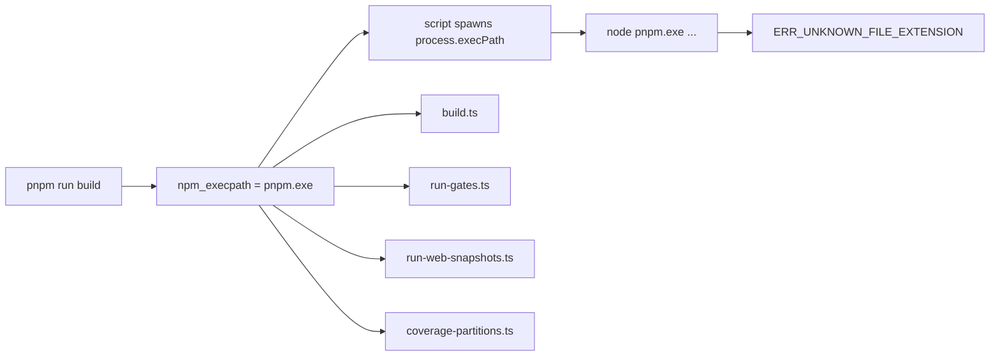

# Fix `ERR_UNKNOWN_FILE_EXTENSION .exe` with standalone pnpm on Windows

DeepSeek Harness rc.8 repository scripts assume `npm_execpath` names a JavaScript package-manager entrypoint. When pnpm 11 is installed as the standalone `@pnpm/exe` build, that variable can name a native `pnpm.exe` instead. The scripts then run the equivalent of:

```text
node C:\...\@pnpm\exe\pnpm.exe run build:lib
```

Node tries to load the executable as an ES module and fails:

```text
TypeError [ERR_UNKNOWN_FILE_EXTENSION]: Unknown file extension ".exe"
```

This is a repository build-runner incompatibility. It is not a failure in the package being built, a pnpm store corruption, or the same problem as `ERR_PNPM_ADDING_TO_ROOT` during plugin installation.

## Confirm all three identities

From the official source checkout at the exact release commit:

```powershell
node --version
pnpm --version
pnpm exec node -p "process.env.npm_execpath"
Get-Command pnpm -All | Select-Object Source, CommandType
git rev-parse HEAD
```

For rc.8, the repository declares:

```text
Node: ^22.19.0 or >=24.0.0
pnpm: 11.7.0
commit: 141eb6fef83422698aef7a981029e843e8161534
```

Route the result:

| `npm_execpath` value | Meaning |
|---|---|
| ends in `.js`, `.cjs`, or `.mjs` | Node wrapping is structurally valid |
| ends in `.exe` | standalone native pnpm; rc.8 scripts will pass it to Node incorrectly |
| empty or undefined | runner was not invoked through the expected package-manager environment |
| ends in `.cmd` | shell shim; do not pass it to Node or spawn it shell-free as if it were native |

Meet the Node engine independently. Upgrading Node can remove one gate while leaving the `.exe` failure unchanged.

## Why one command fans out into many failures



At rc.8, the same assumption affects:

- `pnpm run build` through `scripts/build.ts`;
- `check:all` and CI aggregates through `scripts/run-gates.ts`;
- `test:web:ci` through `scripts/run-web-snapshots.ts`;
- partitioned coverage through `scripts/coverage-partitions.ts`.

The first nested command fails before package compilation or tests begin. Do not debug TypeScript, Vite, Vitest, or a workspace package until the child-process command line is correct.

## Current recovery: use a JavaScript-entrypoint pnpm

Keep the failing environment as evidence. In a fresh terminal, use a pnpm distribution that exposes a JavaScript entrypoint and exactly matches the repository declaration. Corepack is the intended version-selection path for a repository with a `packageManager` field:

```powershell
corepack enable
corepack prepare pnpm@11.7.0 --activate
corepack pnpm --version
corepack pnpm exec node -p "process.env.npm_execpath"
```

The last command must print a `.js`, `.cjs`, or `.mjs` path before continuing. If system policy prevents `corepack enable`, use Corepack explicitly without changing global shims:

```powershell
corepack pnpm install --frozen-lockfile
corepack pnpm run build
```

Verify `npm_execpath` under the exact invocation first. Do not assume the word “Corepack” proves which binary won PATH resolution.

An npm-installed `pnpm@11.7.0` package can also expose its JavaScript bin, but installing another global manager adds PATH ambiguity. Prefer an explicit Corepack command for the bounded recovery, and keep `Get-Command pnpm -All` with the evidence.

## Re-run from the first meaningful gate

After the entrypoint and Node engine are correct:

```powershell
corepack pnpm install --frozen-lockfile
corepack pnpm run build
corepack pnpm run typecheck:contracts-ready
corepack pnpm run check:all
```

Record the first new failure. A later native addon, test, snapshot, lint, or generated-artifact error is a different boundary; do not attribute it to `npm_execpath` merely because the environment previously had that problem.

## Do not use these shortcuts

- Do not rename `pnpm.exe` to `.js` or `.cjs`; file extension does not change its format.
- Do not set `npm_execpath` globally to a guessed path; package managers own that invocation variable.
- Do not enable `shell: true` just to make `.cmd` execute. It changes quoting, injection, and signal behavior across platforms.
- Do not patch only `scripts/build.ts`; three other runners carry the same assumption.
- Do not remove `packageManager` or ignore the rc.8 Node engine to make a local command appear green.
- Do not delete the pnpm store or lockfile: the failure occurs before package resolution is the controlling boundary.

## Upstream repair contract

The runner should classify the concrete entrypoint:

```text
JavaScript (.js/.cjs/.mjs)
  command = process.execPath
  args    = [entrypoint, ...packageManagerArgs]

Native executable (.exe or extensionless native binary)
  command = entrypoint
  args    = packageManagerArgs

Shell shim (.cmd/.bat)
  resolve a shell-free native or JavaScript target; do not silently enable a shell
```

A shared helper should own this decision so build, gates, Web snapshots, and coverage cannot drift.

### Regression gates

- [ ] JavaScript pnpm entrypoints remain wrapped with the current Node executable.
- [ ] Native `pnpm.exe` is spawned directly with no shell.
- [ ] `.cmd` and `.bat` shims are not passed to Node.
- [ ] Missing `npm_execpath` fails with the runner-specific actionable error.
- [ ] Paths containing spaces and non-ASCII characters work on Windows.
- [ ] Arguments remain an array; no command-string quoting is introduced.
- [ ] Exit status, signal, inherited stdio, cwd, and environment remain unchanged.
- [ ] `build.ts` uses the shared helper for both nested build scripts.
- [ ] `run-gates.ts` uses it for `run` and `exec` gates.
- [ ] Web snapshot and coverage partition runners use the same command/args pair.
- [ ] Unit tests cover `.cjs`, `.js`, `.mjs`, `.exe`, missing input, and mixed-case extensions.
- [ ] A real Windows standalone-pnpm build passes build, contracts, gates, coverage, and Web snapshots.

## Route neighboring pnpm failures

| Symptom | First boundary |
|---|---|
| Node reports unknown `.exe` extension | runner wrapped native pnpm with Node |
| `npm_execpath is unavailable` | script invocation environment |
| `ERR_PNPM_ADDING_TO_ROOT` | plugin target is a workspace root |
| ignored build scripts or missing native artifact | pnpm build policy and package artifact |
| package cannot resolve after global install | isolated global dependency graph |
| engine mismatch before scripts run | Node or pnpm version contract |

## Primary sources

- [Official discussion #3440](https://github.com/deepseek-ai/deepseek-harness/discussions/3440)
- [Official rc.8 release](https://github.com/deepseek-ai/deepseek-harness/releases/tag/dsh-v0.1.0-rc.8)
- [rc.8 `scripts/build.ts`](https://github.com/deepseek-ai/deepseek-harness/blob/141eb6fef83422698aef7a981029e843e8161534/scripts/build.ts)
- [rc.8 `scripts/run-gates.ts`](https://github.com/deepseek-ai/deepseek-harness/blob/141eb6fef83422698aef7a981029e843e8161534/scripts/run-gates.ts)
- [rc.8 `scripts/run-web-snapshots.ts`](https://github.com/deepseek-ai/deepseek-harness/blob/141eb6fef83422698aef7a981029e843e8161534/scripts/run-web-snapshots.ts)
- [rc.8 `scripts/coverage-partitions.ts`](https://github.com/deepseek-ai/deepseek-harness/blob/141eb6fef83422698aef7a981029e843e8161534/scripts/coverage-partitions.ts)
- [rc.8 root package contract](https://github.com/deepseek-ai/deepseek-harness/blob/141eb6fef83422698aef7a981029e843e8161534/package.json)

