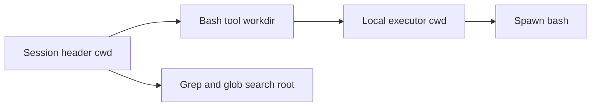

# Recover `spawn bash ENOENT` after a workspace moves

Use this runbook when Bash, grep, glob, or another subprocess-backed tool suddenly fails after a project directory was moved, renamed, deleted, or unmounted.

The misleading part is the error:

```text
Error: spawn bash ENOENT
ripgrep launch failed
glob could not start its search command
```

`ENOENT` does not prove that Bash or ripgrep is missing. Node can report the executable name even when the missing object is the child process working directory.

> If in-process file tools still work but every subprocess-backed tool fails, verify the Session workspace before reinstalling shells or changing `PATH`.

## Why one moved directory breaks several tools

DeepSeek Harness stores the workspace in the immutable Session header. The Bash tool uses that Session cwd as its default `workdir`; the local executor passes the resolved workdir to the subprocess as `cwd`.



If the recorded path no longer resolves, the shell runner can fail before `bash -c` executes. Grep and glob can fail for the same reason because their search process also needs a valid root.

The Session does not automatically adopt the new directory name. Its cwd is an identity boundary used by Session persistence, workspace membership, sandbox roots, local instructions, skills, tools, and subagents. Silently rewriting it would change more than a display path.

## Confirm the failure without another Agent turn

Do not ask the Agent to run more tools as a diagnostic. Inspect the host outside DeepSeek Harness.

Record the first error, Session ID, visible workspace path, Harness version, and whether the directory was recently moved. Then check both the executable and the recorded path:

```sh
command -v bash
test -x "$(command -v bash)" && printf 'bash executable is usable\n'

old_workspace='/absolute/path/recorded/by/the/session'
test -d "$old_workspace" && printf 'workspace exists\n' || printf 'workspace is missing\n'
```

Use the exact absolute workspace recorded by the affected Session. Do not substitute the current terminal directory.

This signal is strong when all of the following are true:

| Evidence | Meaning |
|---|---|
| `command -v bash` succeeds | executable discovery is not the first failure |
| recorded workspace is missing | spawn has an invalid cwd candidate |
| read or edit still works | not every tool shares the subprocess boundary |
| Bash, grep, and glob fail together | shared workspace or runner boundary is more likely than three missing binaries |
| a fresh Session at the new path works | provider, profile, and executable are probably healthy |

## Choose a recovery path

### Move the project back

This preserves the exact Session cwd and is the lowest-ambiguity way to continue the existing Session.

1. Stop any process writing to either location.
2. Move the complete project back to the recorded absolute path.
3. Verify that the path is a directory and contains the expected repository marker.
4. Resume with a harmless read-only command before allowing writes.

```sh
test -d "$old_workspace"
git -C "$old_workspace" rev-parse --show-toplevel
git -C "$old_workspace" status --short
```

### Keep the new location and start a new Session

This is the cleanest choice when the move is intentional. Create or select the workspace at its new canonical path, begin a fresh Session, and provide a concise handoff from the old transcript.

Do not reuse the old Session ID with a different cwd. The persistence coordinator rejects stored and live cwd disagreement as an identity collision.

### Use a compatibility symlink only when its effects are understood

An old-path symlink to the new project can make filesystem lookup resolve again on platforms that support it:

```sh
parent=$(dirname "$old_workspace")
mkdir -p "$parent"
ln -s '/absolute/new/project/path' "$old_workspace"
```

Before resuming, verify the resolved target, repository identity, writable roots, project instructions, and any watcher or build behavior that distinguishes lexical and canonical paths.

```sh
realpath "$old_workspace"
git -C "$old_workspace" rev-parse --show-toplevel
git -C "$old_workspace" status --short
```

A symlink is a compatibility bridge, not a Session migration. Prefer a new Session when policy, tooling, or storage treats the new canonical path as a new workspace.

## Do not create an empty directory and continue writing

Recreating the old path with `mkdir -p` is a useful diagnostic because a subsequent successful spawn proves that cwd validity was involved. An empty directory is not a safe project recovery.

The Agent may assume that repository files, instructions, lockfiles, and policy roots still exist. A command that now succeeds in an empty directory can create files in the wrong place or run without project-specific controls.

If you use an empty directory as a probe:

1. allow only a harmless command such as `pwd`;
2. do not permit edits, installs, builds, or external side effects;
3. stop the Session immediately after the signal;
4. remove the probe only after confirming no process still uses it;
5. recover with the real project or start a new Session.

## Distinguish nearby `ENOENT` failures

| Symptom | First boundary to inspect |
|---|---|
| `spawn bash ENOENT`, executable exists, Session cwd is missing | moved or deleted workspace |
| `spawn bash ENOENT`, Session cwd exists, Bash is absent | shell executable or non-FHS platform configuration |
| `ripgrep launch failed`, Bash also fails | shared subprocess cwd or runner |
| only grep or glob fails | ripgrep packaging, search adapter, or sandbox classification |
| `EACCES` instead of `ENOENT` | permissions, ACL, sandbox, or non-directory workdir |
| fresh Session also fails in a known-good directory | runtime installation, profile, or host environment |
| old Session fails but fresh Session works at the same path | persisted Session or live Activation state |

For a genuinely missing `/bin/bash` on NixOS or another non-FHS host, use the [shell path guide](pty-shell-path.md). For missing or damaged durable history, use the [Session log recovery runbook](live-session-log-durability.md).

## Prevent recurrence

- Finish or archive active Sessions before renaming their workspace directories.
- Treat the Session cwd as durable identity, not a mutable convenience setting.
- Give independent automation jobs fresh Session IDs and explicit absolute workspaces.
- Stop Harness writers before moving a directory tree that contains their active workspace.
- After a move, create a new workspace record and Session instead of expecting old Sessions to migrate.
- Include the recorded cwd in incident evidence whenever subprocess launch fails.

## Report the right evidence

```text
Harness package version and commit:
Surface and profile:
Operating system and Node version:
Session ID:
Recorded Session cwd:
Does that path resolve to a directory?:
Current project path:
Exact first subprocess error:
Does command -v bash succeed outside Harness?:
Do in-process read/edit tools still work?:
Does a fresh Session at the new path work?:
Was the directory moved, renamed, deleted, or unmounted?:
```

Sanitize private paths and content before posting. Report the first failure before retries add unrelated symptoms.

## Source boundary

This page was verified against DeepSeek Harness commit `99f6f02fecdb7dff40c3fbc9470f5907c29f74ca` (`dsh-v0.1.0-rc.7`).

- [The Bash tool derives workdir from the Session header cwd](https://github.com/deepseek-ai/deepseek-harness/blob/99f6f02fecdb7dff40c3fbc9470f5907c29f74ca/packages/shell/tool-bash/src/index.ts#L138-L155)
- [The Bash executor passes the resolved workdir as subprocess cwd](https://github.com/deepseek-ai/deepseek-harness/blob/99f6f02fecdb7dff40c3fbc9470f5907c29f74ca/packages/shell/bash-local/src/index.ts#L139-L185)
- [The executor contract tests a missing workdir as `ENOENT`](https://github.com/deepseek-ai/deepseek-harness/blob/99f6f02fecdb7dff40c3fbc9470f5907c29f74ca/packages/shell/bash-local/tests/executor.spec.ts#L131-L134)
- [Workspace indexing rejects a Session cwd that does not resolve](https://github.com/deepseek-ai/deepseek-harness/blob/99f6f02fecdb7dff40c3fbc9470f5907c29f74ca/packages/workspace/workspace/src/index.ts#L572-L589)
- [Canonical sandbox roots resolve symlinks and preserve missing paths conservatively](https://github.com/deepseek-ai/deepseek-harness/blob/99f6f02fecdb7dff40c3fbc9470f5907c29f74ca/packages/sandbox/sandbox/src/roots.ts#L20-L40)
- [Session persistence refuses a stored/live cwd mismatch](https://github.com/deepseek-ai/deepseek-harness/blob/99f6f02fecdb7dff40c3fbc9470f5907c29f74ca/packages/session/session-persistence/src/coordinator.ts#L1245-L1253)
- [Community reproduction and immediate diagnostic workaround](https://github.com/deepseek-ai/deepseek-harness/discussions/3277)
