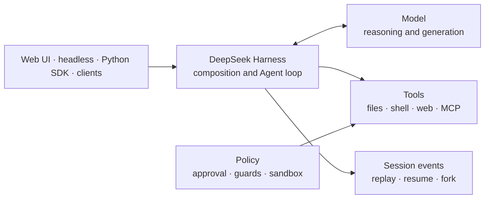

# What is DeepSeek Harness?

DeepSeek Harness, invoked as `dsh`, is DeepSeek AI's open-source runtime for building and operating tool-using Agents. It is not a model, an API proxy, or a fixed coding assistant. It composes model adapters, tools, sessions, policy, sandboxing, subagents, and interfaces as replaceable Cordis plugins.



## Model versus API versus harness

| Layer | Primary job | Example question |
|---|---|---|
| Model | turn messages into generated output or tool calls | Which model should reason about this task? |
| Provider API | authenticate, route, and stream model requests | Which endpoint and credential should serve it? |
| Harness | run the Agent loop and govern tools, state, and interfaces | What may the Agent do, remember, and expose? |

Calling a DeepSeek model does not automatically give you a durable Agent. The harness adds the execution contract around that model.

## “Everything is a plugin” in practical terms

DeepSeek Harness is powered by Cordis. The model adapter, prompt assembly, tool registry, session log, Agent loop, persistence, approval, sandbox, and UI can all enter the same plugin graph. Registrations are reversible effects, so behavior can be added or removed through composition rather than by patching one privileged core.

The runtime boots from a **profile**. A profile stacks ordered **bundles**, then applies profile, home, and command-line **patches**. The shipped `web` and `headless` profiles are therefore product compositions—not separate runtimes.

Inspect the exact graph on your machine:

```sh
dsh --profile web --dump-config
```

## What happens during an Agent turn?

1. Input enters the Agent inbox.
2. The driver opens a durable turn and claims input.
3. Plugins assemble prompt sections and tool schemas.
4. A model adapter streams assistant chunks.
5. Tool calls enter a guarded execution pipeline.
6. Calls and results are appended as durable session events.
7. The loop starts another step when tools or queued input owe more work.
8. The turn closes when no work remains.

This split between **live Agent events** and **durable Session events** explains how UIs can stream current status while replay and resume reconstruct authoritative history.

## What can you build with it?

- a Web-based coding or repository Agent;
- a one-shot headless Agent for automation;
- a Python application using the bundled runtime;
- custom tools, model adapters, hooks, and UI nodes;
- Agents backed by MCP servers or alternative sandboxes;
- multi-Agent systems using swappable subagent providers.

## What it is not

- It is not a new DeepSeek model.
- It does not make every tool call safe by default.
- Approval and sandboxing are separate controls, not synonyms.
- A custom provider's claimed capabilities are not automatically verified.
- Developer preview means configurations and interfaces may break between revisions.

## Choose your next path

- First run: [Web UI quickstart](getting-started/quickstart.md)
- Application integration: [Python SDK quickstart](getting-started/python-sdk.md)
- Architecture: [Agent runtime mental model](architecture/agent-runtime.md)
- Safety and effects: [Tool execution pipeline](architecture/tool-execution-pipeline.md)

## Official sources

- [DeepSeek Harness repository](https://github.com/deepseek-ai/deepseek-harness)
- [Architecture](https://github.com/deepseek-ai/deepseek-harness/blob/master/docs/architecture.md)
- [Cordis primer](https://github.com/deepseek-ai/deepseek-harness/blob/master/docs/cordis-primer.md)
- [Extension cookbook](https://github.com/deepseek-ai/deepseek-harness/blob/master/docs/cookbook/extension-cookbook.md)
