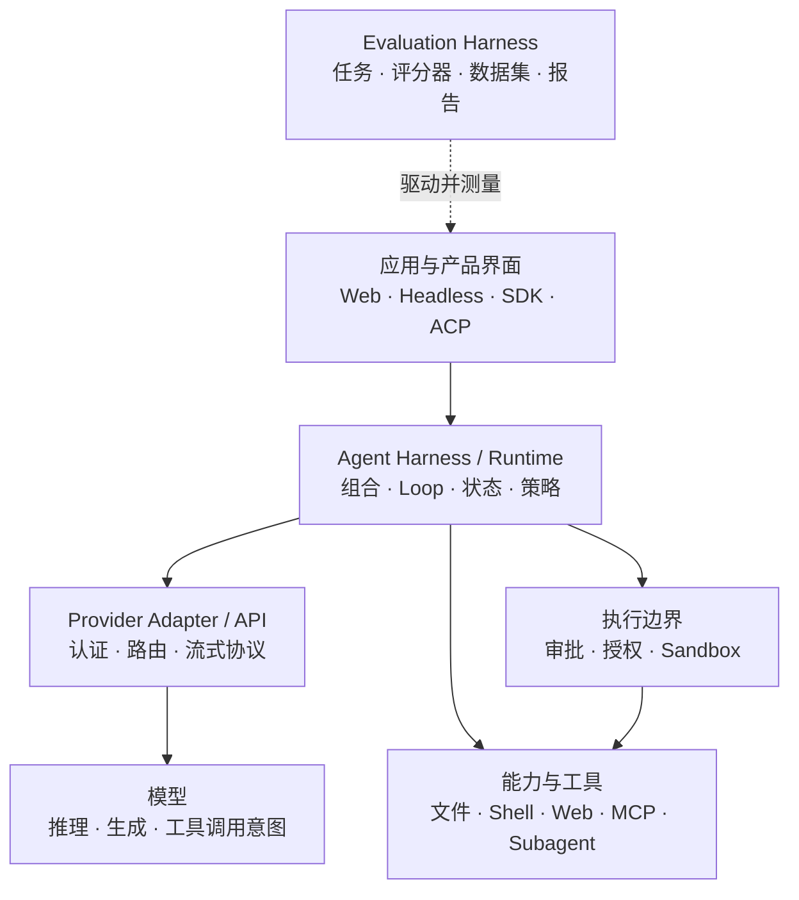
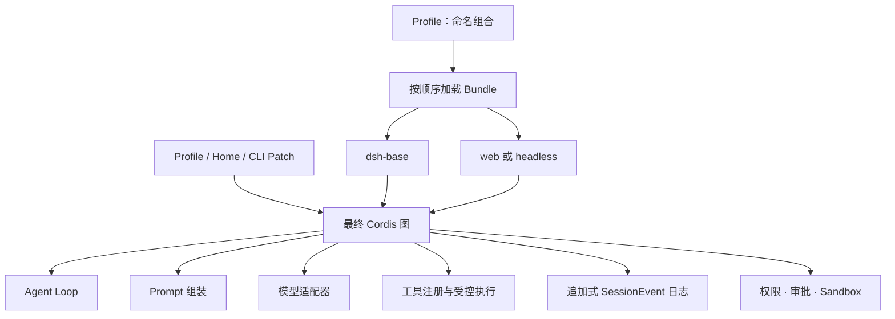
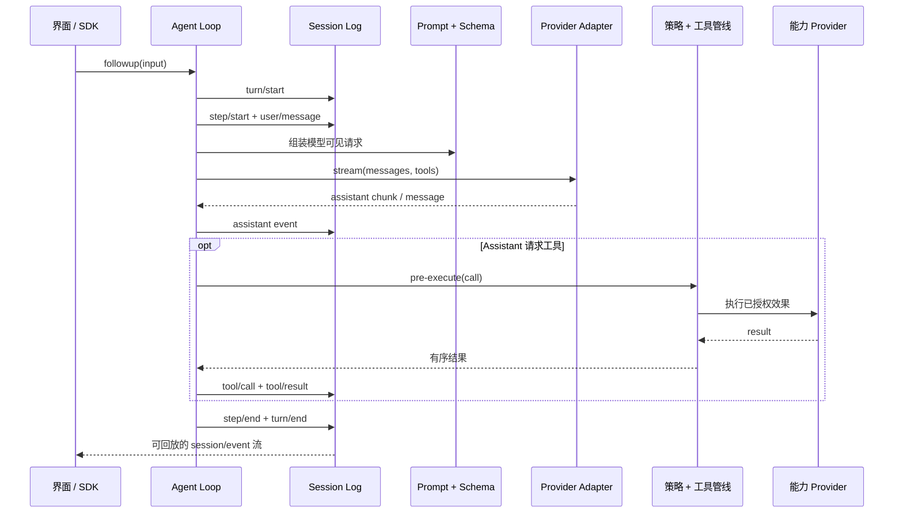
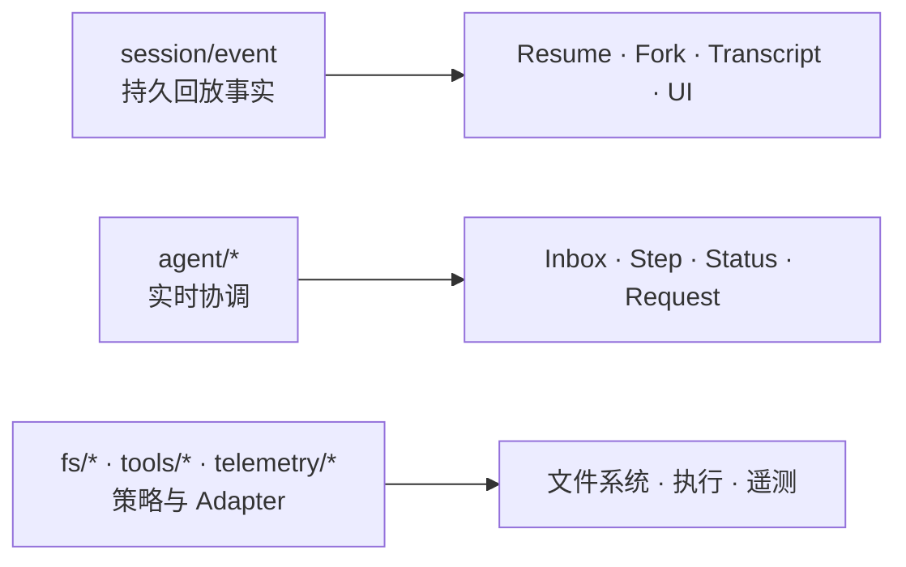

# DeepSeek Harness 架构：Agent Harness 边界地图

DeepSeek Harness 不只是“模型外面套一组工具”。在经过源码核验的 rc.2 边界中，它是一个 Cordis 组合，负责 Agent Loop、持久化 Session Event、工具执行、策略接缝、模型适配器和用户界面。因此它属于 **Agent Harness / Runtime**：围绕可替换模型与外部效果建立的执行和控制层。

这张地图用于避免常见的概念混淆：模型、Provider API、Agent Framework、Agent Harness、Evaluation Harness 和 Sandbox 可以共同构成一个产品，但它们不是同一层。

## 七层边界地图



| 层 | 负责什么 | **不能**证明什么 |
|---|---|---|
| 模型 | 文本生成、推理行为、建议的工具调用 | 持久状态、安全执行或任务已经完成 |
| Provider Adapter / API | 凭证、端点路由、请求与流式协议转换 | Agent 策略或工具正确性 |
| Agent Framework 基础组件 | 消息、工具、图或 Workflow 等复用抽象 | 已经形成可运行的产品组合 |
| Agent Harness / Runtime | Loop、组合、工具注册、持久事件、生命周期、策略集成和界面 | 基准测试质量或天然具备隔离性 |
| Evaluation Harness | 测试用例、评分器、重复实验、评分和报告 | 生产编排或效果隔离 |
| 能力与工具层 | 文件系统、Shell、Web、MCP 和委派等外部效果 | 有 Schema 就等于已授权 |
| Sandbox / 控制边界 | 隔离、审批、授权、审计或远程执行 | Agent 选择了正确动作 |

DeepSeek Harness 位于 Agent Harness 这一列。你可以用独立的 Eval Harness 评估它、挂载不同模型 Provider，或把本地能力 Provider 替换成隔离环境。这些是组合选择，并不会改变项目身份。

## Runtime 实际组合了什么



**Profile** 是保存在 Harness Home 中的命名组合，负责叠加 Bundle、安装外部插件并保存用户的 `cordis.patch.yml`。官方发行版提供 `web` 和 `headless` Profile 模板。

**Bundle** 封装 Cordis 配置行及其挂载代码。`dsh-base` 提供共享 Runtime 能力，界面 Bundle 再增加浏览器应用或一次性 Headless Runner。

最终顺序是：Profile 中的 Bundle、Profile Patch、Home Patch、`--patch` 临时覆盖。Patch 按 ID 定位配置行并整体替换配置，因此修改前先查看真实解析结果：

```sh
dsh --profile web --dump-config
```

## 一个 Turn 中各层分别负责什么



模型提出建议，Loop 负责调度，策略负责门控，能力 Provider 执行效果，Session Log 保存可回放事实，界面负责呈现或 Steering。因此在排障或安全评审中，“Agent 做了这件事”通常过于含糊。

## Runtime 职责表

| 职责 | 核心 Context / Service | 边界问题 |
|---|---|---|
| 持久事件与 Session | `ctx.sessions` | 事实能否跨刷新存在并重建历史？ |
| Prompt Section 与工具 Schema | `ctx.systemPrompt` | 什么会进入模型可见上下文？ |
| Scoped 工具注册与受控执行 | `ctx.tools` | 建议的调用在哪里获得准入并排序？ |
| 实时 Agent 注册与事件 | `ctx.agents` | 谁负责 Inbox、Status、Steering 和实时协调？ |
| 默认 Driver | `ctx.agentLoop` | 谁创建 Turn 并推进 Step？ |
| 模型消息与流式词汇 | `ctx.llm` | 哪个 Adapter 转换 Provider Stream？ |

这种拆分对运维很重要。Provider 失败不自动等于 Loop 失败；工具拒绝不等于 Sandbox 崩溃；Transcript 缺项是 Session Event 问题，不只是 UI 渲染问题。

## 三类事件域



- 必须跨刷新并重建模型历史的事实使用 **Session Event**。
- 观察或拦截运行中工作使用 **Agent Event**。
- 不导入 Loop 而挂载策略或替换 Adapter 使用 **Capability Event**。

源码中可验证的关键约束是：模型可见输入必须能从 Session Log 重建。因此 Replay、Resume、Fork、Telemetry 和 UI 渲染都收敛到 `session/event`。

## Capability Seam：接口、Provider、Consumer

完整的能力接缝包含三个角色：声明契约的 Service Definition、实现契约的 Provider，以及调用能力的 Consumer（通常是模型可见工具）。

例如，替换文件系统与 Subprocess Provider，可以把 Shell、Terminal 和语言服务效果迁移到另一个执行环境，而不必 Fork 每个 Consumer。只有工具 Schema 并不能形成安全边界；仍需检查 Provider、授权路径、Sandbox 和证据链。

## 新行为应该挂在哪一层？

| 目标 | 挂载位置 | 不要与什么混淆 |
|---|---|---|
| 路由另一个模型 | `ctx.llm` Adapter | 第二个 Agent Loop |
| 增加模型可见动作 | `ctx.tools` 注册 | 自动授权 |
| 增加人工命令 | `ctx.commands` | 模型 Turn |
| 运行后台工作 | `ctx.jobs` | 无 Owner 的 Detached Promise |
| 替换文件系统执行 | `ctx.fs` Provider 和 `fs/*` 策略 | 只切换 UI Workspace |
| 隔离进程 | `ctx.sandbox` 与 Subprocess Provider | 审批文案 |
| 拦截 Request 或 Tool | `agent/*` 或 `tools/*` | 持久历史 |
| 增加模型可见上下文 | 经过准入并落入日志的 Session Event 路径 | 临时 UI 消息 |
| 增加持久自定义状态 | 扩展 `SessionEventMap` | 组件本地状态 |
| 增加 UI 或编辑器集成 | 驱动 `ctx.agents`、渲染 `session/event` | 自己拥有权威 Transcript |
| 跨任务测量质量 | 外部 Evaluation Harness | Runtime 生命周期管理 |

## Agent 架构评审的五个问题

1. 行为由哪一层负责：模型、Provider、Loop、Tool、Policy、执行环境还是界面？
2. 哪些事实必须持久化？Session Log 能否重建全部模型可见输入？
3. 在哪里决定授权？外部效果又在哪里真正执行？
4. 哪个 Profile 和哪些解析后的配置行挂载了这个行为？
5. 哪些可观测证据能区分成功、拒绝、Provider 失败、Loop 失败和 Sandbox 失败？

如果一张架构图无法回答这些问题，它很可能合并了运维排障时必须拆开的边界。

## 核验边界

以上 Runtime 架构已针对 DeepSeek Harness rc.2 提交 [`b150a551`](https://github.com/deepseek-ai/deepseek-harness/tree/b150a551b8d465e31e418e1b2eaf5e79bbb7d28e) 完成源码核验。七层分类与评审问题属于本手册的解释框架，不是上游专有术语，也不表示 DeepSeek Harness 自带 Evaluation 系统。

## 固定版本的官方来源

- [rc.2 Architecture](https://github.com/deepseek-ai/deepseek-harness/blob/b150a551b8d465e31e418e1b2eaf5e79bbb7d28e/docs/architecture.md)
- [rc.2 Agent Lifecycle](https://github.com/deepseek-ai/deepseek-harness/blob/b150a551b8d465e31e418e1b2eaf5e79bbb7d28e/docs/agent-lifecycle.md)
- [rc.2 Capability Seams](https://github.com/deepseek-ai/deepseek-harness/blob/b150a551b8d465e31e418e1b2eaf5e79bbb7d28e/docs/capability-seams.md)
- [rc.2 Tool Execution Pipeline](https://github.com/deepseek-ai/deepseek-harness/blob/b150a551b8d465e31e418e1b2eaf5e79bbb7d28e/docs/tool-execution-pipeline.md)
- [rc.2 Cordis Primer](https://github.com/deepseek-ai/deepseek-harness/blob/b150a551b8d465e31e418e1b2eaf5e79bbb7d28e/docs/cordis-primer.md)
