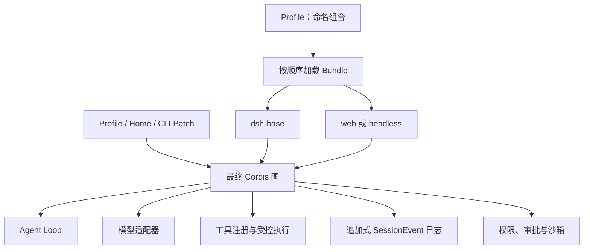

# 从 Agent 开发者视角理解 DeepSeek Harness 架构

DeepSeek Harness 不只是“模型外面套一组工具”。它是一个 Cordis 插件图：模型适配器、工具注册、会话日志、Agent Loop、策略、沙箱和界面都属于可替换的组合单元。



## Profile、Bundle 与 Patch

**Profile** 是保存在 Harness Home 中的命名组合，负责叠加 Bundle、安装外部插件并保存用户 Patch。官方发行版提供 `web` 和 `headless` 模板。

**Bundle** 封装 Cordis 配置行及其挂载代码。`dsh-base` 提供通用能力，界面 Bundle 再增加浏览器应用或一次性无服务运行器。

最终顺序是：Profile 中的 Bundle、Profile Patch、Home Patch、`--patch` 临时覆盖。修改之前先看真实结果：

```sh
dsh --profile web --dump-config
```

## 三类事件

- **Session Event：** 必须经受刷新、恢复和回放的持久事实。
- **Agent Event：** Inbox、Step、Status、Request 等运行中控制。
- **Capability Event：** 文件系统、工具和遥测等能力的策略与适配。

官方架构给出了一个关键约束：模型可见的输入必须能够从 Session Log 重建。因此 Transcript、Replay、Resume、Fork、Telemetry 和 UI 都应以 `session/event` 为事实来源。

## Capability Seam

完整的能力接缝包含三种角色：接口定义、Provider 实现和 Consumer。替换 Provider 可以把一组共享执行环境的能力移动到远程沙箱，而不需要分别 Fork 每一个工具。

设计 Agent 时依次回答：

1. 哪些事实必须持久化？
2. 哪个运行中的 Step 或 Request 需要拦截？
3. 哪项能力需要 Provider 与策略边界？
4. 哪个 Profile 应该挂载这套组合？
5. 成功或失败时，操作者能看到什么证据？

## 官方来源

- [Architecture](https://github.com/deepseek-ai/deepseek-harness/blob/master/docs/architecture.md)
- [Cordis primer](https://github.com/deepseek-ai/deepseek-harness/blob/master/docs/cordis-primer.md)
- [Capability seams](https://github.com/deepseek-ai/deepseek-harness/blob/master/docs/capability-seams.md)
