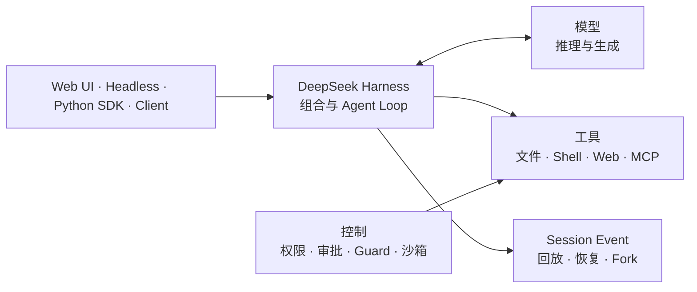

# DeepSeek Harness 是什么？

DeepSeek Harness 通过 `dsh` 命令运行，是 DeepSeek AI 开源的工具型 Agent Runtime。它不是模型、API 代理，也不是一款固定形态的 Coding Agent，而是把模型适配器、工具、会话、策略、沙箱、Subagent 和用户界面组合成 Cordis 插件图的运行时。



## 模型、API 和 Harness 的区别

| 层级 | 主要职责 |
|---|---|
| 模型 | 把消息转换成文本输出或 Tool Call |
| Provider API | 完成认证、路由和流式传输 |
| Harness | 运行 Agent Loop，管理工具、状态、安全控制与界面 |

调用 DeepSeek 模型并不会自动得到一个持久、可操作的 Agent。Harness 提供的是包围模型的执行契约。

## Harness 与 Framework 的区别

选择集成边界时，这个区别很实际：

| 你要做什么 | Framework 通常提供 | Harness 还必须让什么可观测 |
|---|---|---|
| 调用模型 | Prompt、适配器和编排原语 | 确切 Provider 路由、重试预算和请求证据 |
| 添加工具 | 函数包装器或 schema | 权限、审批、沙箱、执行和持久化结果边界 |
| 保持上下文 | 记忆或检索助手 | 作用域、注入顺序、token 成本、持久化和恢复行为 |
| 运行数小时 | 循环或工作流图 | Session 身份、可恢复性、取消、子 Agent 所有权和回滚 |

换句话说，Framework 帮你组装 Agent；Harness 是让 Agent 的副作用、状态和失败路径可治理的运行环境。可以从[生态资源能力地图](ecosystem/awesome-resources.md)一次选择一个能力，然后验证最终 profile，不要把包描述当成 Runtime 契约。

## “Everything is a plugin”意味着什么？

DeepSeek Harness 基于 Cordis。模型适配器、Prompt Assembly、Tool Registry、Session Log、Agent Loop、持久化、审批、沙箱和 UI 都能进入同一插件图。注册项属于可撤销 Effect，因此扩展行为不需要修改一个不可替换的核心。

Runtime 从 **Profile** 启动。Profile 按顺序叠加 **Bundle**，随后应用 Profile、Home 和命令行 **Patch**。官方 `web` 和 `headless` 是两种产品组合，并不是两套独立 Runtime。

查看当前机器最终解析出的组合：

```sh
dsh --profile web --dump-config
```

## 一次 Agent Turn 发生了什么？

1. 输入进入 Agent Inbox；
2. Driver 打开持久化 Turn 并领取输入；
3. 插件组装 Prompt Section 与 Tool Schema；
4. 模型适配器流式输出 Assistant Chunk；
5. Tool Call 进入受控执行管线；
6. Call 与 Result 写入持久化 Session Event；
7. 工具结果或排队输入触发新的 Step；
8. 没有待处理工作时 Turn 结束。

**实时 Agent Event** 与**持久化 Session Event** 的分离，使 UI 能显示实时状态，同时让 Replay、Resume 和 Fork 依据同一份事实日志工作。

## 可以用它构建什么？

- 基于 Web 的代码或仓库 Agent；
- 用于自动化的一次性 Headless Agent；
- 使用内置 Runtime 的 Python 应用；
- 自定义工具、模型适配器、Hook 和 UI Node；
- 连接 MCP Server 或远程沙箱的 Agent；
- 使用不同 Subagent Provider 的多 Agent 系统。

## 它不是什么？

- 它不是新的 DeepSeek 模型；
- 它不会让所有 Tool Call 默认安全；
- Approval 与 Sandbox 是两套控制机制；
- 自定义 Provider 声明的能力不会被自动验证；
- Developer preview 意味着配置和接口可能发生不兼容变化。

## 官方来源

- [DeepSeek Harness 官方仓库](https://github.com/deepseek-ai/deepseek-harness)
- [Architecture](https://github.com/deepseek-ai/deepseek-harness/blob/master/docs/architecture.zh.md)
- [Cordis primer](https://github.com/deepseek-ai/deepseek-harness/blob/master/docs/cordis-primer.zh.md)
- [Extension cookbook](https://github.com/deepseek-ai/deepseek-harness/blob/master/docs/cookbook/extension-cookbook.zh.md)
